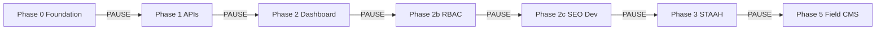
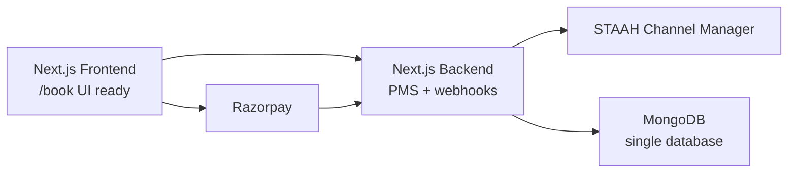
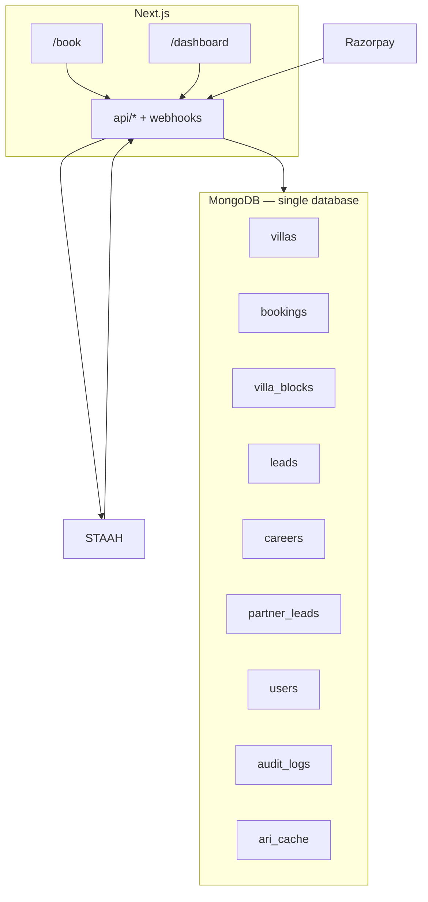
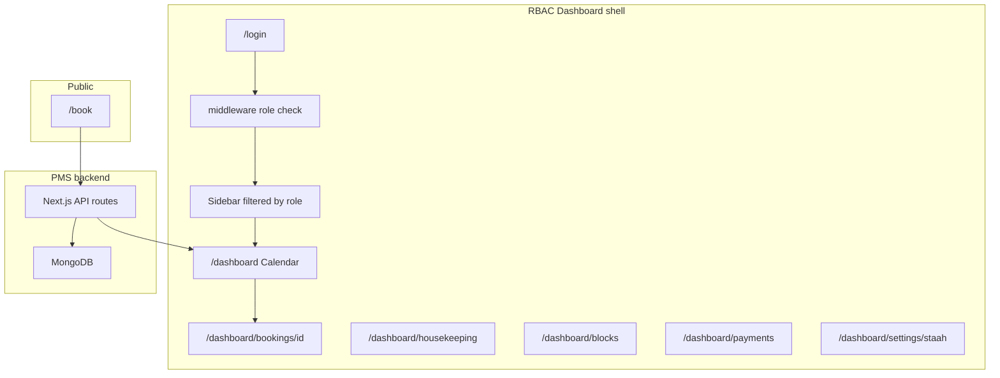
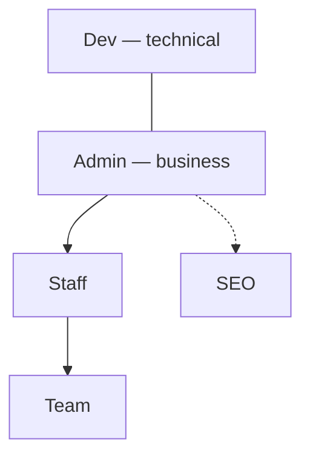

# Custom Villa PMS — MongoDB-only (approved)

## Special Note — Execution Mode

> **To the AI executing this plan:**
>
> **Work phase by phase. Pause at every gate.** Do not start Phase N+1 until Phase N checklist passes and the user has had a chance to review (unless they explicitly say “continue without pause”).
>
> Within a phase: automate fully (code, files, routes, stubs). Across phases: **stop, summarize, list what was done + what to test, then wait.**
>
> **For blockers inside a phase:** ask the user, or stub with `// TODO: live credential` + `.env.example` so `npm run build` passes.
>
> **Credentials — TWO tiers.** Build always proceeds with stubs + `.env.example` so `npm run build` passes. But **Phase 1 verification gates require Tier 1**, and **production cutover requires Tier 2**. The agent must **NOT stub-and-tick** the E2E book→pay→confirm or restore-test gates — those need real Tier 1 credentials.

**Tier 1 — needed to VERIFY Phase 1 gates (all free):**

| Variable | Status |
|----------|--------|
| Test `MONGODB_URI` (replica set — Atlas free tier **is** a replica set, or local Docker `rs.initiate()`) | Needed to verify Phase 1 (free) |
| `RAZORPAY_KEY_ID` / `RAZORPAY_KEY_SECRET` (**TEST mode**) | Needed to verify Phase 1 (free) |
| `RAZORPAY_WEBHOOK_SECRET` (test webhook) | Needed to verify Phase 1 (free) |

**Tier 2 — provided at CUTOVER (the last step):**

| Variable | Status |
|----------|--------|
| **Production** `MONGODB_URI` | Provide at cutover |
| **Production** `RAZORPAY_KEY_ID` / `RAZORPAY_KEY_SECRET` + `RAZORPAY_WEBHOOK_SECRET` | Provide at cutover |
| `STAAH_API_KEY` / property mapping | Provide at cutover (Phase 3) |
| `NEXTAUTH_SECRET` | Provide at cutover (Phase 2b live) |
| `CRON_SECRET` | Provide at cutover (cron routes) |

> **Single database:** MongoDB only via `connectDB()`. No PostgreSQL pool, no dual-DB, no `BOOKINGS_STORE=postgres`.
>
> **Degraded mode (not rollback):** optional `BOOKINGS_STORE_FALLBACK=true` serves read-only booking availability from an in-memory map when Mongo is unreachable — outage buffer only.
>
> **Quality over speed:** Take as much time as needed per phase. Full precision — responsive layouts, balanced padding, no rushed multi-phase dumps. Each page is built and verified before the next.

---

## Phase gates — pause protocol (mandatory)

Each phase ends with: **(1)** short summary, **(2)** test checklist, **(3)** explicit “Phase X complete — ready for Phase Y?”** Do not batch Phase 1+2+2b in one run unless the user asks.



### Phase 0 — Foundation (PAUSE before Phase 1)

**Deliverables:** `bookingDates.ts` (exclusive-end `rangesOverlap`), `connectDB()` in [`src/lib/db.ts`](src/lib/db.ts) **only** (remove `pg` pool), Mongoose models (`Villa`, `Booking`, `VillaBlock`, `Lead`, `Career`, `Partner`, `User`, `audit_logs`), `bookings/store.ts` + `MongoBookingStore`, [`src/lib/money.ts`](src/lib/money.ts) paise helpers, `auditLog()` service, `.env.example` (`MONGODB_URI` only), README replica-set + **backup** note.

**Gate checklist:**

- [ ] `npm run build` passes **with `pg` removed**
- [ ] `npm run test` passes (`bookingDates` includes **same-day turnover**: A `checkOut === B checkIn` → no conflict)
- [ ] **Postgres fully gone (unconditional):** repo grep for `pg` / `Pool` / `pg-pool` / `postgres` / `POSTGRES_` / pg `DATABASE_URL` / `schema.sql` / `PostgresBookingStore` / raw SQL is **clean**; only `connectDB()` / Mongoose remain; `docker-compose.yml` has **no postgres service/volume**
- [ ] All money fields documented as **paise**; `rupeesToPaise()` is the only UI→server conversion
- [ ] Villa schema carries pricing-model fields (`dayOutBasePricePaise`, `stayBasePax`, `dayOutBasePax`, `stayMaxPax`, `extraPax*Paise`, `weddingVenue`, `weddingTiers`, `addOnAvailability`); `cleaningFeePaise`/`securityDepositPaise` default 0; `cancellationPolicy` seeded `[TO BE CONFIRMED]`
- [ ] `ADD_ON_CATALOG` defined (flat / perPerson+minPax / quoteOnly); complimentary items are not in it
- [ ] **Property seed parser** reads [`Jade_Property_Data.md`](src/Jade%20Property%20Data/Jade_Property_Data.md), **fails loudly** on any missing required field, excludes **Royalty by Jade** (`bookable:false`), and does **not** seed unconfirmed `[CONFLICT]`/`[TBD]` values
- [ ] **`weddingTiers` `pricePaise` = base / GST-exclusive** figure; **never** the parenthesised inclusive figure (no double-tax)
- [ ] `bookingDates.ts` exposes `nowIST()`/`todayIST()`; **no `Date.now()` day-boundary math** outside it (timezone pinned to `Asia/Kolkata`)
- [ ] `villa_nightlocks` model + **unique `{villaId,date}`** index defined; `webhook_events` + **unique `{eventId,source}`**; partial unique on `payment.processedPaymentId`
- [ ] **No `expiresAt` TTL / `expireAfterSeconds` index** anywhere (cron-only soft expire)
- [ ] Resume/partner-photo schemas store **GridFS/object-storage refs only** (no `data: Buffer`)

**Pause output:** List files created; collections map; **`pg`-removal grep evidence**; confirm backup strategy acknowledged.

---

### Phase 1 — PMS APIs (PAUSE before Phase 2)

**Deliverables:** Wire all booking/availability/leads/careers/partner routes to Mongo; `MongoBookingStore` only; extend Razorpay webhook (idempotent `payment.captured`); expire-pending cron; STAAH push stub; `auditLog()` on every write listed below; soft-delete + partial indexes live.

**Gate checklist:**

- [ ] `POST /api/bookings` creates `pending` + `expiresAt`; pricing in **paise**; `taxPaise` derived from `villa.settings.taxPercent`
- [ ] **Server-side pricing for ALL components:** `basePaise`, `extraPaxPaise`, `eventPaise`, `addOnPaise`, `taxPaise`, `totalPaise` all server-derived from villa doc + `ADD_ON_CATALOG`; `addOns` is id+quantity only; **no client paise trusted**
- [ ] **Extra-pax:** 20-guest stay at a 12-base villa = base + `8 × extraPaxStayPaise` (Vitest + manual)
- [ ] **Two products:** a `day_out` booking blocks the same villa-date from a conflicting `stay` (and vice-versa) via `villa_nightlocks`
- [ ] **Event tier:** an `event` booking is priced from `villa.weddingTiers[eventTierId].pricePaise`, **not** `basePricePaise`; full-day tier includes its `stayIncludedPax`; "stay + party" charges nights + tier
- [ ] **Event guest band:** `eventGuests > tier.maxGuests` → **400** (or auto-select tier by headcount)
- [ ] **Standalone + multi-day event date-lock:** an `event` (no overnight) inserts `villa_nightlocks` for **every** date in `[eventStartDate, eventEndDate]`; a stay/day-out on any event day is blocked
- [ ] **Children/extra-pax rule:** `chargeableHeads` excludes children under `childFreeAgeLimit` per the configured rule; the applied rule is **snapshotted** (default confirmed-with-business)
- [ ] **Add-on modes:** per-person add-on below `minPax` is **rejected**; quote-only add-on is **excluded from `totalPaise`** and creates a follow-up flag; complimentary items are **never billed**
- [ ] **Capacity:** `guests ≤ base` → base only; `base < guests ≤ stayMaxPax` → +extra-pax; `guests > stayMaxPax` → **400**
- [ ] **Deposit:** for `paymentPlan: deposit` the Razorpay order amount = server `payment.depositPaise` (client ignored); booking confirms on deposit captured (`deposit_paid`); `balancePaise` tracked; folio shows deposit + balance
- [ ] **Refund execution:** server-side Razorpay refund (full + partial) computed from `cancellationPolicy`/snapshot (never client amount); `status` → `refunded`/`partially_refunded`; `refund.issue` audited
- [ ] **Anti-griefing:** booking creation rate-limited (per-IP + per-email caps) + CAPTCHA/Turnstile + short pre-payment hold (or lock only on payment-initiated); store is **persistent** (Mongo/Redis), not in-memory
- [ ] **Input validation:** all public inputs zod-validated at the route boundary; operator-object payloads (`{$ne:...}`) rejected; no raw `req.body` into Mongo queries
- [ ] **IDOR:** guest links use unguessable `bookingToken`, never `_id`
- [ ] **DPDP:** guest-PII erasure path exists + audited; erasing PII keeps the append-only audit event
- [ ] **Cleaning/deposit:** both default 0 and excluded from payable total unless the villa doc explicitly sets them (then snapshotted)
- [ ] **GST:** `taxPaise` = 18% of the correct taxable base per product; folio shows "GST (18%)" + GSTIN
- [ ] **Pricing snapshot** persisted on `booking.pricing.snapshot` (base/day-out rates, base-pax, extra-pax rates, resolved event tier, cleaning/deposit, taxPercent); folio reads snapshot, not live `villa.settings`
- [ ] **Order amount re-derived server-side** from `booking.pricing.totalPaise`; client `amountSubunits` ignored
- [ ] **Review & Pay** total equals server pricing across stay / day-out / event / extra-pax / per-person-add-on cases (Vitest + manual); page renders only server-computed values (see **Review & Pay rebuild**)
- [ ] **Double-booking lock at BOTH stages:** per-night `villa_nightlocks` inserted (E11000 = rejected) at pending-create **and** re-asserted at webhook-confirm; concurrent same-date holds → exactly one succeeds
- [ ] **Confirm-time overlap re-checks `villa_blocks` too** (owner block during payment in flight → `conflict`, not `confirmed`)
- [ ] Overlap ignores `expired` / `cancelled` / `conflict` / `isDeleted` / expired pending
- [ ] **Cron-only soft expire** (no TTL delete): expired `pending` → `status: 'expired'` retained for audit/folio
- [ ] **Same-day turnover:** booking A `checkOut ===` booking B `checkIn` (same villa) → **no conflict** (Vitest + manual case)
- [ ] **Audit:** 10 mixed writes (booking create, block, villa price patch, user seed, STAAH stub, login, logout, …) → all appear in `audit_logs` (append-only; no update/delete API)
- [ ] **Atomic Razorpay idempotency:** `webhook_events` insert (dup eventId → no-op) + single guarded `findOneAndUpdate({status:{$ne:'confirmed'}})`; concurrent duplicate deliveries → **exactly one** confirm, one email, one STAAH queue
- [ ] **Binary uploads:** resume/partner-photo go to GridFS/object storage (ref only); server validates max size + MIME allowlist
- [ ] **STAAH conflict:** inbound OTA overlapping live direct booking → `status: conflict`, `payment.status: external`, excluded from availability; surfaced on admin conflict queue (not silent confirm)
- [ ] Staging E2E: `/book` → pay → confirm → grid shows booking (**required before production cutover**)
- [ ] **Backup restore tested within 90 days** — HARD production-cutover blocker (see Backup strategy)
- [ ] `npm run build` + tests green

**Pause output:** API contract summary; Razorpay webhook idempotency note; audit sample; E2E evidence; restore-test evidence.

---

### Phase 2 — Dashboard UI redesign + separate pages (PAUSE before Phase 2b)

**Deliverables:** Full `/dashboard` segment; luxury UI; **responsive on all viewports**; sub-phases 2a–2e; `/admin` redirect.

**Gate checklist:**

- [ ] **Responsive:** 320 / 390 / 768 / 1280 / 1440 on every shipped page
- [ ] **Padding:** balanced; `FLUID_SPACE` + jade tokens (spot-check vs public pages)
- [ ] Dark luxury + glass matches marketing site
- [ ] Separate routes; grid → folio works on touch + desktop
- [ ] Housekeeping + blocks wired
- [ ] `npm run build` passes

**Pause output:** Route map + **full UI/viewport sign-off** before RBAC.

---

### Phase 2 sub-phases (build one, pause one)

Phase 2 is **not** a single bulk UI drop. Sub-phases each end with responsive QA + pause.

| Sub-phase | Scope | Pause after |
|-----------|--------|-------------|
| **2a** | `dashboard/layout.tsx`, `DashboardShell`, `Sidebar` drawer, `/login`, `GlassPanel`, tokens | Shell OK on all viewports |
| **2b** | `/dashboard` calendar grid only — responsive scroll + cell tap | Grid approved |
| **2c** | Folio `/bookings/[id]` — stacked sections mobile, two-column desktop | Folio approved |
| **2d** | Housekeeping + blocks pages | PMS ops pages approved |
| **2e** | Placeholder routes (payments, settings, seo, dev) + `/admin` redirect | Full route map approved |

Do not start 2b until 2a gate passes; do not start Phase 2b (RBAC) until **2e** + full UI review pass.

---

## Dashboard responsive & spacing standards (public-page parity)

Dashboard pages must feel like **the same brand** as public pages: readable, balanced, never cramped or overflow-hidden on real devices.

### Viewports to verify (every dashboard page)

| Zone | Width | Expectation |
|------|-------|-------------|
| Mobile S | 320–374px | Sidebar drawer; single-column; no horizontal page overflow |
| Mobile L | 375–429px | Same; touch targets ≥ 44px |
| Tablet | 768–1023px | Drawer or narrow rail; grid horizontal scroll inside panel |
| Desktop | 1024–1439px | Persistent sidebar; main content fluid |
| Large | 1440px+ | Max content width capped; generous but **balanced** padding |

Also test: **iOS safe-area** (`env(safe-area-inset-*)`), **125–150% Windows display scaling**, landscape phone.

### Spacing & typography (reuse site tokens — do not invent ad-hoc px)

| Token / source | Use on dashboard |
|----------------|------------------|
| [`FLUID_SPACE`](src/lib/layoutSpacing.ts) (`xs`–`2xl`) | Panel padding, stack gaps, form spacing |
| [`--jade-section-pad-y`](src/app/globals.css) | Page vertical rhythm (scaled down ~20% for ops density if needed via `LAYOUT_SPACE_SCALE`) |
| `Philosopher` / `Manrope` via root [`layout.tsx`](src/app/layout.tsx) | Headings / body — same as public site |
| [`glassChrome.ts`](src/lib/glassChrome.ts) | Cards, sidebar, top bar glass |
| `viewportFit: cover` + theme `#1A1C1E` | Inherited from root layout |

**Rules:**

- **Balanced padding:** symmetric horizontal page inset `FLUID_SPACE.md` mobile → `FLUID_SPACE.lg` desktop; no edge-to-edge text on glass panels.
- **No layout shift:** fixed top bar height; sidebar open/close must not jump main content (reserve space or smooth transition).
- **Calendar grid:** sticky villa name column on horizontal scroll; month header row sticky on vertical scroll inside panel.
- **Folio:** mobile = single column stack; desktop = guest | pricing two-column; Razorpay IDs `break-all` on narrow screens.
- **Tables** (payments, logs): `overflow-x-auto` **inside** glass panel, not full-page scroll.
- **Contrast:** text on glass must meet WCAG AA (reuse public overlay text colors).

### Responsive QA gate (required per sub-phase)

Before each Phase 2 sub-phase pause:

- [ ] Chrome DevTools device toolbar: 320, 390, 768, 1280, 1440
- [ ] No clipped buttons or overlapping sidebar
- [ ] Padding visually matches public pages (spot-check vs `/villas` or `/book`)
- [ ] `npm run build` passes
- Optional: Playwright viewport snapshots for `/dashboard` shell (stretch — add in Phase 2e)

### What we explicitly avoid

- Desktop-only admin tables with no mobile path
- Random `p-4` / `m-8` without fluid tokens
- Shrinking font below 14px body on mobile
- Building all dashboard routes in one PR without sub-phase pauses

---

### Phase 2b — RBAC 5 roles (PAUSE before Phase 2c)

**Deliverables:** `User` model, `/login`, NextAuth, `permissions.ts`, middleware, role-filtered sidebar.

**Gate checklist:**

- [ ] Each role sees only allowed sidebar items
- [ ] `/dashboard/dev/*` blocked for staff/seo/team
- [ ] `/dashboard/seo/*` blocked for team/staff
- [ ] Booking APIs use session + `requireRole` (admin/staff write; team read-only on grid)
- [ ] **Team `assignedVillas` enforced server-side:** housekeeping/stayStatus write for a villa not in user's `assignedVillas` → **403** (verified, not just matrix)
- [ ] **Role revocation:** short session TTL **and** server-side DB role re-check on payments/staff/dev/STAAH routes (demoted user denied before token expiry)
- [ ] **Login hardening:** failed-login audit entries written; **persistent** (Mongo) rate-limit/lockout; generic error messages
- [ ] **CSRF:** dashboard mutations require NextAuth CSRF + same-site; custom POST/PATCH/DELETE reject cross-site requests
- [ ] **Security headers** via middleware/`next.config`: CSP (Razorpay domains allowlisted), HSTS, X-Content-Type-Options, Referrer-Policy, Permissions-Policy — present on responses
- [ ] Admin has 👁️ read on error + webhook logs (bus-factor)
- [ ] Seed users documented in README

**Pause output:** Matrix spot-check table (5 roles × 3 sample URLs).

---

### Phase 2c — SEO + Dev shells (PAUSE before Phase 3)

**Deliverables:** Route scaffolds under `/dashboard/seo/*` and `/dashboard/dev/*`; API guards; empty states OK.

**Gate checklist:**

- [ ] SEO role reaches blogs route; staff cannot
- [ ] Dev role reaches webhook logs; admin has 👁️ read (bus-factor); staff/seo/team cannot
- [ ] **Dev console locked down:** DB explorer = read-only named-aggregation allowlist; **no** `$where`/`mapReduce`/`$function`/raw eval/free-form query; PII redacted; every explorer/debug read calls `auditLog()`; no write path
- [ ] **Content source of truth:** Mongo `content_posts` is canonical; public blog/landing pages read Mongo via ISR — OR SEO edits are explicit read-only previews (no silent-no-op half-state)
- [ ] `npm run build` passes

**Pause output:** What is scaffold vs fully wired.

---

### Phase 3 — STAAH live (PAUSE when credentials arrive)

**Deliverables:** ChannelConnect client, inbound push webhook, outbound reservation, `staah-retry` cron.

**Gate checklist:**

- [ ] Sandbox reservation push succeeds
- [ ] Inbound ARI updates availability on `/book`
- [ ] `staahSynced` retry cron runs
- [ ] **Cancellation sync:** cancelling an already-synced booking pushes a release back to STAAH (OTA frees the dates); `staahCancelSynced` retried by the cron
- [ ] **Conflict resolution actions** on `/dashboard/conflicts` (cancel OTA / cancel direct / manual override) each audited; **double-pay auto-issues the server-side Razorpay refund** of the losing booking within SLA (not a manual playbook) — see **Refund execution**

**Pause output:** STAAH dashboard config steps for user ops team.

---

### Phase 5 — Site content CMS (structured field CMS, NOT a page builder)

**Depends on:** Phase 2b RBAC + the `content_posts`/ISR foundation (Phase 2c). **Scope:** edit **text / content / pricing / images on EXISTING pages** only — layout, design system, animations, and component structure are **NOT** editable (no drag-drop builder, no arbitrary fields).

**Deliverables:** `content_pages` model (fixed editable field set per page/section); public marketing pages read from Mongo via **ISR** with `revalidatePath()`/`revalidateTag()` on publish; one-time import of `src/data` copy into Mongo; **media library** (upload → sharp → WebP ~80% + responsive set 480/768/1280/1920, strip EXIF, require alt text); villa price/capacity edits reuse villa validation + `auditLog()` + `pricing.snapshot`; draft → publish with preview + `updatedBy`/`updatedAt` + last-N version history.

**Gate checklist:**

- [ ] Edits appear on the **live public page via ISR revalidate** (no redeploy)
- [ ] Image upload produces **WebP + responsive sizes** with **alt text** required; EXIF stripped
- [ ] **Media storage decision** honored: object storage (R2/S3) or GridFS by default; public-folder write **only** if user confirmed a persistent VPS
- [ ] Pricing/property edit is **validated** (no negative paise, GST-exclusive wedding tiers, capacity sanity) + **audited**; **does not touch existing bookings** (`pricing.snapshot` preserved)
- [ ] **RBAC:** only SEO + admin (per matrix) can edit; others blocked; every edit audited; draft→publish + version history works
- [ ] No half-wired state: a page is **either** Mongo-backed (editable) **or** static — never "saves but never appears"
- [ ] `npm run build` passes

**Pause output:** Which pages are Mongo-backed vs static; media-storage target; version-history sample.

---

### Agent discipline (per phase)

1. Mark plan todos **in_progress** only for the current phase.  
2. Complete gate checklist before marking phase todos **completed**.  
3. End message: **“Phase X done — [checklist]. Proceed to Phase Y?”**  
4. Do not edit later-phase files early “to save time.”  
5. **Phase 2 only:** sub-phases **2a → 2e** sequentially; responsive QA at each pause.  
6. **Precision over speed** — fix failing viewports before advancing.

---

## Realistic timeline (solo)

| Sprint | Plan doc | Realistic |
|--------|----------|-----------|
| A — Mongo + APIs | Week 1–2 | **1.5–2 weeks** |
| B — Grid + folio | Week 2–3 | **~2 weeks** |
| C — RBAC | Week 3–4 | **~1 week** |
| STAAH live | Parallel | When partner credentials arrive |

---

# Custom Villa PMS — MongoDB-only (approved)

## Confirmed architecture (your summary)



| Layer | Role |
|-------|------|
| **Frontend** | Public booking + staff dashboards (grid, folio, housekeeping) |
| **Backend** | Single source of truth logic, overlap checks, webhook verify, STAAH push |
| **MongoDB** | **Only database:** villas, bookings, blocks, users, leads, careers, partner, audit_logs, ari_cache |
| **Razorpay** | `payment.captured` → confirm booking (idempotent webhook) |
| **STAAH** | OTA distribution + inbound reservations; `conflict` status on overlap |

**Not needed:** New Razorpay modal script — already in [src/lib/payments/razorpayCheckout.ts](src/lib/payments/razorpayCheckout.ts).

---

## Plan verdict (gaps addressed)

| Area | Status |
|------|--------|
| MongoDB-only + extend Razorpay webhook | Solid |
| Race conditions | **Locked** — per-night `villa_nightlocks` unique index at create + confirm (transactions allow write-skew); replica set |
| **Payment integrity** | **Locked** — server-derived order amount; all pricing components server-side; `pricing.snapshot` for disputes |
| **Pricing model** | **Locked** — stay/day_out/event products, extra-pax (chargeable-heads rule), weddingTiers (GST-exclusive), `ADD_ON_CATALOG` (flat/perPerson/quoteOnly), capacity 400, GST 18% |
| **Multi-day events** | **In plan** — `eventStartDate`/`End`, per-day/package pricing, guest-band check, range night-locks |
| **Deposit + refunds** | **In plan** — server `depositPaise` order + balance tracking; server-side Razorpay refund (full/partial) + `refund.issue` audit; double-pay auto-refund |
| **Public security perimeter** | **In plan** — anti-griefing rate-limit/CAPTCHA/persistent hold, zod input validation, `bookingToken` (no IDOR), security headers, DPDP erasure |
| **Field CMS (Phase 5)** | **In plan** — structured fields only, ISR publish, image pipeline, object-storage default, RBAC + versioning |
| **Credentials** | **Two tiers** — Tier 1 (free, verify Phase 1) vs Tier 2 (production at cutover); no stub-and-tick of E2E/restore gates |
| **Review & Pay** | **Rebuild** — server-computed values only; no hardcoded figures; complimentary not billed |
| **Property seed** | Canonical `Jade_Property_Data.md`; fail-loud parser; Royalty excluded; `[CONFLICT]`/`[TBD]` confirmed first |
| **PostgreSQL** | **Removed unconditionally** — `pg` uninstalled, `schema.sql` deleted, repo grep clean |
| STAAH wrong REST pattern | ChannelConnect only |
| **Currency** | **Locked** — paise everywhere; `basePricePaise`; `rupeesToPaise()` at API boundary only |
| **Audit trail** | **Locked** — `audit_logs` append-only + required on writes |
| **Soft deletes** | **Locked** — partial unique indexes; overlap excludes `isDeleted` |
| **STAAH conflict** | **Locked** — `status: conflict`; never silent OTA confirm |
| **Razorpay idempotency** | **Locked** — `webhook_events` ledger + atomic guarded update; no-op on redelivery |
| **Dev console** | **Locked** — read-only allowlist, no free-form queries, PII redacted, audited |
| **Binary uploads** | **Locked** — GridFS/object-storage refs only; size + MIME validation |
| **Date format** | `YYYY-MM-DD` strings; exclusive-end turnover test in Phase 1 |
| **Pending hold expiry** | `expiresAt` marker + **cron-only soft-expire** (no TTL auto-delete — preserves audit/folio) |
| **STAAH retry job** | Cron spec in Phase 3 |
| **Prod safety** | Staging E2E + Atlas backups (no Postgres rollback) |
| RBAC after grid | Phase 2 → 2b window |

---

## Sprint A prerequisites (before coding booking APIs)

Do these **first** in Sprint A — not optional polish.

### 1. Date format (single convention) + timezone

**Decision:** Store `checkIn` and `checkOut` as **`YYYY-MM-DD` strings**.

- Add [`src/lib/bookingDates.ts`](src/lib/bookingDates.ts): `rangesOverlap` uses **exclusive end** — `aIn < bOut && bIn < aOut` so **same-day turnover is allowed** (A `checkOut === B checkIn` → no overlap).
- **Never** mix `Date` objects with timezone drift in overlap logic.
- Razorpay webhook and STAAH payloads: convert with `.split('T')[0]` only at API boundaries.
- **Timezone — `Asia/Kolkata` (IST), pinned:** all day-boundary math, check-in/out times (`settings.checkInTime`/`checkOutTime`), pending-expiry "now", and "today arrivals/departures" use IST. Date strings are TZ-agnostic, but any `new Date()` boundary comparison must resolve in IST (single helper `nowIST()` / `todayIST()` in `bookingDates.ts`). No `Date.now()` day math in handlers.

### 2. Pending booking TTL (revenue protection)

Without expiry, two guests can block a high-ticket villa while one abandons checkout.

On `POST /api/bookings` (pending):

- `expiresAt: new Date(nowIST() + 15 * 60 * 1000)` (configurable `BOOKING_HOLD_MINUTES`)
- **No MongoDB TTL auto-delete index** on the booking doc. A hard `expireAfterSeconds` TTL would **erase pending bookings before the audit/folio trail captures them** — forbidden. Expiry is **cron-only soft expire** (the doc is retained with `status: 'expired'`).

**v1 (cron-only soft expire — the single approach):**

- **No `expiresAt` TTL index, no auto-delete** anywhere in the schema.
- Cron every 2 min: `pending` + `expiresAt < nowIST()` → `status: 'expired'`, `payment.status: 'failed'` (audited).
- Overlap query **ignores** `pending` where `expiresAt < now` and all `expired` / `cancelled`.

On `payment.captured` webhook: `$unset: { expiresAt }` or set `expiresAt: null`.

### 3. MongoDB replica set + real double-booking lock (transactions are NOT enough)

`mongoose.startSession()` + transactions **require** a replica set (Atlas or Docker `rs.initiate()`). Document in README.

**A transaction alone does NOT prevent double booking.** MongoDB transactions use **snapshot isolation**, which permits **write-skew**: two concurrent requests can each read "no overlap", each insert a *different* booking doc, and both commit (different documents = no storage-level write conflict). "Wrap in a transaction" is therefore insufficient.

**Chosen mechanism — (a) per-night lock docs (`villa_nightlocks`):**

```ts
// villa_nightlocks — one doc per held night
{ villaId: ObjectId, date: string /* "YYYY-MM-DD" */, bookingId: ObjectId }
// unique index: { villaId: 1, date: 1 } { unique: true }
```

- To hold dates, insert one lock doc per night in range `[checkIn, checkOut)` (exclusive end → turnover night not locked).
- The **duplicate-key error (E11000) IS the lock** — if any night is already held, the insert fails and the booking is rejected. No read-then-check race.
- Locks are inserted **inside the same transaction** as the booking write.
- Apply the lock at **BOTH** stages:
  - **pending-create** (`POST /api/bookings`) — hold the nights immediately, and
  - **webhook-confirm** (`payment.captured`) — re-assert / re-check before flipping to `confirmed`.
- Skipping the lock at either stage allows two guests to both hold and both pay the same dates → forced post-payment refund.
- On `expired` / `cancelled`: delete that booking's lock docs so nights free up.
- *(Alternative (b): atomic `findOneAndUpdate` on a versioned per-villa availability doc — not chosen; (a) is the spec.)*

### 4. Money unit — paise only (no ambiguity)

| Rule | Detail |
|------|--------|
| **Storage** | All persisted money: **integer paise** (`basePricePaise`, `pricing.*Paise`, Razorpay `amount` subunits) |
| **Villa field** | `basePricePaise` (rename from `basePricePerNight`) |
| **Single conversion** | [`src/lib/money.ts`](src/lib/money.ts) `rupeesToPaise(n: number)` — **only** place UI rupee integers become paise (e.g. `/book` payload, admin forms) |
| **Display** | `formatPaise(p)` for dashboard/folio; never store floats |
| **Base** | `pricing.basePaise` = stay → `basePricePaise × nights`; day_out → `dayOutBasePricePaise`; event-only → 0 |
| **Extra-pax** | `pricing.extraPaxPaise = max(0, guests − basePax) × extraPax{Stay\|DayOut}Paise` — server only |
| **Event** | `pricing.eventPaise = villa.weddingTiers[eventTierId].pricePaise` (tier price, NOT nightly base) |
| **Add-ons** | `pricing.addOnPaise = Σ ADD_ON_CATALOG[id]` by mode (flat × qty / perPerson × pax with `minPax` check); `addOns` is an **id + quantity** array; quote-only excluded; complimentary never billed |
| **Tax** | `pricing.taxPaise = round(taxableBase * villa.settings.taxPercent / 100)` — never client-sent |
| **Total** | `pricing.totalPaise = basePaise + extraPaxPaise + eventPaise + addOnPaise + taxPaise` — fully server-derived; any client-sent paise/`amountSubunits` is **ignored** |

**Server-side pricing rule (all components, not just tax):** every component (`basePaise`, `extraPaxPaise`, `eventPaise`, `addOnPaise`, `taxPaise`, `totalPaise`) is computed server-side on `POST /api/bookings` from the villa doc + `ADD_ON_CATALOG` (see **Pricing model**). The client sends only `bookingType`, dates, guest counts, optional `eventTierId`, and add-on **ids + quantities**. No paise value is ever client-trusted.

**Pricing snapshot (disputes/audit):** at creation, persist the rates that applied inside `booking.pricing.snapshot` — base/day-out rates, base-pax counts, extra-pax rates, the resolved `eventTier`, `cleaningFeePaise`, `securityDepositPaise`, `taxPercent` — copied at that moment. Folio and dispute resolution read `pricing.snapshot`, **never** live `villa.settings` (which may have changed since booking).

### 5. Store interface (testability — Mongo only)

- [`src/lib/bookings/store.ts`](src/lib/bookings/store.ts) — interface for tests/mocks
- **Only** [`MongoBookingStore`](src/lib/bookings/mongoStore.ts) in production
- Optional `BOOKINGS_STORE_FALLBACK=true` — in-memory read map for degraded outage mode (**not** Postgres rollback)

### 6. Remove PostgreSQL — UNCONDITIONAL (Phase 0–1)

PostgreSQL removal is **explicit and unconditional** — not a "conditional Phase 4". MongoDB via `connectDB()` (Mongoose) is the **only** database for everything. Phase 0/1 deliverables:

- **Uninstall the `pg` dependency** (and any `pg-pool` / `postgres` / SQL-builder-on-pg packages) from `package.json` and remove lockfile entries — `npm uninstall pg`.
- **Delete the pg `Pool`/client and `query()`** from [`src/lib/db.ts`](src/lib/db.ts); `connectDB()` is the **sole** DB entry point.
- **Remove** `PostgresBookingStore`, `schema.sql` runtime usage, and `schema_migration_*.sql` from all runtime/import paths.
- **Remove** `POSTGRES_*` and any pg `DATABASE_URL` from `.env.example`, `.env`, README, and CI; **remove the postgres service + volumes** from `docker-compose.yml`.
- **Grep the whole repo** and remove/replace every reference: `pg`, `Pool`, `pg-pool`, `postgres`, `POSTGRES_`, pg `DATABASE_URL`, `schema.sql`, `PostgresBookingStore`, and raw SQL strings — all migrate to Mongo/Mongoose equivalents.
- Rewrite [`src/app/api/leads`](src/app/api/leads), [`careers/apply`](src/app/api/careers/apply), [`leads/partner`](src/app/api/leads/partner) to Mongo models.
- **If no legacy Postgres production data exists → SKIP ETL and DELETE [`schema.sql`](schema.sql).** Keep it **only** if a one-time ETL is genuinely required, then delete it after migration.

---

## Pricing model (products + extra-pax + events + add-ons)

> The old flat `basePricePaise × nights` model **cannot price the real business**. Pricing is computed **entirely server-side** on `POST /api/bookings` from the villa doc + `ADD_ON_CATALOG`. The canonical numbers live in [`src/Jade Property Data/Jade_Property_Data.md`](src/Jade%20Property%20Data/Jade_Property_Data.md) — see **Property data = seed + content source**.

### Three booking products (`bookingType`)

| Product | Pricing base | Dates | Notes |
|---------|--------------|-------|-------|
| **stay** | `basePricePaise × nights` (covers `stayBasePax`) | nights (`checkIn`..`checkOut` exclusive) | may also attach an event tier ("stay + party") |
| **day_out** | `dayOutBasePricePaise` (covers `dayOutBasePax`) | single date (stored `checkOut = checkIn + 1`) | no overnight; still consumes the villa-date + a `villa_nightlocks` doc |
| **event** | `villa.weddingTiers[eventTierId].pricePaise` (NOT nightly base) | event date(s) — single **or** multi-day (`eventStartDate`..`eventEndDate`) | only at `weddingVenue: true` villas; full-day tier includes its `stayIncludedPax` |

A **stay** booking may also carry `eventTierId` (the "stay + party" sample): `pricing.basePaise` (nights) **and** `pricing.eventPaise` (tier) both apply.

**Event guest-band check:** validate `eventGuests ≤ villa.weddingTiers[eventTierId].maxGuests` — **or** auto-select the tier by headcount. If the chosen tier's band cannot hold `eventGuests`, **reject 400**. Events are only valid at `weddingVenue: true` villas.

**Multi-day events:** Indian weddings run 2–3 days (mehndi / sangeet / wedding). An event carries `eventStartDate`..`eventEndDate`; pricing is either **per-day tier** (`eventPaise = Σ tier.pricePaise per event day`) or a **multi-day package** tier — the resolved basis is snapshotted. **Every date in the range** inserts a `villa_nightlocks` doc so the whole event range is held (see overlap section).

### Extra-pax

- Base rate covers the product's base pax (`stayBasePax` / `dayOutBasePax`).
- `extraPaxPaise = max(0, chargeableHeads − basePax) × extraPax{Stay|DayOut}Paise` (`₹2,000`/head stay, `₹1,000`/head day-out).
- **Chargeable heads rule (must be explicit, snapshotted):** define whether children/infants count toward `chargeableHeads`. **Default policy (confirm with business):** children **under `childFreeAgeLimit`** (e.g. 5) are **not** chargeable heads; adults + older children are. Until business confirms, the seed/config carries `childFreeAgeLimit` and `countInfants:false`, and the **applied rule is snapshotted** on the booking so a later policy change never re-prices a past booking.
- Rates **and the chargeable-heads rule** are **snapshotted** on the booking (`pricing.snapshot`).

### Capacity validation

| guests vs capacity | Result |
|--------------------|--------|
| `guests ≤ basePax` | base only |
| `basePax < guests ≤ stayMaxPax` | base + extra-pax |
| `guests > stayMaxPax` | **400 reject** |

### Add-on catalog (server-side `ADD_ON_CATALOG`, replaces flat `ADD_ON_EXPERIENCES`)

```ts
// src/lib/bookings/addOnCatalog.ts — keyed by id; client never prices
type AddOn =
  | { id: string; label: string; mode: "flat";       pricePaise: number }
  | { id: string; label: string; mode: "perPerson";  pricePerPersonPaise: number; minPax: number }
  | { id: string; label: string; mode: "quoteOnly" }  // NO price — excluded from total, flags follow-up
```

| Mode | Examples | Pricing |
|------|----------|---------|
| **flat** | picnic ₹4,000; floating breakfast ₹4,000; Jade 735 rooftop jacuzzi ₹4,000 | `pricePaise × quantity` |
| **perPerson** (`minPax`) | high tea ₹150/pp; 2-starter BBQ ₹360/pp (min 5); 4-starter ₹720/pp (min 5); standard meal ₹650/pp (min 5); BBQ meal ₹650/pp (min 5); extra biryani ₹300/pp (min 5) | `pricePerPersonPaise × pax`; **reject if `pax < minPax`** |
| **quoteOnly** | "Culinary Experience"; anything "subject to confirmation by group size" | **no price** — excluded from `totalPaise`, never sent to Razorpay, added to `pricing.quoteOnlyAddOns` + creates a manual follow-up flag |

**Complimentary inclusions are FREE and must NEVER appear as paid add-ons:** breakfast, BBQ stand (self-use), bonfire, plug-and-play speakers, indoor/outdoor games, lawn projector movie night. They render as "Included", never billed.

Server validates `minPax` and computes `addOnPaise` from `ADD_ON_CATALOG`; `addOns` on the booking is an **id + quantity** array only.

### GST presentation

`pricing.taxPaise = round(taxableBase × villa.settings.taxPercent / 100)` where `taxableBase` = (stay nights + extra-pax + priced add-ons) **or** (event tier) **or** their sum for "stay + party". Folio/invoice shows **"GST (18%)"** + GSTIN. Quote-only add-ons and complimentary items are **not** in the taxable base.

---

## Review & Pay rebuild (current `/book` page is hardcoded — mark for rebuild)

The current [`/book`](src/app/book/page.tsx) Review & Pay step **hardcodes / miscomputes** the order and must be rebuilt to render **only server-computed values from the booking doc**:

| Field | Current (broken) | Required |
|-------|------------------|----------|
| Nights | shows "1 Night" for a 4-night range | server-computed `nights` from `checkIn`..`checkOut` |
| Base rate | ₹99,000 (not the real ₹54,000) | `pricing.basePaise` from villa doc |
| Tax | flat ₹5,000 | `pricing.taxPaise` = 18% GST of taxable base |
| Total | ₹9,99,000 — does **not** equal the ₹2,03,000 line-item sum | `pricing.totalPaise` (server) |
| Add-ons | placeholder list, every add-on ₹99,000; even bills FREE inclusions (Bonfire, Movie Under the Stars, Private BBQ) | sourced from `ADD_ON_CATALOG` by mode |

**Rebuild deliverable:** Review & Pay shows **no client-side or hardcoded figures**. It renders server values for nights, extra-pax, add-ons (by mode), GST, and total. The add-on list comes from `ADD_ON_CATALOG`; **complimentary items show "Included"** (not charged); **quote-only items show "Price on request"** and are excluded from the payable total. The Razorpay amount is the server `pricing.totalPaise` (or `payment.depositPaise` for deposit plans — see **Deposit vs full payment**).

---

## Deposit vs full payment

Villa / event bookings may be booked on a **configurable advance** with the balance due later (`payment.paymentPlan: "full" | "deposit"`).

- **Server-derived advance:** `depositPaise` is computed server-side from a villa/event `depositPercent` (or fixed `depositPaise`) — **never client-set**.
- **Razorpay order amount = `depositPaise`** when `paymentPlan === "deposit"` (still re-derived server-side, client `amountSubunits` ignored); `= pricing.totalPaise` when `full`.
- **Confirm on deposit captured:** booking flips to `confirmed` (`payment.status: deposit_paid`) and tracks `balancePaise` + `balanceDueDate`. A balance Razorpay order is issued later (guest pays via the `bookingToken` link).
- **Folio shows both** deposit paid and balance outstanding.

## Refund execution (not just policy)

Cancellation **policy** and `refunded` status are not enough — the plan must actually issue refunds.

- **Server-side Razorpay refund call** (full + partial) — refund amount computed **server-side** from `villa.settings.cancellationPolicy` (and `pricing.snapshot`); **never** expose or accept a client-supplied refund amount.
- `payment.status` → `refunded` (full) or `partially_refunded` (partial); set `payment.refundedPaise`.
- **Audit:** every refund writes an `auditLog()` entry (`refund.issue`) with amount + reason + actor.
- **Wire the double-pay SLA to actually refund:** the conflict "refund-or-alert SLA" (see conflict workflow) issues the refund of the losing paid booking via this path, not a manual playbook.

---

## Property data = seed + content source

The `villas` seed and public listings are **derived from the canonical property markdown** [`src/Jade Property Data/Jade_Property_Data.md`](src/Jade%20Property%20Data/Jade_Property_Data.md) (generated from `Jade_Hospitainment_Property_Portfolio_v33.docx`).

**Deliverable (Agent-mode):** a seed parser reads that `.md` into the `villas` seed — `slug`, `basePricePaise`, `dayOutBasePricePaise`, `stayBasePax`, `dayOutBasePax`, `extraPaxStayPaise`, `extraPaxDayOutPaise`, `stayMaxPax`, `weddingVenue`, `weddingTiers`, `addOnAvailability`, location, capacities. The parser **MUST fail loudly** on any missing required field — never default to a placeholder.

- **Confirm-before-seed:** the `.md` flags several `[CONFLICT]` / `[TBD]` fields (Magnolia bedroom count & parking; Diamond Pavilion dorm capacity, floors, site area; Haven distances; Jade 735 pool size; etc.). These **must be confirmed by the property team** before seeding — capacity drives extra-pax and event pricing.
- **GST-exclusive wedding tiers:** the parser MUST store `weddingTiers[].pricePaise` as the **base / GST-exclusive** figure (e.g. `₹2,00,000`), **never** the GST-inclusive number shown in parentheses in `Jade_Property_Data.md` (`₹2,36,000`). `taxPaise` adds 18% on top — storing the inclusive figure would **double-tax** weddings.
- **Exclude "Royalty by Jade"** from bookable inventory (`bookable: false` — non-functional).
- Generating/refreshing the `.md` and writing the seed parser are **Agent-mode tasks**; this plan documents them and the gate enforces them.

### Property descriptions — surgical edits only (do not rewrite)

Existing property descriptions (Introduction, Visual Walkthrough, Sales Pitch, Ideal For, amenity wording) are **approved as written** — preserve voice/tone **verbatim**. **No** rewriting, rephrasing, expanding, restructuring, or AI-style filler. Only the specific factual/structural defects below get **token-level** corrections (change the figure/word/label, never the surrounding sentence), in priority order:

1. Booking-critical facts (capacities, base pax, prices, wedding tiers the engine reads)
2. Physical specs (bedroom counts, plot / built-up / pool sizes, bathrooms, parking)
3. Mislabeled fields (e.g. Jade 735 "Pool depth" actually holds the pool dimensions — move to the correct field)
4. Wrong indexing / sequencing of spaces (room on the wrong floor / order — fix only the index/floor/order, not prose)
5. Numeric typos (e.g. "40–30" → "30–40", "15–10" → "10–15")
6. Location distances (only where clearly wrong or blank)

**Rules:** where a value is genuinely unknown/contradictory, keep the `[TBD]` / `[CONFLICT]` marker and flag for the property team — **never invent** a number. For every change, output `old → new` (e.g. `Magnolia parking: "200–300 cars" → "25 cars" [confirm]`) so each edit is auditable. Apply the same surgical rule to **both** the property `.md` and any property data already in the repo. *(The current `.md` already carries these markers/corrections; the engine never reads unconfirmed `[CONFLICT]`/`[TBD]` values — the seed parser fails loudly instead.)*

---

## Your decision

**MongoDB-only** for all application persistence: PMS ledger, leads, careers, partner uploads metadata, users, audit. Marketing copy in `src/data` remains static until Phase 2c, when **Mongo `content_posts` becomes the single source of truth** and public pages switch to ISR-from-Mongo (see **Content source of truth**).

---

## What the pasted proposal gets right vs wrong

| Topic | Assessment |
|-------|------------|
| Villa = one grid row (not Room 101) | Correct — use `slug` / `villaId` |
| `pending` → Razorpay → `paid` → STAAH | Correct flow |
| Mongoose compound index on dates | Good — **not sufficient alone**; transactions allow write-skew, so use per-night lock docs (see **double-booking lock**) |
| Rewrite entire webhook from scratch | **Unnecessary** — [src/app/api/webhooks/razorpay/route.ts](src/app/api/webhooks/razorpay/route.ts) already verifies HMAC via [src/lib/payments/razorpayWebhookVerify.ts](src/lib/payments/razorpayWebhookVerify.ts) |
| Frontend `window.Razorpay` | **Already done** — [src/lib/payments/razorpayCheckout.ts](src/lib/payments/razorpayCheckout.ts) + [src/app/book/page.tsx](src/app/book/page.tsx) |
| STAAH `fetch('https://staah.net', Bearer ...)` | **Incorrect** — use [STAAH ChannelConnect](https://getapidoc.staah.net/) certified endpoints, `apikey` in body, reservation POST + inbound push ARI; partner onboarding required |
| MongoDB compound index prevents double booking | **Partial** — transaction permits write-skew; use **per-night lock docs** with unique `{villaId,date}` at **both** pending-create and confirm (see **double-booking lock**) |

---

## Architecture (MongoDB-only)



---

## MongoDB collections (production-shaped)

### Currency rule (all collections)

**Paise only** in DB. See **Money unit — paise only** in Sprint A prerequisites.

### 1. `villas`

```ts
{
  slug: string,                 // partial unique: { slug: 1 }, { unique: true, partialFilterExpression: { isDeleted: false } }
  name: string,
  basePricePaise: number,       // STAY per-night base, integer paise (covers stayBasePax)
  dayOutBasePricePaise: number, // DAY-OUT base, integer paise (covers dayOutBasePax)

  // --- capacity + extra-pax (drives pricing) ---
  stayBasePax: number,          // pax included in basePricePaise
  dayOutBasePax: number,        // pax included in dayOutBasePricePaise
  stayMaxPax: number,           // hard cap for stay; guests > this → 400
  extraPaxStayPaise: number,    // per head beyond stayBasePax (e.g. 200000 = ₹2,000)
  extraPaxDayOutPaise: number,  // per head beyond dayOutBasePax (e.g. 100000 = ₹1,000)

  // --- event / wedding (only at flagged venues) ---
  weddingVenue: boolean,        // only Magnolia, Tranquil Woods, Haven, Diamond Pavilion
  weddingTiers: [{
    id: string,
    label: string,
    mode: "half_day" | "full_day",
    maxGuests: number,          // event guest band — eventGuests must be ≤ this
    pricePaise: number,         // GST-EXCLUSIVE tier price (e.g. ₹2,00,000 = 20000000) — taxPaise adds 18% on top; NEVER the parenthesised inclusive figure (₹2,36,000)
    stayIncludedPax: number     // stay pax included; honored only on full_day
  }],

  settings: {
    checkInTime: string,        // e.g. "14:00"
    checkOutTime: string,       // e.g. "11:00"
    securityDepositPaise: number, // DEFAULT 0 — only set if property team confirms it exists
    taxPercent: number,         // e.g. 18 — pricing.taxPaise derives from this
    cleaningFeePaise: number,     // DEFAULT 0 — only set if property team confirms it exists
    cancellationPolicy: string    // REQUIRED per villa; seed value "[TO BE CONFIRMED]" until real policy provided — drives refund/conflict SLA
  },
  addOnAvailability: string[],  // add-on ids available at this villa (e.g. Jade 735 → rooftop jacuzzi)
  staah: { propertyId, roomTypeId, ratePlanId? },
  status: "active" | "maintenance" | "hidden",
  bookable: boolean,            // "Royalty by Jade" → false (non-functional, excluded from inventory)
  isDeleted: boolean,
  deletedAt?: Date,
  deletedBy?: ObjectId
}
```

**Cleaning fee / security deposit:** the portfolio shows **no** separate cleaning fee or security deposit on any property. `cleaningFeePaise` and `securityDepositPaise` **default to 0** and are **excluded** from the payable total and Review & Pay **unless** the property team confirms they exist for a specific villa; if confirmed, document per-villa and snapshot them on the booking. Do **not** assume they are always charged.

**Cancellation policy:** stop hardcoding "Cancel within 24 hours". `settings.cancellationPolicy` is **required per villa**, seeded as `[TO BE CONFIRMED]` until the real policy is provided, and drives the refund SLA + conflict-refund logic.

### 2. `bookings`

```ts
{
  villaId: ObjectId,
  bookingType: "stay" | "day_out" | "event",  // stay = nights; day_out = single date no overnight; event = tier-priced
  guestDetails: { name, email, phone },  // email partial-unique N/A on booking; villa slug rules on villas/users
  checkIn: string,            // "YYYY-MM-DD"
  checkOut: string,           // exclusive end; for day_out, checkOut === checkIn + 1 (single villa-date consumed)
  guests: number,             // total pax — drives extra-pax pricing
  adults, children, pets,

  // --- event / wedding (when bookingType includes an event, incl. "stay + party") ---
  eventType?: string,         // e.g. "wedding" | "function" | "intimate"
  eventGuests?: number,       // event headcount — must be ≤ villa.weddingTiers[eventTierId].maxGuests
  eventTierId?: string,       // references villa.weddingTiers[].id — event pricing reads tier, NOT basePricePaise
  eventStartDate?: string,    // "YYYY-MM-DD" — multi-day events (mehndi/sangeet/wedding) run 2–3 days
  eventEndDate?: string,      // "YYYY-MM-DD" inclusive; every date in range gets a villa_nightlocks doc

  addOns: [{ id: string, quantity: number }],  // ids + qty only — prices resolved server-side, never client-trusted
  pricing: {
    basePaise,                 // server: stay → basePricePaise × nights; day_out → dayOutBasePricePaise; event-only → 0
    extraPaxPaise,             // server: max(0, guests − basePax) × extraPax{Stay|DayOut}Paise
    eventPaise,                // server: villa.weddingTiers[eventTierId].pricePaise (0 if no event)
    addOnPaise,                // server: Σ ADD_ON_CATALOG[id] by mode (flat / perPerson×qty); quote-only excluded
    taxPaise,                  // server: round(taxableBase × taxPercent / 100)
    totalPaise,                // server-derived; client amountSubunits ignored
    quoteOnlyAddOns?: string[],// ids flagged for manual follow-up (NOT in totalPaise, never sent to Razorpay)
    snapshot: {                // rates that applied at creation — folio/disputes read THIS, not live villa.settings
      basePricePaise, dayOutBasePricePaise,
      stayBasePax, dayOutBasePax, extraPaxStayPaise, extraPaxDayOutPaise,
      chargeableHeadsRule: { childFreeAgeLimit, countInfants },  // which heads counted toward extra-pax
      eventTier?: { id, label, mode, pricePaise, stayIncludedPax },
      cleaningFeePaise, securityDepositPaise, taxPercent
    }
  },
  payment: {
    gateway: "razorpay" | "external",
    paymentPlan: "full" | "deposit", // deposit = advance now, balance later
    orderId?: string,
    paymentId?: string,
    processedPaymentId?: string, // idempotency guard — partial unique index { processedPaymentId: 1 } { unique, partial: exists }
    amountDuePaise: number,      // = pricing.totalPaise
    depositPaise: number,        // server-derived advance (villa/event depositPercent or depositPaise); Razorpay order = THIS when plan=deposit
    depositPaidPaise: number,    // captured advance
    balancePaise: number,        // amountDuePaise − depositPaidPaise
    balanceDueDate?: string,     // "YYYY-MM-DD"
    refundedPaise?: number,      // total refunded (server-computed, never client)
    status: "pending" | "paid" | "deposit_paid" | "failed" | "refunded" | "partially_refunded" | "external" | "not_applicable"
  },
  bookingToken: string,         // unguessable crypto-random token for guest links (view booking / pay balance) — NEVER expose _id; unique index
  status: "pending" | "confirmed" | "cancelled" | "expired" | "conflict",
  expiresAt?: Date,            // soft-expire marker only — NO TTL/auto-delete index (cron flips to status:'expired')
  stayStatus?: "upcoming" | "in_house" | "departed" | "turnover" | "ready",
  source: "website" | "staah_airbnb" | "staah_booking_com" | "admin_manual",
  staahSynced: boolean,
  staahSyncAttempts: number,
  staahLastError?: string,
  staahReservationId?: string,
  notes: string,
  isDeleted: boolean,
  deletedAt?: Date,
  deletedBy?: ObjectId,
  createdAt, updatedAt
}
```

**Overlap / availability active set:**

- `isDeleted: false`
- `status` in `confirmed`, or `pending` with `expiresAt > now`
- **Exclude:** `expired`, `cancelled`, `conflict`
- `rangesOverlap` exclusive-end (same-day turnover OK)
- **`day_out` consumes the villa-date:** a day-out is stored as `checkOut = checkIn + 1` so it inserts one `villa_nightlocks` doc and **blocks the same villa-date from a conflicting stay** (and vice-versa). Day-out vs day-out on the same date also conflict. (If the business later allows a same-day turnover stay + day-out, revisit; v1 treats the date as exclusive.)
- **Standalone `event` consumes its event date(s):** a `bookingType:"event"` with **no overnight** MUST still insert `villa_nightlocks` for **every** date in `[eventStartDate, eventEndDate]` so a stay/day-out can't be sold on a wedding day. Multi-day events lock the whole range (see **Multi-day events**).

**Confirm-time overlap must also re-check `villa_blocks`:** the `payment.captured` transaction re-runs the overlap check against **both** active `bookings` **and** active `villa_blocks` (an owner can block the dates while a payment is in flight). If a block now covers the dates → route to `status: conflict` instead of `confirmed`, and trigger the double-pay refund/alert SLA below.

**STAAH inbound conflict:** if OTA dates overlap a live direct `confirmed`/`pending` booking → insert `status: conflict`, `payment.status: external` or `not_applicable`; show on `/dashboard/conflicts` (admin); **never** upsert as `confirmed`.

**Conflict resolution workflow (`/dashboard/conflicts` — not a dead-end list):** each conflict row exposes admin actions, **each audited** via `auditLog()`:

- **Cancel OTA side** — cancel the inbound OTA booking + push release to STAAH so the channel frees the dates.
- **Cancel direct side** — cancel the direct booking; if already paid, route to the refund path below.
- **Manual override** — admin keeps one side intentionally; reason captured in audit metadata.
- **Double-pay SLA (auto-refund):** when two paid bookings collide for the same dates, the system auto-flags within a defined SLA — alert `BOOKING_NOTIFY_EMAIL` immediately **and issue the refund of the losing booking via the server-side Razorpay refund path** (see **Refund execution**), audited. High-ticket cash must **not** sit on a silent manual playbook.

### 3. `villa_blocks`

```ts
{ villaId, checkIn, checkOut, reason, createdBy, createdAt, isDeleted?, deletedAt?, deletedBy? }
```

### 4. `booking_charges` (folio extras)

```ts
{ bookingId, label, amountPaise, createdAt }
```

### 5. `users` (RBAC)

```ts
{
  name, email,                  // partial unique email: isDeleted false
  passwordHash,
  role: "admin" | "staff" | "team" | "seo" | "dev",
  assignedVillas?: ObjectId[],
  isDeleted, deletedAt?, deletedBy?
}
```

### 6. `leads`

```ts
{
  source: "general_enquiry" | "weekend_getaways_enquiry" | "wedding_enquiry" | "rathaa_enquiry",
  payload: object,
  email?: string,
  isDeleted, deletedAt?, deletedBy?,
  createdAt
}
```

### 7. `careers` (career applications)

```ts
{
  jobId, jobTitle, sourcePage, applyContext, clientPath,
  fullName, email, phone, company,
  resume: { filename, mime, size, gridFsId },  // GridFS/object-storage REF only — never Buffer-in-doc
  isDeleted, deletedAt?, deletedBy?,
  createdAt
}
```

### 8. `partner_leads` + `partner_lead_photos`

```ts
// partner_leads
{ email, payload, isDeleted, deletedAt?, deletedBy?, createdAt }
// partner_lead_photos — REF only, never Buffer-in-doc
{ partnerLeadId, ordinal, filename, mime, size, gridFsId }
```

**Binary storage (DEFAULT, not an "or"):** resumes and partner photos are stored in **GridFS** (or external object storage) with **only a ref** (`gridFsId`/object key) persisted on the doc. Buffer-in-document is forbidden — it risks the **16MB doc cap** and bloats every read. Server-side validation is mandatory on upload: enforce **max file size** and an **allowed MIME-type** allowlist (e.g. pdf/doc for resumes, jpg/png/webp for photos); reject otherwise.

**Upload hardening:** validate by **magic bytes / content sniffing**, not just the client-sent MIME header (MIME is spoofable — a `.exe` renamed `.pdf` must be rejected). Download routes set a **safe `Content-Disposition`** (`attachment; filename="..."` for resumes; no inline HTML/SVG execution) and re-assert the size cap. Same rule applies to any CMS media upload (Phase 5).

### 9. `audit_logs` (append-only)

```ts
{
  userId?: ObjectId,            // null for system/webhook
  action: string,               // e.g. "booking.create", "login", "staah.push"
  targetType: string,           // "booking" | "villa" | "user" | ...
  targetId?: string,
  ip?: string,
  metadata?: object,
  createdAt
}
```

**Rules:** **No** `PATCH`/`DELETE` routes for `audit_logs`. Writes only via [`auditLog()`](src/lib/audit/auditLog.ts).

**Required calls:** every booking / block / villa price+settings / user write; STAAH push attempt; **login** + **logout**.

### 10. `ari_cache` (STAAH push inbound)

```ts
{ villaId, date, available, ratePaise?, minStay?, updatedAt }
```

### 11. `villa_nightlocks` (double-booking lock)

```ts
{ villaId, date: "YYYY-MM-DD", bookingId }
// unique index: { villaId: 1, date: 1 } { unique: true } — E11000 IS the lock
```

See **double-booking lock** in Sprint A. Inserted in the booking transaction at pending-create and re-asserted at confirm; deleted on expire/cancel.

### 12. `webhook_events` (idempotency ledger)

```ts
{ eventId: string, source: "razorpay" | "staah", receivedAt, status }
// unique index: { eventId: 1, source: 1 } { unique: true }
```

**Atomic webhook idempotency (Razorpay):** do **not** read-then-write `processedPaymentId`. Instead:

1. Insert into `webhook_events` keyed on the Razorpay **event id** — a duplicate-key error means "already seen", so the handler no-ops (covers out-of-order / duplicate deliveries).
2. Confirm via a **single atomic** `findOneAndUpdate({ orderId, status: { $ne: 'confirmed' } }, { $set: { status: 'confirmed', processedPaymentId } })` — guarded so concurrent duplicate deliveries yield **exactly one** confirm. The partial unique index on `payment.processedPaymentId` is the backstop.

### 13. `content_pages` (Phase 5 field CMS)

```ts
{
  pageKey: string,              // partial unique — e.g. "home" | "villas/magnolia" | "weddings"
  sections: [{
    sectionKey: string,         // fixed per page — nothing arbitrary
    heading?: string,
    body?: string,              // rich-text
    imageRef?: { storage: "r2"|"s3"|"gridfs", key: string, alt: string, sizes: object }, // URL/ref only; alt required
    pricePaise?: number,        // reuses villa validation (no negative paise) when present
    ctaLabel?: string, ctaHref?: string,
    seo?: { title, description, ogImageRef }
  }],
  status: "draft" | "published",
  versions: [{ updatedBy: ObjectId, updatedAt: Date, snapshot: object }], // last-N for rollback
  updatedBy: ObjectId, updatedAt: Date
}
```

**Rules:** fixed field set per page (no free-form builder); public pages read via **ISR** and `revalidatePath()`/`revalidateTag()` on publish; villa price/capacity edits **reuse villa validation + `pricing.snapshot`** so a CMS price change never rewrites past bookings; every edit `auditLog()`-ed; SEO + admin only (per matrix). See **Phase 5**.

---

## Alex books Magnolia — end-to-end (MongoDB version)

1. **Setup:** `villas` doc `slug: magnolia`, `staah.roomTypeId` set after STAAH onboarding.
2. **Book:** `/book` → `GET /api/bookings/availability` reads Mongo aggregations (`bookings` + `villa_blocks` + `ari_cache`).
3. **Hold:** `POST /api/bookings` → insert `pending`, `payment.status: pending`; per-night locks held.
4. **Pay:** `POST /api/payments/razorpay-order` loads the booking and creates the order with **`amount = booking.pricing.totalPaise` re-derived server-side from the booking doc**. Any client-sent `amountSubunits` is **ignored** — the route never trusts a client amount.
5. **Webhook:** load by `payment.orderId`; **idempotent** confirm; `auditLog`; `staahSynced: false` → STAAH queue.
6. **STAAH:** ChannelConnect reservation API (not generic REST) within 30s; mark `staahSynced: true` on success.
7. **Admin grid:** row = villa name, cells shaded where `payment.status === 'paid'` or `status === 'confirmed'`.

---

## Code migration map (what to rewrite)

| File / area | Action |
|-------------|--------|
| [`src/lib/db.ts`](src/lib/db.ts) | **Mongo only** — `connectDB()`; **delete** `pg` pool + `query()` |
| `package.json` / lockfile / `docker-compose.yml` / CI / env | **`npm uninstall pg`**; remove `POSTGRES_*`, pg `DATABASE_URL`, postgres service + volumes (unconditional) |
| [`src/lib/money.ts`](src/lib/money.ts) | `rupeesToPaise`, `formatPaise` — sole rupee→paise boundary |
| `src/lib/bookings/addOnCatalog.ts` | `ADD_ON_CATALOG` (flat / perPerson+minPax / quoteOnly) — server price source |
| `scripts/seed-villas.*` | Parse [`Jade_Property_Data.md`](src/Jade%20Property%20Data/Jade_Property_Data.md) → `villas` seed; **fail loudly** on missing fields; exclude Royalty |
| [`src/lib/audit/auditLog.ts`](src/lib/audit/auditLog.ts) | Append-only audit service |
| Models | `Villa`, `Booking`, `VillaBlock`, `Lead`, `Career`, `Partner`, `User`, `AuditLog`, `VillaNightlock`, `WebhookEvent` |
| [`src/lib/bookings/store.ts`](src/lib/bookings/store.ts) | Interface + `MongoBookingStore` only |
| All `src/app/api/bookings/*` | Mongo + soft-delete + audit + server pricing (`bookingType`, extra-pax, event, add-ons) |
| [`src/app/api/leads/*`](src/app/api/leads) | Mongo `Lead` / `Partner` |
| [`src/app/api/careers/apply`](src/app/api/careers/apply) | Mongo `Career` |
| [`src/app/book/page.tsx`](src/app/book/page.tsx) | **Rebuild Review & Pay** to render only server-computed values (nights, extra-pax, add-ons by mode, GST, total) — no hardcoded figures |
| [`src/app/api/payments/razorpay-order/route.ts`](src/app/api/payments/razorpay-order/route.ts) | **Re-derive `amount` from `booking.pricing.totalPaise`** server-side; ignore client `amountSubunits` |
| [`src/app/api/webhooks/razorpay/route.ts`](src/app/api/webhooks/razorpay/route.ts) | Extend — atomic idempotent confirm (`webhook_events` + guarded `findOneAndUpdate`), confirm-time overlap re-check (bookings + `villa_blocks`), audit |
| [`schema.sql`](schema.sql) | **DELETE** (after one-time ETL if legacy prod data exists; else delete immediately) |
| `PostgresBookingStore` / `schema_migration_*.sql` | **Delete** from all runtime/import paths |
| [`src/app/admin/page.tsx`](src/app/admin/page.tsx) | Replace with `/dashboard` (Phase 2) |

**Do not rewrite:** Razorpay Checkout UI, signature verify helper, `/book` **wizard UX/steps** (rebuild only the Review & Pay computation + add-on list — keep the wizard flow).

---

## What the villa PMS does (8 modules)

| # | Module | What it does | Data / API |
|---|--------|--------------|------------|
| 1 | **Booking management** | Create reservation, overlap prevention, lifecycle `pending` → `confirmed` | `POST /api/bookings`, store abstraction |
| 2 | **Payment tracking** | Razorpay order + webhook → `paid` / `failed` | Extend existing webhook; folio shows IDs |
| 3 | **Calendar grid** | Villas × days visual occupancy | `GET /api/bookings` + blocks; grid UI |
| 4 | **Folio** | One file per booking: guest, money, notes, extras | `/dashboard/bookings/[id]` |
| 5 | **Stay status** | `upcoming` → `in_house` → `departed` → `turnover` → `ready` | PATCH booking `stayStatus` |
| 6 | **Manual blocks** | Owner holds, walk-in blocks without fake guests | `villa_blocks` + `/dashboard/blocks` |
| 7 | **OTA sync (STAAH)** | Push direct bookings; pull Airbnb/Booking.com | ChannelConnect + crons |
| 8 | **Staff roles (RBAC)** | Admin / Staff / Team / SEO / Dev on same dashboard | Phase 2b–2c — NextAuth |

**One line:** Who is in which villa, when, paid how much, and operational status — not WhatsApp + Excel.

---

## PMS lives inside the RBAC dashboard (one product)

The **dashboard is the shell**; **RBAC is security**; **PMS is logic + MongoDB**. Not three separate apps.



### Role hierarchy (5 roles)



**Dev and Admin are parallel at the top** — Dev owns technical surfaces; Admin owns business ops. Neither role blocks the other in middleware (union of permissions per route).

| Role | Owns |
|------|------|
| **admin** | Full business control |
| **dev** | Full technical control (logs, webhooks, DB explorer, debug) |
| **seo** | Blogs, landing pages, meta, sitemap, analytics |
| **staff** | Day-to-day bookings and guests |
| **team** | Housekeeping / stay status only — scoped to `assignedVillas`, **enforced server-side** (write to non-assigned villa → 403) |

Legend: ✅ write · 👁️ read-only · ❌ no access

### Full permission matrix

| Dashboard area | Admin | Staff | Team | SEO | Dev |
|----------------|:-----:|:-----:|:----:|:---:|:---:|
| PMS — Calendar grid | ✅ | ✅ | 👁️ | ❌ | ✅ |
| PMS — Folio / booking detail | ✅ | ✅ | ❌ | ❌ | ✅ |
| PMS — Manual booking / block | ✅ | ✅ | ❌ | ❌ | ❌ |
| PMS — Housekeeping / stay status | ✅ | ✅ | ✅ | ❌ | 👁️ |
| PMS — STAAH conflict queue | ✅ | 👁️ | ❌ | ❌ | 👁️ |
| Payments / Razorpay logs | ✅ | ❌ | ❌ | ❌ | ✅ |
| Villa pricing / settings | ✅ | ❌ | ❌ | ❌ | 👁️ |
| STAAH integration settings | ✅ | ❌ | ❌ | ❌ | ✅ |
| Staff management | ✅ | ❌ | ❌ | ❌ | ✅ |
| Blog create / edit / delete | ✅ | ❌ | ❌ | ✅ | 👁️ |
| Landing pages edit | ✅ | ❌ | ❌ | ✅ | 👁️ |
| Meta tags / SEO settings | ✅ | ❌ | ❌ | ✅ | 👁️ |
| Sitemap management | ✅ | ❌ | ❌ | ✅ | ✅ |
| Analytics & traffic | ✅ | ❌ | ❌ | ✅ | ✅ |
| API logs | ❌ | ❌ | ❌ | ❌ | ✅ |
| System config viewer | ❌ | ❌ | ❌ | ❌ | ✅ |
| Database query explorer | ❌ | ❌ | ❌ | ❌ | ✅ |
| Error logs / debug panel | 👁️ | ❌ | ❌ | ❌ | ✅ |
| Razorpay webhook logs | 👁️ | ❌ | ❌ | ❌ | ✅ |

**Admin observability (bus factor):** Admin gets 👁️ read on **error logs** and **Razorpay webhook logs** so that if Dev is unavailable, business owners can still diagnose payment/booking failures. Admin remains blocked from write-capable dev surfaces (DB explorer, system config, debug write).

Implement via [`src/lib/auth/permissions.ts`](src/lib/auth/permissions.ts): `type Role = "admin"|"staff"|"team"|"seo"|"dev"` and `canAccess(path, role): "write"|"read"|"none"`.

### Dashboard URL map (all roles)

| URL | Roles | Module |
|-----|-------|--------|
| `/login` | public | — |
| `/dashboard` | admin, staff, team (👁️), dev | Calendar grid |
| `/dashboard/bookings/[id]` | admin, staff, dev | Folio |
| `/dashboard/housekeeping` | admin, staff, team | Stay status |
| `/dashboard/blocks` | admin, staff | Manual blocks |
| `/dashboard/conflicts` | admin, staff (👁️), dev (👁️) | STAAH OTA vs direct clashes (`status: conflict`) |
| `/dashboard/payments` | admin, dev | Razorpay logs |
| `/dashboard/settings/villas` | admin | Villa pricing |
| `/dashboard/settings/staah` | admin, dev | STAAH config |
| `/dashboard/staff` | admin, dev | User accounts |
| `/dashboard/seo` | admin (👁️), seo | SEO hub |
| `/dashboard/seo/blogs`, `.../new`, `.../[id]/edit` | admin (👁️), seo | Blogs CMS |
| `/dashboard/seo/landing-pages` | admin (👁️), seo | Landing pages |
| `/dashboard/seo/meta` | admin (👁️), seo | Meta tags |
| `/dashboard/seo/sitemap` | admin (👁️), seo, dev | Sitemap |
| `/dashboard/seo/analytics` | admin (👁️), seo, dev | Analytics |
| `/dashboard/dev` | dev | Dev hub |
| `/dashboard/dev/logs/api` | dev | API logs |
| `/dashboard/dev/logs/webhooks` | dev | Razorpay + STAAH webhooks |
| `/dashboard/dev/logs/errors` | dev | Errors |
| `/dashboard/dev/system` | dev | Config viewer (redacted secrets) |
| `/dashboard/dev/database` | dev | Mongo read-only explorer |
| `/dashboard/dev/debug` | dev | Debug panel |

**Legacy:** [`/admin`](src/app/admin/page.tsx) → redirect to `/dashboard` when dashboard ships.

### Sidebar by role (nav config)

Single config array in [`src/components/dashboard/Sidebar.tsx`](src/components/dashboard/Sidebar.tsx) — filter by `session.user.role`:

- **Admin:** Calendar, Bookings, Housekeeping, Payments, Villa Settings, STAAH, Staff  
- **Staff:** Calendar, Bookings, Housekeeping, Manual Blocks  
- **Team:** Calendar (read), Housekeeping  
- **SEO:** Blogs, Landing Pages, Meta Tags, Sitemap, Analytics  
- **Dev:** Calendar (read), Payments, STAAH, Staff, API Logs, Webhook Logs, Error Logs, System Config, Database Explorer, Debug Panel  

**Note:** Admin sees SEO/Dev items only where matrix shows 👁️ or ✅ — optional “superuser” expansion: Admin gets 👁️ on SEO routes + no Dev routes unless you want Admin to see Dev (matrix says ❌ for Admin on dev tools).

### End-to-end flow (integrated)

```
Guest /book → MongoDB pending → Razorpay → webhook confirm → STAAH queue
     ↓
Staff /login → /dashboard grid → click cell → /dashboard/bookings/[id] folio
     ↓
Team /dashboard/housekeeping → stayStatus turnover → ready
```

---

## Build phases (integrated: PMS first, RBAC wraps second)

### Phase 0 — Mongo foundation (week 1)

- Sprint A prerequisites (dates, paise, replica set, audit service stub, soft-delete fields on schemas)
- `npm install mongoose` (done); **`npm uninstall pg`** + remove pg from `db.ts`, `docker-compose.yml`, env, CI (unconditional — see **Remove PostgreSQL**)
- `MONGODB_URI`, `BOOKING_HOLD_MINUTES=15` in `.env.example` — **no** `POSTGRES_*` / pg `DATABASE_URL`
- [`src/lib/db.ts`](src/lib/db.ts) — `connectDB()` only
- All Mongoose models + partial unique indexes documented in schema section; `villa_nightlocks` + `webhook_events`
- `ADD_ON_CATALOG` (flat / perPerson / quoteOnly)
- **Seed `villas` from the canonical [`Jade_Property_Data.md`](src/Jade%20Property%20Data/Jade_Property_Data.md)** (pricing-model fields + `settings`); parser **fails loudly** on missing required fields; **Royalty by Jade excluded**; `[CONFLICT]`/`[TBD]` confirmed by property team first

### Phase 1 — API cutover (week 1–2)

- `MongoBookingStore` + migrate **all** API routes (bookings, leads, careers, partner)
- Pending → paid lifecycle with **per-night `villa_nightlocks`** at create **and** confirm; **server-side pricing for all components** (`basePaise`/`extraPaxPaise`/`eventPaise`/`addOnPaise`/`taxPaise`/`totalPaise`) from `ADD_ON_CATALOG` + `pricing.snapshot`; `bookingType` stay/day_out/event + capacity validation; order amount re-derived server-side
- **Rebuild `/book` Review & Pay** to render only server-computed values (no hardcoded figures) — see **Review & Pay rebuild**
- **Cron-only soft-expire** of pending holds (NO TTL auto-delete); Razorpay webhook **atomic idempotent** extend (`webhook_events` + guarded update) with confirm-time `villa_blocks` re-check
- GridFS/object-storage refs for resume/partner photos (no Buffer-in-doc) + size/MIME validation
- `auditLog()` on all required writes; Phase 1 gate includes 10-write audit check + turnover test
- **Staging E2E required** before production (`/book` → pay → confirm → grid); **restore-test within 90 days is a hard cutover blocker**

### Phase 2 — Dashboard UI redesign + separate pages (PAUSE before Phase 2b)

**Visual direction (approved):** Match the **public Jade site** — dark luxury, glass surfaces, existing fonts/colors from [`globals.css`](src/app/globals.css) and marketing components. **Not** a generic admin template.

**Do not extend** the monolithic [`src/app/admin/page.tsx`](src/app/admin/page.tsx) (~1,200 lines). **Replace** with a new `/dashboard` app segment: one **route per module**, shared layout.

#### App structure (separate pages)

```
src/app/
  login/page.tsx                    # branded staff login (pre-RBAC: password gate OK)
  dashboard/
    layout.tsx                      # shell: sidebar + top bar + main
    page.tsx                        # calendar grid (home)
    bookings/
      page.tsx                      # list view (optional; grid is primary)
      [id]/page.tsx                 # folio
    housekeeping/page.tsx
    blocks/page.tsx
    payments/page.tsx
    staff/page.tsx
    settings/
      villas/page.tsx
      staah/page.tsx
    seo/
      page.tsx                      # hub
      blogs/page.tsx, blogs/new/, blogs/[id]/edit/
      landing-pages/page.tsx
      meta/page.tsx
      sitemap/page.tsx
      analytics/page.tsx
    dev/
      page.tsx
      logs/api/, logs/webhooks/, logs/errors/
      system/, database/, debug/
```

#### Shared UI kit (`src/components/dashboard/`)

| Component | Purpose |
|-----------|---------|
| `DashboardShell.tsx` | Sidebar + header + content area |
| `Sidebar.tsx` | Role-filtered nav (all items in Phase 2; filter in 2b) |
| `DashboardTopBar.tsx` | Villa/date context, refresh, user menu placeholder |
| `CalendarGrid.tsx` | Villa rows × day columns; cell click → folio |
| `BookingFolio.tsx` | Guest, pricing, Razorpay IDs, notes, charges |
| `StayStatusBadge.tsx` | upcoming → ready pipeline |
| `BlockForm.tsx` | Manual hold creator |
| `GlassPanel.tsx` | Reuse site glass tokens — align with [`glassChrome.ts`](src/lib/glassChrome.ts) |
| `DataTable.tsx` | Payments, staff, logs (dense tables inside glass panels) |
| `EmptyState.tsx` | Branded empty states per page |

**Design rules:**

- `robots: noindex` on all `/dashboard/*` and `/login` (like current [`admin/layout.tsx`](src/app/admin/layout.tsx))
- No marketing Lenis/GSAP on dashboard — static scroll, fast ops UX
- **Responsive parity with public pages** — see **Dashboard responsive & spacing standards** above
- Mobile: sidebar → drawer (`Sheet` or slide-over); grid scrolls inside `GlassPanel`
- Desktop: persistent sidebar; `max-w` on main content where folio width would sprawl
- Tokens: `FLUID_SPACE`, `--jade-section-pad-y`, `glassChrome` — no one-off spacing
- **Do not** import hero/video backgrounds

#### Phase 2 deliverables (UI + wiring)

Build in **sub-phases 2a → 2e** (pause between each). See sub-phase table above.

1. **2a Shell** — layout, sidebar drawer, login, design tokens  
2. **2b–2d PMS** — grid, folio, housekeeping, blocks (each responsive before next)  
3. **2e Placeholders** — payments, settings, seo, dev empty states  
4. **Redirect** — `/admin` → `/dashboard`  
5. **Retire** — `admin/page.tsx` after parity  

#### Phase 2 gate checklist (full precision)

- [ ] **Responsive:** 320 / 390 / 768 / 1280 / 1440 — all sub-phases pass
- [ ] **Padding:** balanced insets; matches public-site rhythm (visual spot-check)
- [ ] **Visual:** dark luxury + glass consistent with marketing site
- [ ] **Structure:** each module = own route (no monolithic tabs)
- [ ] Grid → folio navigation works on **touch and desktop**
- [ ] Stay status + blocks wired to APIs
- [ ] `/admin` redirects
- [ ] `npm run build` passes
- [ ] **Pause — your UI sign-off** before Phase 2b RBAC

**Password guard only** (`ADMIN_PASSWORD`) until Phase 2b NextAuth.

**Legacy:** [`/admin`](src/app/admin/page.tsx) — do not patch; replace.

### Phase 2b — RBAC (5 roles) + login (week 3–4)

Replace shared [`ADMIN_PASSWORD`](src/lib/security/adminAuth.ts) with **NextAuth Credentials** + MongoDB `users`. Permission matrix and URLs are defined in **Full permission matrix** above (admin / staff / team / seo / dev).

#### MongoDB `users` schema

```ts
// src/models/User.ts
{
  name: string,
  email: string,              // unique index
  passwordHash: string,
  role: "admin" | "staff" | "team" | "seo" | "dev",
  assignedVillas?: ObjectId[]   // team only
}
```

Bootstrap seeds: at least one `admin` + one `dev` account.

#### Implementation

- [`src/lib/auth/permissions.ts`](src/lib/auth/permissions.ts) — matrix as code; `canAccess(path, role): "write" | "read" | "none"`
- [`src/lib/auth/requireRole.ts`](src/lib/auth/requireRole.ts) — API route guard
- [`src/components/dashboard/Sidebar.tsx`](src/components/dashboard/Sidebar.tsx) — nav filtered per role (see **Sidebar by role** above)
- Middleware: `/dashboard/dev/*` → dev only; `/dashboard/seo/*` → seo (+ admin read where 👁️); STAAH/payments → admin + dev

#### Server-side enforcement (matrix alone is not enforcement)

- **Enforce Team `assignedVillas` server-side:** the API must **reject** any `stayStatus` / housekeeping write for a villa **not in** the authenticated user's `assignedVillas` (403). The permission matrix is UI-level; the guard is the enforcement. (If we choose not to scope teams to villas, drop the `assignedVillas` field entirely — no half-state.)
- **Role revocation lag:** JWT-claim roles let a demoted/fired user keep access until token expiry. Mitigate with a **short session TTL** (e.g. ≤15 min) **and** a **server-side role re-check (fresh DB lookup)** on sensitive routes — payments, staff, dev, STAAH — so a revoked role is denied immediately, not at token expiry.
- **Login hardening:** beyond bcrypt + success audit — write **failed-login audit entries**, enforce **persistent rate-limit/lockout** (stored in Mongo, **not** in-memory — in-memory won't hold across serverless instances), and return **generic error messages** ("invalid credentials", never "no such user").
- **CSRF on dashboard mutations:** all dashboard mutation routes rely on **same-site cookies + NextAuth CSRF tokens**; any custom POST/PATCH/DELETE handler must **reject cross-site requests** (origin/same-site check), not assume the session cookie alone is sufficient.

#### Migration from current admin

1. Phase 2: temporary `ADMIN_PASSWORD` on dashboard.  
2. Phase 2b: `/login` + five roles + middleware.  
3. Remove `x-admin-password` from booking APIs after staff onboarding.

### Phase 2c — SEO + Dev shells (week 4–5)

Scaffold routes under `/dashboard/seo/*` and `/dashboard/dev/*` with API guards (empty states OK in v1).

- **SEO:** blogs list/edit, landing pages, meta, sitemap, analytics — see **Content source of truth** below
- **Dev:** API logs, webhook logs (Razorpay + STAAH), errors, system config (no secrets), Mongo read-only explorer, debug panel — see **Dev console safety** below

#### Dev console safety (single biggest breach surface)

The Database explorer + Debug panel can dump the entire DB if one dev login leaks. Hard rules (locked before these routes ship):

- **Read-only allowlist of named aggregations only.** No free-form query input. The explorer exposes a fixed set of named, parameter-bounded queries — nothing arbitrary.
- **Banned operators:** no `$where`, `mapReduce`, `$function`, `$accumulator`, raw `eval`, or any free-form / user-supplied pipeline. Reject at the API layer.
- **PII redaction:** guest email/phone, `passwordHash`, payment ids, resume/photo refs are masked in explorer/debug output.
- **Every query audited:** each explorer/debug read calls `auditLog()` with the named query id + params.
- **No write path** from dev console — strictly read; mutations go through normal audited APIs.
- One leaked dev login must not be able to exfiltrate the DB.

#### Content source of truth (SEO CMS)

**Decision — Mongo `content_posts` is the single source of truth** for blogs/landing copy once Phase 2c ships. Public pages must switch from build-time [`src/data/blogs.ts`](src/data/blogs.ts) to **reading Mongo via ISR** (`revalidate`), otherwise dashboard SEO edits silently no-op against the static file. Until the public pages are flipped to ISR-from-Mongo, SEO edits are **explicitly read-only previews** — the plan does not allow a half-wired state where edits save but never appear.

### Phase 3 — STAAH (parallel with STAAH partner process)

- Store `staah` ids on `villas`
- Inbound push webhook → `ari_cache`
- Outbound reservation on confirm (inline try + `staahSynced: false` on failure)

**STAAH retry job (required — not optional):**

| Item | Spec |
|------|------|
| Trigger | Vercel Cron / Hostinger cron → `GET /api/cron/staah-retry` every **5 minutes** |
| Auth | Header `Authorization: Bearer ${CRON_SECRET}` |
| Query | (`status: 'confirmed'` + `staahSynced: false`) **OR** (`status: 'cancelled'`/`conflict` + `staahCancelSynced: false`), `staahSyncAttempts < 10` — pushes both new reservations and cancellations/releases |
| Action | Call [`src/lib/staah/pushReservation.ts`](src/lib/staah/pushReservation.ts); on success `staahSynced: true`; on fail increment `staahSyncAttempts`, set `staahLastError` |
| Alerting | If `staahSyncAttempts >= 3`, log error + optional email to `BOOKING_NOTIFY_EMAIL` |
| Idempotency | Pass stable `externalBookingId` = Mongo `_id` to STAAH |
| **Cancellation sync** | When an **already-synced** booking is **cancelled** (or routed to `conflict`), push the **cancellation / availability-release** back to STAAH so OTAs free the dates. Use a flag (e.g. `staahCancelSynced: false`) + the same retry cron, not just `confirmed && !staahSynced`. Without this, Airbnb/Booking.com keep the dates blocked = silent revenue leak |

- Inbound OTA booking: if overlap with live direct → `status: conflict`; else create with `payment.status: external` | `not_applicable`; never silent `confirmed` on clash

### Phase 4 — Legacy Postgres decommission (Postgres removal itself is unconditional in Phase 0–1)

Postgres is **removed unconditionally** in Phase 0–1 (see **Remove PostgreSQL — UNCONDITIONAL**). The only conditional part is whether a **one-time ETL** is needed before deleting `schema.sql`:

| Situation | Action |
|-----------|--------|
| **Legacy Postgres has production data** | Run one-time `scripts/etl-pg-to-mongo.mjs`: bookings, leads, careers, partner → Mongo; **row-count match** per table + spot-check 10 random rows; **then DELETE `schema.sql`** and drop PG tables / remove `POSTGRES_*` from host |
| **Postgres empty / dev-only** | **Skip ETL**; `npm uninstall pg`; **DELETE [`schema.sql`](schema.sql)** (do not archive); document "no migration needed" |

**Gate checklist (if ETL runs):**

- [ ] Row counts: PG vs Mongo match per collection
- [ ] Spot-check: guest emails, dates, resume bytes, partner photos
- [ ] **Restore tested** (see Backup strategy) before decommission
- [ ] PG decommission + `schema.sql` deletion **only after** verification passes

### Phase 5 — Site content CMS (after Phase 3; depends on RBAC + content_posts/ISR)

A **structured field CMS** — the WordPress "edit and it's live" feel for **content only**, with the booking-engine rules intact. **Not** a page builder.

- **Content model** — `content_pages` collection (or per-page docs) with a **fixed editable field set** per page/section: heading, body/rich-text, image ref, price, CTA label/href, SEO meta (title/description/OG). Nothing arbitrary.
- **Source-of-truth flip + ISR** — public marketing pages read content from Mongo via **ISR**; on publish call `revalidatePath()`/`revalidateTag()` so edits go live **without a redeploy**. **One-time import** of existing `src/data` copy into Mongo. **No half-wired state** — a page is either Mongo-backed (editable) or static, never "saves but never appears" (mirrors the blogs **Content source of truth** decision).
- **Media library + image pipeline** — upload → **sharp → WebP ~80%** + responsive set (480/768/1280/1920) + **strip EXIF**; **require alt text**. **Storage is host-dependent — DEFAULT to object storage (Cloudflare R2 / S3) or GridFS** (already in the stack), served via a route/CDN with the URL/ref on the doc. **Writing converted images into the Next.js `/public` folder at runtime only works on a persistent-disk VPS, NOT on Vercel/ephemeral hosting** (writes fail or vanish on redeploy) — so the plan defaults to object-storage/GridFS and permits the public-folder path **only if the user confirms a persistent VPS**.
- **Pricing/property edits reuse existing guards** — editing a villa's price/capacity/settings from the dashboard reuses **villa validation** (no negative paise, **GST-exclusive** wedding tiers, capacity sanity), is **audited** via `auditLog()`, and relies on **`pricing.snapshot`** so changing a price never rewrites what a past booking paid. CMS pricing edits **cannot bypass** booking-engine rules.
- **Workflow + RBAC + versioning** — **draft → publish** with a preview; **SEO + admin** can edit (per the matrix), others can't; **every edit audited**; keep at least `updatedBy`/`updatedAt` + **last-N version history** for rollback.

---

## Backup strategy (required — single DB)

With **no second database**, Atlas backups / restore drills are the **only** recovery path.

| Item | Spec |
|------|------|
| **Production** | MongoDB Atlas **continuous backup** enabled on cluster |
| **Schedule** | Weekly `mongodump` to off-site storage (script in `scripts/`) — ops runbook |
| **Restore test** | Quarterly restore to staging cluster; document RTO/RPO |
| **Gate** | **HARD production-cutover blocker:** a successful **restore test within the last 90 days** must be evidenced before Phase 1 cutover. This is a blocking gate, not a soft checklist line — no restore evidence, no cutover (run the test as part of cutover if stale). |

---

## Security perimeter (public surface)

The public surface (`/book`, `/api/bookings`, lead/career/partner forms, guest links) is currently thin. Harden before Phase 1 sign-off.

### 1. Anti-griefing / denial-of-availability on booking creation

`POST /api/bookings` is **public** and inserts night-locks at pending-create. With no rate limit a bot can spam pending holds and lock every villa's calendar in 15-min waves (cron expires only every 2 min) — turning the double-booking lock into a **denial-of-availability** attack. Mitigations:

- **Per-IP and per-email hold caps** + a **rate limiter** on booking creation.
- **CAPTCHA / Cloudflare Turnstile** on booking creation.
- **SHORT pre-payment hold** (e.g. 5–10 min) — or only insert `villa_nightlocks` once **payment is initiated** (order created), not on bare pending.
- **Tighten the expire-pending cron cadence** so abandoned holds free faster.
- **Persistent store (Mongo or Redis), NOT in-memory** — same rule as login lockout; in-memory won't hold across serverless instances.

### 2. Input validation + NoSQL-injection prevention

- **Validate and type EVERY public/API input with zod** (or equivalent) at the route boundary.
- **Reject operator-object payloads** — an `email` field receiving `{ "$ne": null }` must be rejected, not passed through.
- **Never** pass unsanitised `req.body` into a Mongo query/filter.

### 3. IDOR on guest-facing links

Guest "view my booking / pay balance" links MUST use the **unguessable `bookingToken`** (crypto-random), **never** the Mongo `_id` (timestamp-based, semi-predictable / enumerable).

### 4. Security headers

Set via middleware / `next.config` on all responses: **CSP** (allow Razorpay domains — `checkout.razorpay.com`, `api.razorpay.com`, `lumberjack.razorpay.com`), **HSTS**, **X-Content-Type-Options: nosniff**, **Referrer-Policy**, **Permissions-Policy**.

### 5. Data protection (India DPDP Act)

- **Guest-PII retention window** + a **deletion/erasure path** for guest data on request, **audited** (`pii.erase`).
- Interacts with `audit_logs` (which stay **append-only**): on erasure, **redact/erase PII in the `bookings` doc** but **keep the audit event** (the event records that an erasure happened, not the erased PII).

---

## Risks and mitigations (15+ luxury villas)

| Risk | Mitigation |
|------|------------|
| Race: two guests same villa/dates | **Per-night `villa_nightlocks` unique index** at create + confirm (transaction alone allows write-skew) + overlap query |
| Abandoned pending holds | `expiresAt` + expire cron |
| STAAH outage after pay | `staahSynced: false` + 5-min retry cron |
| **No Postgres rollback** | **Staging E2E** before prod; **Atlas backups** + restore tests; optional `BOOKINGS_STORE_FALLBACK` read-only outage map |
| OTA vs direct clash | `status: conflict` + admin review queue with audited resolve actions (cancel OTA/direct/override) + double-pay refund SLA — never silent confirm |
| OTA dates stay blocked after cancel (revenue leak) | Cancellation/release pushed back to STAAH (`staahCancelSynced`) via retry cron |
| Demoted/fired user keeps access | Short session TTL + server-side DB role re-check on sensitive routes |
| Dev login leak dumps DB | Read-only named-aggregation allowlist; no free-form/`$where`/`$function`; PII redacted; all reads audited |
| Webhook redelivery / out-of-order | `webhook_events` unique `eventId` + atomic guarded `findOneAndUpdate` → exactly one confirm; partial-unique `processedPaymentId` backstop |
| **Booking abuse / denial-of-availability** | Per-IP + per-email hold caps, rate limiter, CAPTCHA/Turnstile, short pre-payment hold (or lock only on payment-initiated), tighter expire cron — persistent (Mongo/Redis) store, not in-memory |
| NoSQL injection via public input | zod validation at every route boundary; reject operator-object payloads; never pass `req.body` into a query |
| IDOR on guest links | Unguessable `bookingToken`, never `_id` |
| Missing security headers | CSP (Razorpay allowlisted) + HSTS + nosniff + Referrer/Permissions-Policy via middleware |
| Guest PII (DPDP) | Retention window + audited erasure path; erase PII in bookings, keep append-only audit event |
| Mongo txn fails locally | Replica set in dev |
| Date / turnover bugs | Exclusive-end `rangesOverlap` + Phase 1 Vitest |
| Data loss (single DB) | Automated backups + quarterly restore test |
| RBAC window | Phase 2 password → 2b NextAuth |

---

## What we will NOT do in this plan

- Full Cloudbeds/Opera-class PMS
- Per-bedroom sellable inventory inside one villa (unless product changes)
- Copy-paste STAAH example with wrong URL/auth
- Replace Razorpay frontend that already works
- **PostgreSQL** anywhere — removed unconditionally; `pg` uninstalled, `schema.sql` deleted, no dual-DB, no Postgres rollback
- Trust any client-sent price/amount; bill complimentary inclusions; auto-charge quote-only add-ons
- Rewrite/reword approved property descriptions (surgical token-level fixes only)
- Invent values for `[CONFLICT]`/`[TBD]` property fields (seed fails loudly instead)
- `PATCH`/`DELETE` on `audit_logs`

---

## Types update ([src/lib/types.ts](src/lib/types.ts))

When Mongo cutover happens:

- `bookingId`: `string` (ObjectId hex)
- All money types: `number` paise fields only in API contracts
- `BookingStatus` includes `conflict`; `PaymentStatus` includes `external` | `not_applicable`

---

## Immediate next step after plan approval

**Sprint A (Mongo foundation + APIs):**

0. Prerequisites: dates, paise, audit, soft-delete indexes, remove pg from `db.ts`  
1. All Mongoose models + `MongoBookingStore`  
2. Migrate bookings + leads + careers + partner APIs  
3. Razorpay webhook idempotent extend + expire cron  
4. Phase 1 gate: turnover test, 10-write audit, staging E2E  
5. Confirm Phase 4 path: ETL vs skip (see table above)

**Sprint B (dashboard UI — sub-phases 2a→2e, pause each):**

5. 2a — Shell + login (responsive)  
6. 2b — Calendar grid (responsive)  
7. 2c — Folio (responsive)  
8. 2d — Housekeeping + blocks  
9. 2e — Placeholders + `/admin` redirect  
10. **PAUSE — full UI + viewport sign-off**

**Sprint C (RBAC 5 roles + fill SEO/Dev pages):**

8. `/login` + NextAuth + `permissions.ts` + middleware
9. Sidebar per role (admin / staff / team / seo / dev)
10. `/dashboard/seo/*` and `/dashboard/dev/*` scaffold + API guards
11. STAAH when partner API credentials arrive

**Phase 5 (after STAAH): site content field CMS** — `content_pages` + ISR publish + image pipeline + RBAC/versioning (see **Phase 5**).

> **Build order rule:** PMS backend APIs first → dashboard pages second → RBAC wraps the dashboard third. STAAH parallel when credentials arrive. Field CMS (Phase 5) last.

Say **execute Phase 0** (or **execute the plan**) in **Agent mode** to begin — one phase per session unless you say **continue all phases**.

Plan mode can only edit this document; implementation requires Agent mode.

**You do not need** a new Razorpay checkout script unless the current modal regresses during Mongo cutover.

---

## Post-review status (locked)

| Item | Status |
|------|--------|
| MongoDB-only architecture | Approved |
| Paise-only currency + villa `settings` | In plan |
| Audit trail + soft deletes + STAAH conflict | In plan |
| Razorpay idempotency + turnover test | In plan |
| Double-booking lock (per-night unique index, both stages) | In plan |
| Server-derived pricing + amount + snapshot | In plan |
| Dev console read-only allowlist + GridFS uploads | In plan |
| RBAC enforcement (assignedVillas, revocation, login, CSRF) | In plan |
| STAAH cancellation sync + conflict resolution SLA | In plan |
| Backup restore test = hard cutover blocker | In plan |
| Pricing model (products, extra-pax, events, ADD_ON_CATALOG, capacity, GST) | In plan |
| Review & Pay rebuild (server-computed only) | In plan |
| Property seed from canonical .md + surgical-edit policy | In plan |
| PostgreSQL removed unconditionally (pg uninstalled, schema.sql deleted) | In plan |
| GST-exclusive wedding tiers + children/extra-pax rule | In plan |
| Event guest-band + standalone/multi-day event date-locks | In plan |
| Deposit/balance + server-side Razorpay refund (full/partial) | In plan |
| Public security perimeter (anti-griefing, zod, bookingToken, headers, DPDP) | In plan |
| Two-tier credentials (Tier 1 verify / Tier 2 cutover) | In plan |
| Phase 5 field CMS (ISR publish, image pipeline, RBAC, versioning) | In plan |
| Phase gates + pause protocol | Phase 5 added |
| Backup strategy | Required |
| Postgres rollback | **Removed** — replaced by E2E + backups + optional read fallback |
| `mongoose` installed | Yes — wire-up pending Agent mode |
| Implementation | Plan amended — awaiting **execute Phase 0** in Agent mode |
