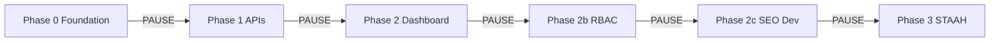
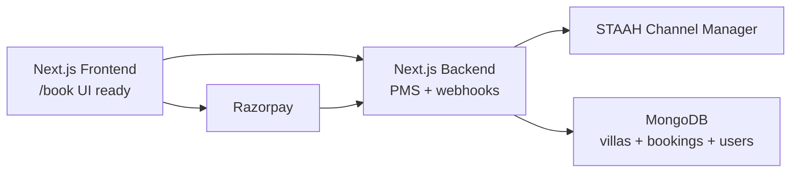
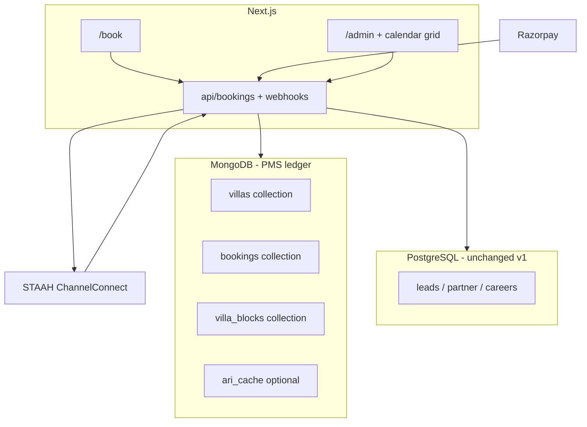
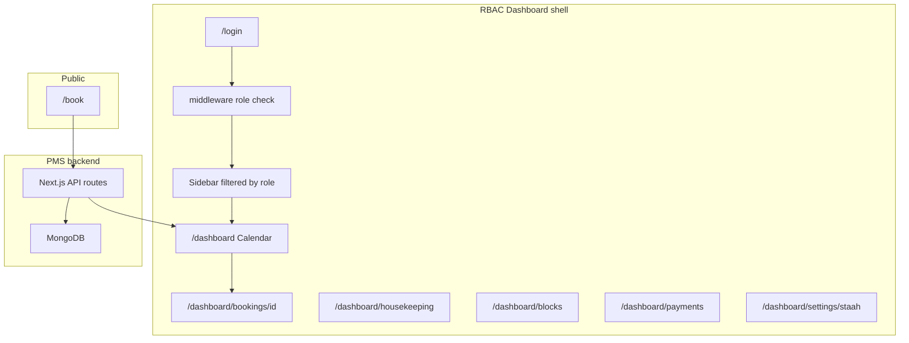
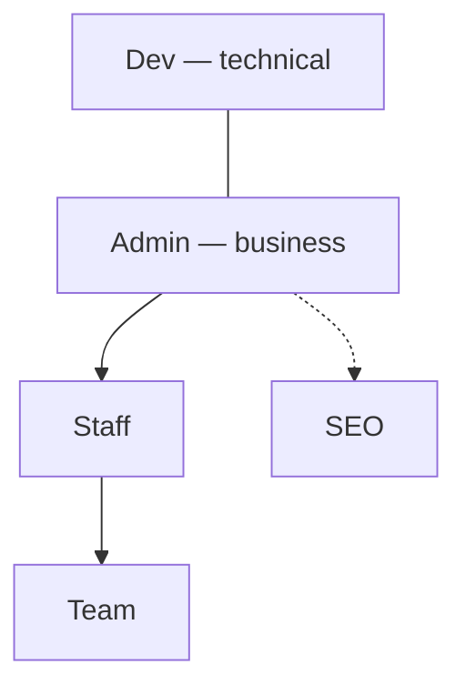

# Custom Villa PMS — MongoDB path (approved)

## Special Note — Execution Mode

> **To the AI executing this plan:**
>
> **Work phase by phase. Pause at every gate.** Do not start Phase N+1 until Phase N checklist passes and the user has had a chance to review (unless they explicitly say “continue without pause”).
>
> Within a phase: automate fully (code, files, routes, stubs). Across phases: **stop, summarize, list what was done + what to test, then wait.**
>
> **For blockers inside a phase:** ask the user, or stub with `// TODO: live credential` + `.env.example` so `npm run build` passes.
>
> **Credentials (provided later):**

| Variable | Status |
|----------|--------|
| `MONGODB_URI` | Provide later |
| `RAZORPAY_KEY_ID` / `RAZORPAY_KEY_SECRET` | Provide later |
| `RAZORPAY_WEBHOOK_SECRET` | Provide later |
| `STAAH_API_KEY` / property mapping | Provide later |
| `NEXTAUTH_SECRET` | Provide later (Phase 2b) |
| `CRON_SECRET` | Provide later (cron routes) |

> Default `BOOKINGS_STORE=postgres` until Phase 1 gate passes with `mongo` in staging.

---

## Phase gates — pause protocol (mandatory)

Each phase ends with: **(1)** short summary, **(2)** test checklist, **(3)** explicit “Phase X complete — ready for Phase Y?”** Do not batch Phase 1+2+2b in one run unless the user asks.



### Phase 0 — Foundation (PAUSE before Phase 1)

**Deliverables:** `bookingDates.ts`, `db/mongo.ts`, Mongoose models (`Villa`, `Booking`, `VillaBlock`), `bookings/store.ts` + postgres impl skeleton, `.env.example` vars, `schema_migration_pms_pending.sql` (postgres `expires_at`), README replica-set note.

**Gate checklist:**

- [ ] `npm run build` passes
- [ ] `npm run test` passes (new `bookingDates` tests)
- [ ] `BOOKINGS_STORE=postgres` unchanged — no behavior change yet

**Pause output:** List files created; confirm Mongo URI not required for this gate.

---

### Phase 1 — PMS APIs (PAUSE before Phase 2)

**Deliverables:** `MongoBookingStore`, wire `POST/GET/PATCH/DELETE` bookings + availability, extend Razorpay webhook, expire-pending cron, STAAH push stub, `isBookingRef` for ObjectId + UUID.

**Gate checklist:**

- [ ] `POST /api/bookings` creates `pending` + `expiresAt`
- [ ] Overlap ignores expired pending
- [ ] `npm run build` + tests green
- [ ] Optional: `BOOKINGS_STORE=mongo` smoke with local Mongo — only if user provided `MONGODB_URI`

**Pause output:** API contract summary; what still uses postgres by default; Razorpay webhook diff (extend only).

---

### Phase 2 — Dashboard + PMS UI (PAUSE before Phase 2b)

**Deliverables:** `/dashboard` layout, calendar grid, `/dashboard/bookings/[id]` folio, housekeeping, blocks; temporary `ADMIN_PASSWORD` gate; `/admin` redirect.

**Gate checklist:**

- [ ] Grid renders villa rows × days from API
- [ ] Folio opens from grid cell
- [ ] Stay status PATCH works
- [ ] Manual block creates unavailable dates on `/book` calendar
- [ ] `npm run build` passes

**Pause output:** Screenshots or routes list; no NextAuth yet.

---

### Phase 2b — RBAC 5 roles (PAUSE before Phase 2c)

**Deliverables:** `User` model, `/login`, NextAuth, `permissions.ts`, middleware, role-filtered sidebar.

**Gate checklist:**

- [ ] Each role sees only allowed sidebar items
- [ ] `/dashboard/dev/*` blocked for staff/seo/team
- [ ] `/dashboard/seo/*` blocked for team/staff
- [ ] Booking APIs use session + `requireRole` (admin/staff write; team read-only on grid)
- [ ] Seed users documented in README

**Pause output:** Matrix spot-check table (5 roles × 3 sample URLs).

---

### Phase 2c — SEO + Dev shells (PAUSE before Phase 3)

**Deliverables:** Route scaffolds under `/dashboard/seo/*` and `/dashboard/dev/*`; API guards; empty states OK.

**Gate checklist:**

- [ ] SEO role reaches blogs route; staff cannot
- [ ] Dev role reaches webhook logs; admin cannot (per matrix)
- [ ] `npm run build` passes

**Pause output:** What is scaffold vs fully wired.

---

### Phase 3 — STAAH live (PAUSE when credentials arrive)

**Deliverables:** ChannelConnect client, inbound push webhook, outbound reservation, `staah-retry` cron.

**Gate checklist:**

- [ ] Sandbox reservation push succeeds
- [ ] Inbound ARI updates availability on `/book`
- [ ] `staahSynced` retry cron runs

**Pause output:** STAAH dashboard config steps for user ops team.

---

### Agent discipline (per phase)

1. Mark plan todos **in_progress** only for the current phase.  
2. Complete gate checklist before marking phase todos **completed**.  
3. End message: **“Phase X done — [checklist]. Proceed to Phase Y?”**  
4. Do not edit later-phase files early “to save time.”

---

## Realistic timeline (solo)

| Sprint | Plan doc | Realistic |
|--------|----------|-----------|
| A — Mongo + APIs | Week 1–2 | **1.5–2 weeks** |
| B — Grid + folio | Week 2–3 | **~2 weeks** |
| C — RBAC | Week 3–4 | **~1 week** |
| STAAH live | Parallel | When partner credentials arrive |

---

# Custom Villa PMS — MongoDB path (approved)

## Confirmed architecture (your summary)



| Layer | Role |
|-------|------|
| **Frontend** | Public booking + staff dashboards (grid, folio, housekeeping) |
| **Backend** | Single source of truth logic, overlap checks, webhook verify, STAAH push |
| **MongoDB** | Villas, bookings, blocks, users (RBAC), optional ARI cache |
| **Razorpay** | `payment.captured` → confirm booking (extend existing webhook) |
| **STAAH** | OTA distribution + inbound OTA reservations (ChannelConnect, not generic REST) |
| **PostgreSQL** | Leads / careers / partner only (v1 dual-DB) |

**Not needed:** New Razorpay modal script — already in [src/lib/payments/razorpayCheckout.ts](src/lib/payments/razorpayCheckout.ts).

---

## Plan verdict (gaps addressed)

| Area | Status |
|------|--------|
| MongoDB + dual DB + extend Razorpay webhook | Solid |
| Race conditions need transactions | Specified below + replica set requirement |
| STAAH wrong REST pattern | Documented — ChannelConnect only |
| **Date format ambiguity** | **Fixed** — `checkIn` / `checkOut` as `YYYY-MM-DD` strings everywhere |
| **Pending hold TTL** | **Fixed** — `expiresAt` + TTL index + overlap excludes expired |
| **STAAH retry job** | **Fixed** — cron spec in Phase 3 |
| **Mongo transactions in dev** | **Fixed** — Atlas replica set or Docker compose replica set |
| **Prod rollback** | **Fixed** — `BOOKINGS_STORE` feature flag |
| RBAC after grid with shared password | Documented window (Phase 2 → 2b) |

---

## Sprint A prerequisites (before coding booking APIs)

Do these **first** in Sprint A — not optional polish.

### 1. Date format (single convention)

**Decision:** Store `checkIn` and `checkOut` as **`YYYY-MM-DD` strings** (same as current PostgreSQL `DATE` and [`src/app/api/bookings/route.ts`](src/app/api/bookings/route.ts) ISO validation).

- Add [`src/lib/bookingDates.ts`](src/lib/bookingDates.ts): `parseBookingDate`, `nightsBetween`, `rangesOverlap(a,b)`, `expandDateRangeToDays` for availability grid.
- **Never** mix `Date` objects with timezone drift in overlap logic.
- Razorpay webhook and STAAH payloads: convert with `.split('T')[0]` only at API boundaries.

### 2. Pending booking TTL (revenue protection)

Without expiry, two guests can block a high-ticket villa while one abandons checkout.

On `POST /api/bookings` (pending):

- `expiresAt: new Date(Date.now() + 15 * 60 * 1000)` (configurable `BOOKING_HOLD_MINUTES`)
- MongoDB TTL index: `{ expiresAt: 1 }, { expireAfterSeconds: 0 }` — Mongo deletes doc when `expiresAt` passes **or** set `status: 'expired'` in a cron if you need audit trail (recommended: **soft expire** via cron + keep doc with `status: 'expired'` instead of hard TTL delete for folio history).

**Recommended v1 (audit-friendly):**

- No TTL auto-delete on whole booking doc.
- Cron every 2 min: `pending` + `expiresAt < now` → `status: 'expired'`, `payment.status: 'failed'`.
- Overlap query **ignores** `pending` where `expiresAt < now` and all `expired` / `cancelled`.

On `payment.captured` webhook: `$unset: { expiresAt }` or set `expiresAt: null`.

### 3. MongoDB replica set (transactions)

`mongoose.startSession()` + transactions **require** a replica set.

- **Production:** MongoDB Atlas (default replica set).
- **Local dev:** `docker-compose` with 1-node replica set **or** Atlas free tier dev cluster — standalone `mongod` will fail or no-op transactions.
- Document in README: `rs.initiate()` for local Docker if not using Atlas.

### 4. Cutover / rollback flag

Env: `BOOKINGS_STORE=postgres | mongo` (default `postgres` until cutover tested).

- Booking routes delegate to `src/lib/bookings/store.ts` interface (`create`, `findOverlap`, `confirmPaid`, …).
- Implement `PostgresBookingStore` (existing SQL) + `MongoBookingStore`.
- Allows revert to PostgreSQL without redeploying UI if Mongo Sprint A breaks `/book`.

---

## Your decision

You chose **migrate to MongoDB/Mongoose** for the PMS booking ledger. That is valid for ~15 whole-villa units with flexible nested `guestDetails` / `payment` objects.

**Plan stance:** MongoDB for **bookings + villa inventory mapping + blocks + STAAH cache**. Keep **PostgreSQL** for existing **leads, careers, partner** tables unless you later unify everything.

---

## What the pasted proposal gets right vs wrong

| Topic | Assessment |
|-------|------------|
| Villa = one grid row (not Room 101) | Correct — use `slug` / `villaId` |
| `pending` → Razorpay → `paid` → STAAH | Correct flow |
| Mongoose compound index on dates | Good — **not sufficient alone** for race conditions (see below) |
| Rewrite entire webhook from scratch | **Unnecessary** — [src/app/api/webhooks/razorpay/route.ts](src/app/api/webhooks/razorpay/route.ts) already verifies HMAC via [src/lib/payments/razorpayWebhookVerify.ts](src/lib/payments/razorpayWebhookVerify.ts) |
| Frontend `window.Razorpay` | **Already done** — [src/lib/payments/razorpayCheckout.ts](src/lib/payments/razorpayCheckout.ts) + [src/app/book/page.tsx](src/app/book/page.tsx) |
| STAAH `fetch('https://staah.net', Bearer ...)` | **Incorrect** — use [STAAH ChannelConnect](https://getapidoc.staah.net/) certified endpoints, `apikey` in body, reservation POST + inbound push ARI; partner onboarding required |
| MongoDB compound index prevents double booking | **Partial** — need **transaction** or unique partial index on overlapping date ranges at confirm time |

---

## Architecture (MongoDB PMS + dual DB)



---

## MongoDB collections (production-shaped)

### 1. `villas` — inventory + STAAH mapping

Maps to your example; slug aligns with frontend `/villas/[id]` and [isRegisteredVillaId](src/lib/security/villaId.ts).

```ts
{
  slug: "magnolia",           // unique index
  name: "Magnolia Villa",
  basePricePerNight: 15000,   // paise or rupees — pick one convention in code
  staah: {
    propertyId: string,
    roomTypeId: string,
    ratePlanId?: string
  },
  status: "active" | "maintenance" | "hidden",
  bookable: true
}
```

Seed from existing `VILLAS` in [src/lib/mockData](src/lib/mockData) + [src/lib/villaBooking.ts](src/lib/villaBooking.ts) non-bookable list.

### 2. `bookings` — PMS heart (corrected schema)

```ts
// src/models/Booking.ts
{
  villaId: ObjectId,
  guestDetails: { name, email, phone },
  checkIn: string,            // REQUIRED "YYYY-MM-DD"
  checkOut: string,           // REQUIRED "YYYY-MM-DD" (exclusive end, same as PG)
  adults, children, pets,
  addOns: string[],
  pricing: { basePaise, addOnPaise, taxPaise, totalPaise },
  payment: {
    gateway: "razorpay",
    orderId: string,
    paymentId?: string,
    status: "pending" | "paid" | "failed" | "refunded"
  },
  status: "pending" | "confirmed" | "cancelled" | "expired",
  expiresAt?: Date,           // set on pending; cleared on paid
  stayStatus?: "upcoming" | "in_house" | "departed" | "turnover" | "ready",
  source: "website" | "staah_airbnb" | "staah_booking_com" | "admin_manual",
  staahSynced: boolean,
  staahSyncAttempts: number,  // default 0
  staahLastError?: string,
  staahReservationId?: string,
  notes: string,
  createdAt, updatedAt
}
```

**Indexes:**

- `{ villaId: 1, checkIn: 1, checkOut: 1 }`
- `{ "payment.orderId": 1 }` unique, sparse
- `{ status: 1, expiresAt: 1 }` for hold expiry cron
- `{ staahSynced: 1, status: 1, staahSyncAttempts: 1 }` for STAAH retry cron
- `{ status: 1, checkIn: 1 }` for admin grid

**Overlap query (single helper used by POST + webhook):**

```ts
// Active holds = confirmed OR (pending AND expiresAt > now)
// Plus villa_blocks for same villa + date range
rangesOverlap(checkIn, checkOut, other.checkIn, other.checkOut)
```

**Double-booking prevention:**

1. `POST /api/bookings`: overlap check → insert `pending` + `expiresAt` (+15 min).
2. `payment.captured` webhook: **transaction** on replica set → overlap again for `paid`/`confirmed` only → confirm or `failed` + refund playbook.
3. Expiry cron: pending past `expiresAt` → `expired` (frees calendar).

### 3. `villa_blocks` — phone/owner holds (not full bookings)

```ts
{ villaId, checkIn, checkOut, reason, createdBy, createdAt }
```

### 4. `booking_charges` (folio extras) — optional v1

```ts
{ bookingId, label, amountPaise, createdAt }
```

---

## Alex books Magnolia — end-to-end (MongoDB version)

1. **Setup:** `villas` doc `slug: magnolia`, `staah.roomTypeId` set after STAAH onboarding.
2. **Book:** `/book` → `GET /api/bookings/availability` reads Mongo aggregations (`bookings` + `villa_blocks` + `ari_cache`).
3. **Hold:** `POST /api/bookings` → insert `pending`, `payment.status: pending`.
4. **Pay:** `POST /api/payments/razorpay-order` links `orderId` on booking doc (same as today’s `razorpay_order_id` on SQL row).
5. **Webhook:** existing route updated to load booking by `payment.orderId`, transactional confirm + `staahSynced: false` → queue STAAH POST.
6. **STAAH:** ChannelConnect reservation API (not generic REST) within 30s; mark `staahSynced: true` on success.
7. **Admin grid:** row = villa name, cells shaded where `payment.status === 'paid'` or `status === 'confirmed'`.

---

## Code migration map (what to rewrite)

| File / area | Action |
|-------------|--------|
| [src/lib/db.ts](src/lib/db.ts) | Add `connectDB()` + Mongoose; keep `pool`/`query` for leads OR split `src/lib/db/pg.ts` + `src/lib/db/mongo.ts` |
| New `src/models/Villa.ts`, `src/models/Booking.ts` | Mongoose schemas as above |
| [src/app/api/bookings/route.ts](src/app/api/bookings/route.ts) | Mongo queries + pending insert |
| [src/app/api/bookings/[id]/route.ts](src/app/api/bookings/[id]/route.ts) | Mongo admin CRUD |
| [src/app/api/bookings/availability/route.ts](src/app/api/bookings/availability/route.ts) | Mongo date expansion (or cache) |
| [src/app/api/webhooks/razorpay/route.ts](src/app/api/webhooks/razorpay/route.ts) | **Extend** — Mongo lookup, transaction, STAAH hook |
| [src/app/api/payments/razorpay-order/route.ts](src/app/api/payments/razorpay-order/route.ts) | Update booking by Mongo `_id` / UUID string |
| [src/app/admin/page.tsx](src/app/admin/page.tsx) | Point fetches at Mongo-backed APIs; add grid view |
| [src/app/book/page.tsx](src/app/book/page.tsx) | Response shape `bookingId` as string ObjectId |
| [schema.sql](schema.sql) bookings table | Deprecate for new writes; migration script optional |
| Leads/careers/partner APIs | **No change** in v1 — stay on PostgreSQL |

**Do not rewrite:** Razorpay Checkout UI, signature verify helper, book page wizard UX (only API response handling).

---

## What the villa PMS does (8 modules)

| # | Module | What it does | Data / API |
|---|--------|--------------|------------|
| 1 | **Booking management** | Create reservation, overlap prevention, lifecycle `pending` → `confirmed` | `POST /api/bookings`, store abstraction |
| 2 | **Payment tracking** | Razorpay order + webhook → `paid` / `failed` | Extend existing webhook; folio shows IDs |
| 3 | **Calendar grid** | Villas × days visual occupancy | `GET /api/bookings` + blocks; grid UI |
| 4 | **Folio** | One file per booking: guest, money, notes, extras | `/dashboard/bookings/[id]` |
| 5 | **Stay status** | `upcoming` → `in_house` → `departed` → `turnover` → `ready` | PATCH booking `stayStatus` |
| 6 | **Manual blocks** | Owner holds, walk-in blocks without fake guests | `villa_blocks` + `/dashboard/blocks` |
| 7 | **OTA sync (STAAH)** | Push direct bookings; pull Airbnb/Booking.com | ChannelConnect + crons |
| 8 | **Staff roles (RBAC)** | Admin / Staff / Team / SEO / Dev on same dashboard | Phase 2b–2c — NextAuth |

**One line:** Who is in which villa, when, paid how much, and operational status — not WhatsApp + Excel.

---

## PMS lives inside the RBAC dashboard (one product)

The **dashboard is the shell**; **RBAC is security**; **PMS is logic + MongoDB**. Not three separate apps.



### Role hierarchy (5 roles)



**Dev and Admin are parallel at the top** — Dev owns technical surfaces; Admin owns business ops. Neither role blocks the other in middleware (union of permissions per route).

| Role | Owns |
|------|------|
| **admin** | Full business control |
| **dev** | Full technical control (logs, webhooks, DB explorer, debug) |
| **seo** | Blogs, landing pages, meta, sitemap, analytics |
| **staff** | Day-to-day bookings and guests |
| **team** | Housekeeping / stay status only (`assignedVillas` optional) |

Legend: ✅ write · 👁️ read-only · ❌ no access

### Full permission matrix

| Dashboard area | Admin | Staff | Team | SEO | Dev |
|----------------|:-----:|:-----:|:----:|:---:|:---:|
| PMS — Calendar grid | ✅ | ✅ | 👁️ | ❌ | ✅ |
| PMS — Folio / booking detail | ✅ | ✅ | ❌ | ❌ | ✅ |
| PMS — Manual booking / block | ✅ | ✅ | ❌ | ❌ | ❌ |
| PMS — Housekeeping / stay status | ✅ | ✅ | ✅ | ❌ | 👁️ |
| Payments / Razorpay logs | ✅ | ❌ | ❌ | ❌ | ✅ |
| Villa pricing / settings | ✅ | ❌ | ❌ | ❌ | 👁️ |
| STAAH integration settings | ✅ | ❌ | ❌ | ❌ | ✅ |
| Staff management | ✅ | ❌ | ❌ | ❌ | ✅ |
| Blog create / edit / delete | ✅ | ❌ | ❌ | ✅ | 👁️ |
| Landing pages edit | ✅ | ❌ | ❌ | ✅ | 👁️ |
| Meta tags / SEO settings | ✅ | ❌ | ❌ | ✅ | 👁️ |
| Sitemap management | ✅ | ❌ | ❌ | ✅ | ✅ |
| Analytics & traffic | ✅ | ❌ | ❌ | ✅ | ✅ |
| API logs | ❌ | ❌ | ❌ | ❌ | ✅ |
| System config viewer | ❌ | ❌ | ❌ | ❌ | ✅ |
| Database query explorer | ❌ | ❌ | ❌ | ❌ | ✅ |
| Error logs / debug panel | ❌ | ❌ | ❌ | ❌ | ✅ |
| Razorpay webhook logs | ❌ | ❌ | ❌ | ❌ | ✅ |

Implement via [`src/lib/auth/permissions.ts`](src/lib/auth/permissions.ts): `type Role = "admin"|"staff"|"team"|"seo"|"dev"` and `canAccess(path, role): "write"|"read"|"none"`.

### Dashboard URL map (all roles)

| URL | Roles | Module |
|-----|-------|--------|
| `/login` | public | — |
| `/dashboard` | admin, staff, team (👁️), dev | Calendar grid |
| `/dashboard/bookings/[id]` | admin, staff, dev | Folio |
| `/dashboard/housekeeping` | admin, staff, team | Stay status |
| `/dashboard/blocks` | admin, staff | Manual blocks |
| `/dashboard/payments` | admin, dev | Razorpay logs |
| `/dashboard/settings/villas` | admin | Villa pricing |
| `/dashboard/settings/staah` | admin, dev | STAAH config |
| `/dashboard/staff` | admin, dev | User accounts |
| `/dashboard/seo` | admin (👁️), seo | SEO hub |
| `/dashboard/seo/blogs`, `.../new`, `.../[id]/edit` | admin (👁️), seo | Blogs CMS |
| `/dashboard/seo/landing-pages` | admin (👁️), seo | Landing pages |
| `/dashboard/seo/meta` | admin (👁️), seo | Meta tags |
| `/dashboard/seo/sitemap` | admin (👁️), seo, dev | Sitemap |
| `/dashboard/seo/analytics` | admin (👁️), seo, dev | Analytics |
| `/dashboard/dev` | dev | Dev hub |
| `/dashboard/dev/logs/api` | dev | API logs |
| `/dashboard/dev/logs/webhooks` | dev | Razorpay + STAAH webhooks |
| `/dashboard/dev/logs/errors` | dev | Errors |
| `/dashboard/dev/system` | dev | Config viewer (redacted secrets) |
| `/dashboard/dev/database` | dev | Mongo read-only explorer |
| `/dashboard/dev/debug` | dev | Debug panel |

**Legacy:** [`/admin`](src/app/admin/page.tsx) → redirect to `/dashboard` when dashboard ships.

### Sidebar by role (nav config)

Single config array in [`src/components/dashboard/Sidebar.tsx`](src/components/dashboard/Sidebar.tsx) — filter by `session.user.role`:

- **Admin:** Calendar, Bookings, Housekeeping, Payments, Villa Settings, STAAH, Staff  
- **Staff:** Calendar, Bookings, Housekeeping, Manual Blocks  
- **Team:** Calendar (read), Housekeeping  
- **SEO:** Blogs, Landing Pages, Meta Tags, Sitemap, Analytics  
- **Dev:** Calendar (read), Payments, STAAH, Staff, API Logs, Webhook Logs, Error Logs, System Config, Database Explorer, Debug Panel  

**Note:** Admin sees SEO/Dev items only where matrix shows 👁️ or ✅ — optional “superuser” expansion: Admin gets 👁️ on SEO routes + no Dev routes unless you want Admin to see Dev (matrix says ❌ for Admin on dev tools).

### End-to-end flow (integrated)

```
Guest /book → MongoDB pending → Razorpay → webhook confirm → STAAH queue
     ↓
Staff /login → /dashboard grid → click cell → /dashboard/bookings/[id] folio
     ↓
Team /dashboard/housekeeping → stayStatus turnover → ready
```

---

## Build phases (integrated: PMS first, RBAC wraps second)

### Phase 0 — Mongo foundation (week 1)

- Sprint A prerequisites (dates helper, replica set docs, `BOOKINGS_STORE`, hold minutes env)
- `npm install mongoose`
- `MONGODB_URI`, `BOOKING_HOLD_MINUTES=15`, `BOOKINGS_STORE=postgres|mongo` in `.env.example`
- [`src/lib/db/mongo.ts`](src/lib/db/mongo.ts) + keep [`src/lib/db.ts`](src/lib/db.ts) PG pool
- Models: `Villa`, `Booking` (schema above), `VillaBlock`
- [`src/lib/bookingDates.ts`](src/lib/bookingDates.ts) + [`src/lib/bookings/store.ts`](src/lib/bookings/store.ts) abstraction
- Seed `villas` from catalog

### Phase 1 — API cutover (week 1–2)

- `MongoBookingStore` + wire routes when `BOOKINGS_STORE=mongo`
- Pending → paid lifecycle + `expiresAt` clear on webhook
- Cron: `GET /api/cron/expire-pending-bookings` (protect with `CRON_SECRET`) — mark expired holds
- Extend Razorpay webhook (transaction + overlap + enqueue STAAH)
- Vitest: overlap with expired pending ignored, concurrent confirm mock, date parser edge cases

### Phase 2 — Dashboard shell + PMS UI (week 2–3)

**Password guard only** (`ADMIN_PASSWORD` / existing header) until Phase 2b.

- `src/app/dashboard/layout.tsx` — sidebar + main content
- `src/components/dashboard/Sidebar.tsx` — nav items (all visible until RBAC filters)
- `/dashboard` — calendar grid (villa rows × day columns; labels like `[ALEX]`, `[HOLD]`)
- `/dashboard/bookings/[id]` — folio page
- `/dashboard/housekeeping` — stay status board (today in/out + turnover)
- `/dashboard/blocks` — create/list `villa_blocks`
- Redirect or link from legacy [`/admin`](src/app/admin/page.tsx)

### Phase 2b — RBAC (5 roles) + login (week 3–4)

Replace shared [`ADMIN_PASSWORD`](src/lib/security/adminAuth.ts) with **NextAuth Credentials** + MongoDB `users`. Permission matrix and URLs are defined in **Full permission matrix** above (admin / staff / team / seo / dev).

#### MongoDB `users` schema

```ts
// src/models/User.ts
{
  name: string,
  email: string,              // unique index
  passwordHash: string,
  role: "admin" | "staff" | "team" | "seo" | "dev",
  assignedVillas?: ObjectId[]   // team only
}
```

Bootstrap seeds: at least one `admin` + one `dev` account.

#### Implementation

- [`src/lib/auth/permissions.ts`](src/lib/auth/permissions.ts) — matrix as code; `canAccess(path, role): "write" | "read" | "none"`
- [`src/lib/auth/requireRole.ts`](src/lib/auth/requireRole.ts) — API route guard
- [`src/components/dashboard/Sidebar.tsx`](src/components/dashboard/Sidebar.tsx) — nav filtered per role (see **Sidebar by role** above)
- Middleware: `/dashboard/dev/*` → dev only; `/dashboard/seo/*` → seo (+ admin read where 👁️); STAAH/payments → admin + dev

#### Migration from current admin

1. Phase 2: temporary `ADMIN_PASSWORD` on dashboard.  
2. Phase 2b: `/login` + five roles + middleware.  
3. Remove `x-admin-password` from booking APIs after staff onboarding.

### Phase 2c — SEO + Dev shells (week 4–5)

Scaffold routes under `/dashboard/seo/*` and `/dashboard/dev/*` with API guards (empty states OK in v1).

- **SEO:** blogs list/edit, landing pages, meta, sitemap, analytics — v1 can wrap existing [`src/data/blogs.ts`](src/data/blogs.ts) then move to Mongo `content_posts`
- **Dev:** API logs, webhook logs (Razorpay + STAAH), errors, system config (no secrets), Mongo read-only explorer, debug panel

### Phase 3 — STAAH (parallel with STAAH partner process)

- Store `staah` ids on `villas`
- Inbound push webhook → `ari_cache`
- Outbound reservation on confirm (inline try + `staahSynced: false` on failure)

**STAAH retry job (required — not optional):**

| Item | Spec |
|------|------|
| Trigger | Vercel Cron / Hostinger cron → `GET /api/cron/staah-retry` every **5 minutes** |
| Auth | Header `Authorization: Bearer ${CRON_SECRET}` |
| Query | `status: 'confirmed'`, `staahSynced: false`, `staahSyncAttempts < 10` |
| Action | Call [`src/lib/staah/pushReservation.ts`](src/lib/staah/pushReservation.ts); on success `staahSynced: true`; on fail increment `staahSyncAttempts`, set `staahLastError` |
| Alerting | If `staahSyncAttempts >= 3`, log error + optional email to `BOOKING_NOTIFY_EMAIL` |
| Idempotency | Pass stable `externalBookingId` = Mongo `_id` to STAAH |

- Inbound OTA booking creates `bookings` with `source: staah_*`, `payment.status: paid` or N/A

### Phase 4 — Data migration + cleanup

- One-time script: copy `bookings` rows from PostgreSQL → Mongo if production data exists
- Stop writing to PG `bookings`; document in README

---

## Risks and mitigations (15+ luxury villas)

| Risk | Mitigation |
|------|------------|
| Race: two guests same villa/dates | Transaction on webhook confirm + overlap query on pending create |
| Abandoned pending holds | `expiresAt` + expire cron; overlap ignores expired pending |
| STAAH outage after pay | `staahSynced: false` + **5-min retry cron** + `staahSyncAttempts` / `staahLastError` |
| Split DB (Mongo + PG) | `BOOKINGS_STORE` flag + store abstraction |
| Mongo txn fails locally | Replica set in dev (Atlas or Docker) — document in README |
| Date timezone bugs | `YYYY-MM-DD` strings only in overlap/availability |
| RBAC window (shared password) | Phase 2 only; Phase 2b before external staff; document in ops runbook |
| Large replatform delay | Default `BOOKINGS_STORE=postgres`; flip to `mongo` after E2E pass |

---

## What we will NOT do in this plan

- Full Cloudbeds/Opera-class PMS
- Per-bedroom sellable inventory inside one villa (unless product changes)
- Copy-paste STAAH example with wrong URL/auth
- Replace Razorpay frontend that already works
- Migrate leads/careers to Mongo in v1

---

## Types update ([src/lib/types.ts](src/lib/types.ts))

When Mongo cutover happens:

- `bookingId`: `string` (ObjectId hex), not SQL UUID (or support both during migration)
- Add `BookingDocument`, `VillaDocument`, `UserRole` types
- `BookingPayload` unchanged for `/book` — API layer maps to Mongoose docs
- Guest-facing types stay stable; admin types gain `stayStatus`, `payment.status`, `source`

---

## Immediate next step after plan approval

**Sprint A (data + bookings):**

0. Prerequisites: `bookingDates.ts`, replica set, `BOOKINGS_STORE`, hold expiry cron spec  
1. `MONGODB_URI` + `Booking` model with `expiresAt` / `staahSyncAttempts`  
2. `bookings/store.ts` (postgres + mongo implementations)  
3. Rewrite booking APIs + extend Razorpay webhook (transaction + overlap + clear `expiresAt`)  
4. Expire-pending cron route  
5. Flip `BOOKINGS_STORE=mongo` in staging; E2E `/book` → pay → admin list  
6. Keep postgres fallback until production sign-off

**Sprint B (dashboard + PMS UI):**

5. `/dashboard` layout + calendar grid + folio routes
6. Housekeeping + manual blocks pages
7. Deprecate or redirect `/admin`

**Sprint C (RBAC 5 roles + SEO/Dev shells):**

8. `/login` + NextAuth + `permissions.ts` + middleware
9. Sidebar per role (admin / staff / team / seo / dev)
10. `/dashboard/seo/*` and `/dashboard/dev/*` scaffold + API guards
11. STAAH when partner API credentials arrive

> **Build order rule:** PMS backend APIs first → dashboard pages second → RBAC wraps the dashboard third. STAAH parallel when credentials arrive.

Say **execute Phase 0** (or **execute the plan**) in **Agent mode** to begin — one phase per session unless you say **continue all phases**.

Plan mode can only edit this document; implementation requires Agent mode.

**You do not need** a new Razorpay checkout script unless the current modal regresses during Mongo cutover.

---

## Post-review status (locked)

| Item | Status |
|------|--------|
| Core flow (pending → Razorpay → confirm → STAAH queue) | Approved |
| 4 Sprint A gaps (dates, TTL, replica set, STAAH cron) | In plan |
| Module confidence table | Grid/folio/availability high; STAAH external |
| `mongoose` npm package | Installed locally — wire-up pending Agent mode |
| Implementation | **Blocked in Plan mode** — awaiting Agent execution |
