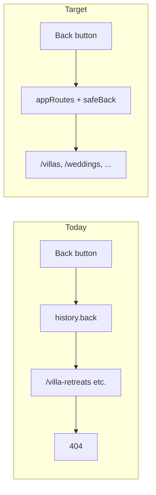

# Fix invalid navigation (no redirects)

## Your direction

- **Do not** add 301/302 redirects in [`next.config.mjs`](next.config.mjs).
- **Remove** invalid/dead route usage (`/villa-retreats`, wrong villa slugs).
- **Use only active App Router paths** and a single **routing module** keyed by experience/category keywords (same idea as menu tabs: Weddings → `/weddings`, Party → `/party-villas`, etc.).
- **Back buttons** must navigate to a **known active route**, not `history.back()` into a dead stack entry.

## Root cause (unchanged)

| Issue | Cause |
|-------|--------|
| `/villa-retreats` 404 | Route tree **does not exist on disk** (canonical listing is `/villas`). Nothing in tracked `src` links there today—404 is from old history/bookmarks or stale dev index. |
| Back → 404 | [`page.tsx`](src/app/villas/[id]/page.tsx) and others call `window.history.back()` / `router.back()` with no validation. |
| Forward 404 | [`FeaturedVillas.tsx`](src/components/FeaturedVillas.tsx): `/villas/dome-villa`, `/villas/retreat-on-ridge` (ids are `dome-villas`, `retreat-on-the-ridge`). |



---

## Active routes (source of truth)

Only these top-level segments exist under [`src/app/`](src/app/) on disk:

| Keyword / intent | Active path |
|------------------|-------------|
| Home | `/` |
| Villa directory (all retreats) | `/villas` |
| Villa detail | `/villas/[id]` |
| Villa spaces | `/villas/[id]/spaces` |
| Weddings | `/weddings` |
| Party | `/party-villas` |
| Corporate | `/corporate-retreats` |
| Weekend | `/weekend-getaways` |
| Experiences | `/experiences` |
| Menu | `/menu` |
| Book | `/book` |
| Blogs, about, contact, careers, caravans, wishlist, policies | existing folders |

**Forbidden (do not link, route, or back-navigate to):**

- `/villa-retreats`, `/villa-retreats/*`
- `/party-villa-retreats`
- Any `/villas/{slug}` where `slug` is not a real `VILLAS[].id`

If phantom folders appear in the IDE (`src/app/villa-retreats/`) but are not on disk, **do not recreate them**; ensure no imports reference them.

---

## Implementation plan

### 1. Central route registry — `src/lib/appRoutes.ts`

Single module (no redirects) exporting:

**Path builders**

- `villaListingPath(query?: { category?: string })` → `/villas` or `/villas?category=...`
- `villaDetailPath(id: string)` → `/villas/${id}`
- `villaSpacesPath(id: string)` → `/villas/${id}/spaces`
- `bookPath(villaId?: string)` → `/book` or `/book?villa=...`

**Experience keyword map** (align with [`menu/page.tsx`](src/app/menu/page.tsx) `villaCategoryHref`):

```ts
export const VILLA_CATEGORY_ROUTE: Record<string, string> = {
  All: "/villas",
  Weddings: "/weddings",
  "Pre-wedding": "/weddings",
  "Corporate Retreats": "/corporate-retreats",
  "Weekend Getaways": "/weekend-getaways",
  "Party Venues": "/party-villas",
  "Wellness Retreats": "/villas?category=Wellness Retreats",
};
export function categoryToListingPath(category: string): string { ... }
```

**Validation**

- `isActiveAppPath(pathname: string): boolean` — pathname must match allowlist prefixes above.
- `isForbiddenPath(pathname: string): boolean` — block `villa-retreats`, `party-villa-retreats`.
- `isValidVillaId(id: string): boolean` — check against `VILLAS` from mock data.

**Optional:** `resolveVillaDetailBackTarget()` / `resolveSpacesBackTarget(id)` for back buttons.

### 2. Safe back navigation — `src/lib/safeBackNavigation.ts`

- **`useSafeBack(fallbackPath: string)`** → `router.push(target)` only (never blind `history.back()`).
- Resolve target: explicit fallback → same-origin `referrer` if `isActiveAppPath` → else fallback.
- Never push to `isForbiddenPath`.
- Optional: set `sessionStorage` `jade:listingReturn` when clicking internal links to villa detail (from `VillaCard`, menu) for more accurate back on detail page.

| File | Fallback via `appRoutes` |
|------|--------------------------|
| [`src/app/villas/[id]/page.tsx`](src/app/villas/[id]/page.tsx) | `villaListingPath()` |
| [`src/app/villas/[id]/spaces/page.tsx`](src/app/villas/[id]/spaces/page.tsx) | `villaDetailPath(id)` |
| [`src/app/book/page.tsx`](src/app/book/page.tsx) | `villaListingPath()` |
| [`src/components/ScrollSectionComposer.tsx`](src/components/ScrollSectionComposer.tsx) | `/experiences` or `/` (per page) |
| [`src/components/CorporateHeader.tsx`](src/components/CorporateHeader.tsx) | `/corporate-retreats` |

Overlays: keep `onClose` only (no URL change).

### 3. Fix invalid links at source (not redirects)

| Task | Detail |
|------|--------|
| **Featured villas** | [`FeaturedVillas.tsx`](src/components/FeaturedVillas.tsx) — use `domeVillas.id`, `retreat-on-the-ridge` id from [`src/data/retreats/`](src/data/retreats/) via `villaDetailPath()`. |
| **Grep sweep** | Replace stray `/villas/dome-villa`, `/villas/retreat-on-ridge`, any `villa-retreats` string in `src/`. |
| **Menu** | Replace local `villaCategoryHref` duplicate with `categoryToListingPath` from `appRoutes`. |
| **Footer / nav** | Already `/villas`; verify no dead paths. |

### 4. Automated guards (Vitest)

[`src/lib/__tests__/appRoutes.test.ts`](src/lib/__tests__/appRoutes.test.ts):

1. Every static `` `/villas/...` `` string in `src/**/*.tsx` must match a real `VILLAS` id (or be dynamic template).
2. No `villa-retreats` or `party-villa-retreats` in `src/`.
3. `categoryToListingPath` returns only `isActiveAppPath` results for known categories.

### 5. Navbar fix

[`Navbar.tsx`](src/components/Navbar.tsx): detail regex `/VILLAS/` → `/villas/` (lowercase).

### 6. QA (no redirect test cases)

1. Featured carousel → opens real villa detail (no 404).
2. Villa detail back → `/villas` (not 404), even with polluted browser history.
3. Spaces back → `/villas/[id]`.
4. Menu category tabs → correct experience pages per keyword.
5. Typing `/villa-retreats` manually may still 404 (expected without redirects)—in-app navigation must never send users there.

Run: `npx tsc --noEmit`, targeted Vitest.

---

## Explicitly out of scope

- **301/302 in `next.config.mjs`** (per your request).
- Re-adding `/villa-retreats` as a duplicate route tree.
- Overlay shell / close button structure changes.

## Files to touch

| File | Change |
|------|--------|
| `src/lib/appRoutes.ts` | **New** — active routes + keyword map + validators |
| `src/lib/safeBackNavigation.ts` | **New** — safe back hook |
| [`src/components/FeaturedVillas.tsx`](src/components/FeaturedVillas.tsx) | Correct villa paths |
| [`src/app/menu/page.tsx`](src/app/menu/page.tsx) | Use shared category map |
| Villa detail, spaces, book, ScrollSectionComposer, CorporateHeader | Safe back |
| [`src/components/Navbar.tsx`](src/components/Navbar.tsx) | Regex fix |
| `src/lib/__tests__/appRoutes.test.ts` | Guards |

**Not changed:** [`next.config.mjs`](next.config.mjs) redirects array.
