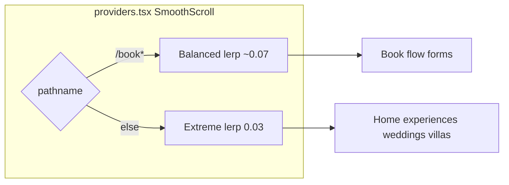

# Global premium Lenis (extreme + book balanced)

## Goal

Apply **extreme Lenis** (`lerp: 0.03`, syncTouch, etc.) across the **entire app**, including:

- Home sticky sections (philosophy + experiences carousel)
- **Villa detail** (`/villas/[id]`, spaces, sticky tabs, horizontal amenity/gallery rails)
- **All form surfaces** (contact, careers multipart, enquiry overlays, book steps)

**Exception (your choice):** `/book` and `/book/*` use a **balanced preset** (`lerp ~0.07`) — still smoother than native, but less floaty for date pickers, payment, and multi-step forms.

Do **not** change scroll-lock animation math in sticky carousel sections or `another-experience-1` CSS timelines.

---

## Preset routing

| Preset | Routes | lerp (approx) | Why |
|--------|--------|---------------|-----|
| **extreme** | Default — all routes except book | 0.03 | Maximum silk |
| **balanced** | `/book`, `/book/success`, etc. | 0.07 | Forms/payment: premium but responsive |

**Implementation:** single `SmoothScroll` in [`src/app/providers.tsx`](src/app/providers.tsx) using `usePathname()`; re-init Lenis when preset changes on navigation (effect deps include pathname). **Do not** nest a second Lenis in [`src/app/book/layout.tsx`](src/app/book/layout.tsx) (server metadata layout stays as-is).

Remove duplicate [`src/app/weddings/layout.tsx`](src/app/weddings/layout.tsx) client Lenis wrapper.

---

## Scope you asked for

| Area | Included | Notes |
|------|----------|-------|
| Villa detail sticky tabs | Yes (extreme) | [`VillaDetailStickyTabs`](src/components/villa/VillaDetailStickyTabs.tsx), [`CategoryTabRail`](src/components/ui/CategoryTabRail.tsx) — already `data-lenis-prevent` / `jade-hscroll-track` |
| Villa detail panels / overlays | Yes | Vertical scroll in overlays: `data-lenis-prevent`; optional nested panel Lenis unchanged |
| Book page forms | Yes (**balanced**) | [`src/app/book/page.tsx`](src/app/book/page.tsx) — inner scroll roots already `data-lenis-prevent` |
| Contact / careers forms | Yes (extreme) | Scrollable form panels keep `data-lenis-prevent` |
| Home Section 2 philosophy | Yes (extreme) | [`UnifiedScrollSection`](src/components/UnifiedScrollSection.tsx) — do not edit scroll math |
| Last experiences 800vh block | Yes (extreme) | [`HorizontalScrollSection`](src/components/HorizontalScrollSection.tsx), [`ExperiencesScrollSection`](src/components/ExperiencesScrollSection.tsx) — do not edit panel math |
| `/book` only | Balanced preset | Recommended compromise — not excluded |

**Is leaving book on native scroll OK?** Yes, but you chose **balanced Lenis on book** instead — better consistency (still premium) with less form lag than extreme.

---

## Scroll-lock sections (do not change logic)

| Section | File |
|---------|------|
| Home philosophy | [`ScrollSectionComposer`](src/components/ScrollSectionComposer.tsx) via [`UnifiedScrollSection`](src/components/UnifiedScrollSection.tsx) |
| Home / experiences carousel | [`HorizontalScrollSection`](src/components/HorizontalScrollSection.tsx), [`ExperiencesScrollSection`](src/components/ExperiencesScrollSection.tsx) |
| Demo SDA page | [`AnotherExperienceOneClient`](src/app/experiences/another-experience-1/AnotherExperienceOneClient.tsx) |

**Do not** add `data-lenis-prevent` on outer `h-[800vh]` wrappers (breaks vertical scroll-jacking).

**Allowed:** `scrollEffects="performance"` + static `LiveBackground` on philosophy section (perf only).

---

## Horizontal manual scroll (mobile + tablet)

| Action | File |
|--------|------|
| Keep `allowNestedScroll: true` | [`SmoothScroll.tsx`](src/components/SmoothScroll.tsx) |
| Assurance selectors | [`HScrollTouchAssurance.tsx`](src/components/HScrollTouchAssurance.tsx) — add `#experience-sda-scroller` |
| Demo scroller | `data-lenis-prevent` on both scroller divs in AnotherExperienceOneClient (attribute only) |
| Villa tabs / blogs / rails | Audit — [`HorizontalScrollRail`](src/components/ui/HorizontalScrollRail.tsx), [`BlogSection`](src/components/BlogSection.tsx), villa detail already covered |
| CSS | [`globals.css`](src/app/globals.css) — `touch-action: pan-x` on coarse pointers |

---

## Config files

- [`src/lib/lenisConfig.ts`](src/lib/lenisConfig.ts) — `EXTREME_*` (current WEDDINGS_*), new `BALANCED_*` (lerp 0.07, wheel 0.92, syncTouchLerp 0.06, shorter anchor duration)
- [`src/components/SmoothScroll.tsx`](src/components/SmoothScroll.tsx) — presets `extreme` | `balanced`; pathname resolver; global resize bursts
- [`src/lib/lenis.ts`](src/lib/lenis.ts) — `getScrollPresetFromPath(pathname)` for scrollTo durations

---

## Test matrix

| Route | Preset | Check |
|-------|--------|-------|
| `/` philosophy + 800vh block | extreme | Sticky progress; no jitter |
| `/villas/[id]` tabs + amenity row | extreme | Horizontal swipe on phone |
| `/book` steps | balanced | Forms usable; no extreme float |
| `/contact`, `/careers` | extreme | Panel scroll + page scroll |
| `/experiences/another-experience-1` | extreme | Horizontal pan not stolen |
| `prefers-reduced-motion` | off | Native scroll |

---

## Risks

| Risk | Mitigation |
|------|------------|
| Extreme lag on villa long pages | Accept or later raise villa detail to balanced (not in scope unless requested) |
| Book still slightly laggy | Balanced preset; inner panels `data-lenis-prevent` |
| Double Lenis on weddings | Remove weddings layout wrapper |
| Preset switch on navigate | Destroy/recreate Lenis in effect when pathname crosses `/book` |

---

## Files to touch

- [`src/app/providers.tsx`](src/app/providers.tsx)
- [`src/app/weddings/layout.tsx`](src/app/weddings/layout.tsx) — remove client Lenis
- [`src/lib/lenisConfig.ts`](src/lib/lenisConfig.ts)
- [`src/components/SmoothScroll.tsx`](src/components/SmoothScroll.tsx)
- [`src/lib/lenis.ts`](src/lib/lenis.ts)
- [`src/components/HScrollTouchAssurance.tsx`](src/components/HScrollTouchAssurance.tsx)
- [`AnotherExperienceOneClient.tsx`](src/app/experiences/another-experience-1/AnotherExperienceOneClient.tsx)
- [`UnifiedScrollSection.tsx`](src/components/UnifiedScrollSection.tsx) — perf props only

**Not editing:** HorizontalScrollSection / ExperiencesScrollSection panel transform math; experience-sda.css timelines.
