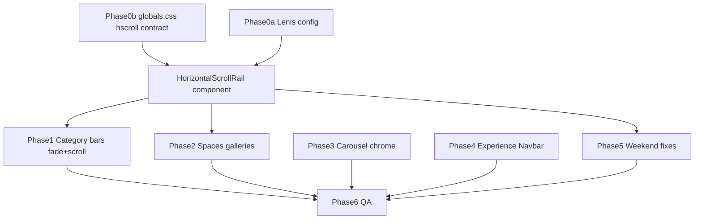

# Mobile scroll, category fades, carousel chrome, and experience pages

## Scope from your list

| # | Request | Primary files |
|---|---------|---------------|
| 3 | Amenities Highlights block — horizontal scroll broken | [`VillaDetailAmenityHighlights.tsx`](src/components/villa/VillaDetailAmenityHighlights.tsx), [`globals.css`](src/app/globals.css) `.amenity-highlight-track--responsive`, venue overlays using `amenityHighlightTrackOverlay` |
| 4 | Right-edge **fade** (not hard cut) on category bars + bars not scrolling | [`VillaDetailStickyTabs.tsx`](src/components/villa/VillaDetailStickyTabs.tsx), [`VillaExperienceStickyTabs`](src/components/experience/VillaExperienceOverlayLayout.tsx), [`spaces/page.tsx`](src/app/villas/[id]/spaces/page.tsx) nav |
| 5 | Spaces **pictures** not scrollable | [`spaces/page.tsx`](src/app/villas/[id]/spaces/page.tsx) ~234 horizontal gallery rows |
| 6 | Experience + Spaces image nav → **VillaCard / listing hero** bottom in-frame controls | [`VillaDetailExperienceCarousel.tsx`](src/components/villa/VillaDetailExperienceCarousel.tsx), [`page.tsx`](src/app/villas/[id]/page.tsx) Spaces block ~853–886 |
| 8 | Experience landing headers → **global Navbar** logic | [`CorporateHeader.tsx`](src/components/CorporateHeader.tsx) vs [`Navbar.tsx`](src/components/Navbar.tsx); pages using CorporateHeader |
| 9 | Weekend villas section frame not scrollable | [`WeekendThemedVillasSection.tsx`](src/components/weekend/WeekendThemedVillasSection.tsx) |
| 10 | Weekend page — **remove last section** | [`weekend-getaways/page.tsx`](src/app/weekend-getaways/page.tsx) lines ~146–166 (`PLAN YOUR WEEKEND` CTA) |

Items 1–2 from the earlier horizontal-scroll investigation remain part of the story; **`globals.css` is an equally important layer** that the first plan under-documented (see Phase 0b below).

---

## Phase 0 — Why horizontal scroll fails (two layers)

### 0a — JavaScript: Lenis on mobile

**Lenis `syncTouch`** is enabled on coarse pointers in [`SmoothScroll.tsx`](src/components/SmoothScroll.tsx) via [`lenisSyncTouchEnabled()`](src/lib/lenisConfig.ts). Touch on nested `overflow-x-auto` rails competes with vertical smooth scroll.

Imported [`lenis/dist/lenis.css`](node_modules/lenis/dist/lenis.css) only helps when the scroll root has `data-lenis-prevent` (sets `overscroll-behavior: contain` on those nodes).

**JS fixes:**

- Prefer Lenis `allowNestedScroll: true` **or** upgrade to `lenis@>=1.3.18` and use `data-lenis-prevent-horizontal` per [Lenis nested scroll docs](https://github.com/darkroomengineering/lenis).
- On every horizontal scroll root in markup: `data-lenis-prevent` (or `data-lenis-prevent-touch` after device testing).

### 0b — CSS: [`globals.css`](src/app/globals.css) horizontal scroll contract (main gap you flagged)

The site maintains **two separate horizontal-scroll systems** in global CSS. Category bars use `.jade-hscroll-track`; **Amenities Highlights use a different block** (`.amenity-highlight-track--responsive`) that never received the same mobile/touch/Lenis-related treatment.

| Rule / block | Location | Effect on mobile horizontal scroll |
|--------------|----------|-----------------------------------|
| **`.amenity-highlight-track--responsive`** | ~239–252 | Has `overflow-x: auto`, `-webkit-overflow-scrolling: touch`, snap — but **no `touch-action: pan-x`**, not merged with `.jade-hscroll-track`, no documented pairing with `data-lenis-prevent` |
| **`.amenity-highlight-viewport` mobile** | ~277–283 | `width: 100vw` + `margin-left/right: calc(50% - 50vw)` full-bleed breakout — fights **`body { overflow-x: hidden }`** (~441) and [`layout.tsx`](src/app/layout.tsx) `overflow-x-hidden`; can clip or confuse touch targeting on iOS |
| **`.jade-hscroll-track`** | ~553–558 | Has momentum scroll + `overscroll-behavior-x: contain` but **missing `touch-action: pan-x`** and default **`min-width: 0`** for flex children |
| **`[data-lenis-prevent]` globals** | ~384–396 | Only targets **`.overflow-y-auto` / `.overflow-y-scroll`** — **no horizontal mirror** for `.overflow-x-auto` rails |
| **`* { scrollbar-width: none !important }`** | ~344–352 | Hides scrollbars on **every** element — scroll still works but users get no visual hint that a row is scrollable |
| **`body { overflow-x: hidden; max-width: 100% }`** | ~439–442 | Page-level clip; nested scrollers should still work, but combined with 100vw amenity breakout and missing `min-w-0` in flex parents, rows often **look** broken or don’t receive gestures |
| **`.jade-scroll-chrome { contain: layout style }`** | ~374–377 | Applied on **sticky tab shells** ([`VillaDetailStickyTabs`](src/components/villa/VillaDetailStickyTabs.tsx), [`MenuPanelTabs`](src/components/menu/MenuPanelTabs.tsx)) wrapping horizontal tracks — audit on iOS Safari; if nested scroll fails, split into `jade-scroll-chrome` (navbar only) vs `jade-hscroll-chrome` **without** `contain: layout` on the rail wrapper |

**Required `globals.css` changes (implement before / with component passes):**

1. **Unify horizontal track utilities** — extend `.jade-hscroll-track` (or add `.jade-hscroll-root`) with:
   - `touch-action: pan-x;`
   - `min-width: 0;` (flex/grid safe)
   - Keep `-webkit-overflow-scrolling: touch` and `overscroll-behavior-x: contain`
2. **Alias amenity track to the same contract** — either:
   - Add `.jade-hscroll-track` alongside `.amenity-highlight-track--responsive` in [`VillaDetailAmenityHighlights.tsx`](src/components/villa/VillaDetailAmenityHighlights.tsx) / spacing tokens, **or**
   - In globals, make `.amenity-highlight-track--responsive` `@apply`/duplicate the touch + min-width rules from `.jade-hscroll-track` (keep amenity-specific snap/gap/::after insets).
3. **Add horizontal Lenis-prevent tier** (mirror vertical block at ~384):
   ```css
   [data-lenis-prevent].overflow-x-auto,
   [data-lenis-prevent].jade-hscroll-track,
   [data-lenis-prevent].amenity-highlight-track--responsive {
     overscroll-behavior-x: contain;
     -webkit-overflow-scrolling: touch;
     touch-action: pan-x;
   }
   ```
4. **Review amenity 100vw breakout** on mobile — verify scroll root is the **track** inside `.amenity-highlight-viewport`, not the viewport itself; if bleed still blocks touch, narrow breakout to the rail only or use padding bleed instead of `100vw` on the outer shell.
5. **Optional:** document in comment at top of horizontal section that **all** new chip/category rails must use `jade-hscroll-track` + `data-lenis-prevent` + `HorizontalScrollRail` fade wrapper.

**Component layer (still needed after CSS contract):**

- Introduce **`HorizontalScrollRail`** (`src/components/ui/HorizontalScrollRail.tsx`): relative shell, inner scroll root with classes above, right-edge gradient fade (prop `fadeFrom` matching section bg).

**Amenities Highlights (item 3) — CSS + markup:**

- Scroll element is `.amenity-highlight-track--responsive` in [`VillaDetailAmenityHighlights`](src/components/villa/VillaDetailAmenityHighlights.tsx) — fix **globals +** `data-lenis-prevent` on the track; same for overlay rows (`amenityHighlightTrackOverlay` in [`villaDetailSpacing.ts`](src/components/villa/villaDetailSpacing.ts)).

---

## Phase 1 — Category / tab bars: fade + scroll (item 4)

Apply `HorizontalScrollRail` (fade + Lenis escape) to:

| Surface | Component / location | Notes |
|---------|----------------------|--------|
| Villa detail | [`VillaDetailStickyTabs`](src/components/villa/VillaDetailStickyTabs.tsx) | Already has `data-lenis-prevent` + `jade-hscroll-track`; add wrapper fade + `touch-action` via utility |
| Know-more overlays (3) | [`VillaExperienceStickyTabs`](src/components/experience/VillaExperienceOverlayLayout.tsx) | Wedding / Party / Corporate venue overlays |
| Spaces subpage | [`spaces/page.tsx`](src/app/villas/[id]/spaces/page.tsx) sticky nav ~105–116 | No Lenis prevent today; no fade |

**Button-heavy rails:** add horizontal padding on the track (`scroll-pl-*` / `pr-8`) so users can swipe in the gutter beside chips, not only on `<button>` nodes.

---

## Phase 2 — Spaces picture galleries (item 5)

[`spaces/page.tsx`](src/app/villas/[id]/spaces/page.tsx) image row:

```234:234:src/app/villas/[id]/spaces/page.tsx
              <div className="jade-hscroll-track flex gap-3 overflow-x-auto pb-4 scrollbar-none snap-x -mx-6 px-6 md:mx-0 md:px-0">
```

- Wrap in `HorizontalScrollRail` with mobile bleed preserved.
- Add `data-lenis-prevent` on scroll root.
- Confirm tiles keep `min-w-[300px]` so `scrollWidth > clientWidth`.

**Spaces category bar** (same file ~105): same rail treatment as Phase 1.

---

## Phase 3 — Experience + Spaces carousel chrome (item 6)

**Reference (target UX):** [`VillaCard`](src/components/VillaCard.tsx) — prev/next **inside** image frame at bottom: `absolute bottom-3/4 left-3 right-3`, flex row, arrows + centered label.

**Current (wrong for your spec):**

- **Spaces** on villa detail: arrows in **section header** above frame ([`page.tsx`](src/app/villas/[id]/page.tsx) ~853–857); frame only has centered caption ([`page.tsx`](src/app/villas/[id]/page.tsx) ~874–884).
- **Experiences:** arrows in [`VillaDetailExperienceCarousel`](src/components/villa/VillaDetailExperienceCarousel.tsx) header (~43–61); frame has text overlay only, no in-frame arrows.

**Implementation:**

1. Add shared **`VillaDetailCarouselControls`** (e.g. `src/components/villa/VillaDetailCarouselControls.tsx`) — copy structure/classes from `VillaCard` bottom bar (`bg-black/40 backdrop-blur-md border border-white/20 rounded-sm` buttons, optional index line).
2. Render inside [`VillaDetailImageFrame`](src/components/villa/VillaDetailImageFrame.tsx) `children` for Spaces + Experiences; wire `onPrev` / `onNext` / label / index.
3. **Remove** duplicate arrow clusters from section headers (Spaces + `VillaDetailExperienceCarousel` top row).
4. Keep [`CarouselSwipeLayer`](src/components/ui/CarouselSwipeLayer.tsx) for swipe; ensure controls sit at `z-20` above gradient scrims.

*Note:* [`FeaturedVillas`](src/components/FeaturedVillas.tsx) home hero uses **corner** chevrons — that is **not** the reference you described; do not copy that pattern.

---

## Phase 4 — Experience page headers = global Navbar (item 8)

**Today:**

| Page | Header |
|------|--------|
| [`/weddings`](src/app/weddings/page.tsx) | `Navbar` + `MobileBottomNav` |
| [`/corporate-retreats`](src/app/corporate-retreats/page.tsx) | `CorporateHeader` (back + phone/contact only) |
| [`/weekend-getaways`](src/app/weekend-getaways/page.tsx) | `CorporateHeader` |
| [`/party-villas`](src/app/party-villas/page.tsx) | `CorporateHeader` |
| [`/caravans`](src/app/caravans/page.tsx) | `CorporateHeader` |

**Change:** Replace `CorporateHeader` with **`Navbar`** + **`MobileBottomNav`** on corporate, weekend, party, caravans — mirror [`weddings/page.tsx`](src/app/weddings/page.tsx).

**Appearance logic to preserve from global header:**

- Scroll progress line, hide-on-scroll (`useBatchedScrollHide`), splash gating on `/`, `navbarTheme` from `AnimationContext` where sections set it (add `NavbarThemeTrigger` on experience heroes if missing).
- Drop page-local back-only chrome unless you add “back” into hero (optional; not in scope unless requested).

Adjust hero/top padding so content clears fixed `Navbar` (same as weddings).

`CorporateHeader` can remain for rare flows or be deprecated if unused.

---

## Phase 5 — Weekend page (items 9–10)

### 9 — Themed villas section not scrollable

[`WeekendThemedVillasSection.tsx`](src/components/weekend/WeekendThemedVillasSection.tsx):

- Section uses `overflow-hidden` + fixed `h-[85dvh]`; inner track `overflow-x-auto` but **no** `data-lenis-prevent`.
- Each card is a full **`Link`** — horizontal swipe often triggers link/navigation instead of scrolling.

**Fix:**

- Wrap track in `HorizontalScrollRail`.
- Split card: image/title link vs scroll gutter, or `Link` only on image with `shrink-0` cards in scroll track (same pattern as menu image strip fix in earlier audit).
- Add `data-lenis-prevent` + `touch-action: pan-x`.

### 10 — Remove last section

Delete **Section: “PLAN YOUR WEEKEND”** CTA block in [`weekend-getaways/page.tsx`](src/app/weekend-getaways/page.tsx) (~lines 146–166). Keep `Footer` after `WeekendThemedVillasSection`.

---

## Phase 6 — Verification

Manual matrix (iOS Safari + Android Chrome):

- Villa detail → Amenities Highlights swipe
- Villa detail → sticky tabs swipe + right fade visible
- Villa detail → Spaces + Experiences in-frame arrows work; swipe still works
- Know-more overlay (each of 3) → tab bar swipe + fade
- `/villas/[id]/spaces` → category bar + image rows
- Weekend → themed villas row
- Experience pages → Navbar matches home/weddings (scroll hide, menu, wishlist)

---

## Dependency order



---

## Out of scope (unless you add later)

- Home / blog / villa listing category bars (covered by Phase 0 global policy; can use same `HorizontalScrollRail` when touching those files).
- Changing FeaturedVillas hero corner buttons.
- Commit / deploy.

Confirm this plan to begin implementation.
