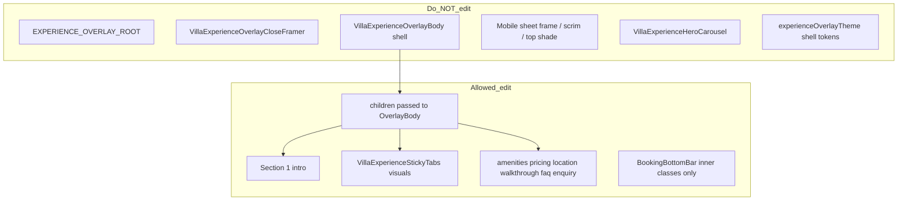

# Overlay UI parity — internal content only

## What you asked for

1. **Reference:** [View Villa Detail](src/app/villas/[id]/page.tsx) for **UI and spacing** (8pt system), colors, alignment, separators, amenity tiles, category bar fade, etc.
2. **Spacing is a first-class deliverable** — overlays currently use `px-6 md:px-12` and one-off `mb-6` / `mb-8` / `mt-5`; these must match detail tokens in [`villaDetailSpacing.ts`](src/components/villa/villaDetailSpacing.ts) and `.villa-section-pad-block` in [`globals.css`](src/app/globals.css).
3. **Scope:** Only **sections that already exist** in Wedding / Party / Corporate overlays — no Spaces, no new headers, no new buttons, no brochure, no SEE MORE.
4. **Hard boundary:** Update **internal scroll content UI only** — do **not** change the **external overlay shell** (static frame, mobile sheet, top shade, close button, portal root, hero pin slot architecture).

---

## Touch boundary (read first)



### Do NOT edit (external structure)

| Area | Files / symbols |
|------|------------------|
| Portal root, open/close motion | `EXPERIENCE_OVERLAY_ROOT_CLASS` in overlay files |
| Close button (mobile above-sheet + desktop fixed) | `VillaExperienceOverlayCloseFramer` in [`VillaExperienceOverlayLayout.tsx`](src/components/experience/VillaExperienceOverlayLayout.tsx) |
| Mobile top shade / backdrop dismiss | `EXPERIENCE_OVERLAY_MOBILE_TOP_SHADE_*`, backdrop `onBackdropClick` wiring |
| Sheet frame, scrim, rounded top, scroll container shell | `VillaExperienceOverlayBody`, `EXPERIENCE_OVERLAY_MOBILE_*`, `EXPERIENCE_OVERLAY_DESKTOP_BODY_CLASS` |
| Pinned hero slot | `VillaExperienceHeroCarousel` and `pinnedTop={...}` usage |
| Shell theme tokens | [`experienceOverlayTheme.ts`](src/lib/experienceOverlayTheme.ts) — **no** changes to host/sheet/frame/scrim/close classes |
| Footer **placement** | `mobileFooter` wrapper `absolute inset-x-0 bottom-0` structure in `OverlayBody` |

### OK to edit (internal UI)

| Area | Where |
|------|--------|
| Section 1 intro | [`VenueOverlay.tsx`](src/components/VenueOverlay.tsx), [`PartyVenueOverlay.tsx`](src/components/PartyVenueOverlay.tsx), [`CorporateVenueOverlay.tsx`](src/components/CorporateVenueOverlay.tsx) — everything inside `OverlayBody` **children** after hero |
| Sticky category bar **look** | `VillaExperienceStickyTabs` — classes only (`VILLA_DETAIL_STICKY_TABS_CHROME_CLASS`, meander `z-40`, `CategoryTabRail` fade/gutter); keep `top-0` / tab list as-is |
| Scroll sections | Same three overlay files: `amenities`, `pricing`, `location`, `walkthrough`, `faq`, `enquiry` |
| Intro amenity tiles | [`OverlayIntroAmenityHighlights.tsx`](src/components/villa/OverlayIntroAmenityHighlights.tsx) |
| Bottom bar **appearance** | `VillaExperienceBookingBottomBar` — inner `max-w-7xl` row: glass class, `vd.gutterX`, gaps; **do not** change `placement` prop or sheet vs viewport wiring |

**Tokens / CSS (read-only reference, no detail page edits):** [`villaDetailSpacing.ts`](src/components/villa/villaDetailSpacing.ts), [`globals.css`](src/app/globals.css) horizontal-scroll fade (only if overlay content needs a one-line class fix, not new globals work).

---

## Existing overlay sections (only these)

| Block | id / role |
|-------|-----------|
| Section 1 intro | pre-tabs charcoal block |
| Category tabs | sticky bar in scroll content |
| Amenities | `amenities` |
| Pricing | `pricing` (conditional Party/Corp) |
| Location | `location` |
| Walkthrough | `walkthrough` |
| FAQ + Key Policies | `faq` (keep both blocks) |
| Enquiry | `enquiry` |

**Unchanged:** tab label strings, form fields, policy text, pricing data, FAQ Q/A copy, conditional rendering (e.g. skip pricing section when empty).

**Not added:** Spaces, Experiences, Details, Services, Perfect For gallery, download brochure, SEE MORE, new meanders where none exist today.

---

## Spacing system (match villa detail)

Single source of truth: `VILLA_DETAIL_SPACING` (`vd`) + `.villa-section-pad-block` (40px block padding mobile, 64px at `lg`).

### Global migration (all three overlay files)

| Overlay today (remove) | Detail token (use) |
|------------------------|-------------------|
| `px-6 md:px-12 max-w-7xl mx-auto` + `sectionY` separately | `vd.sectionShell` (includes gutters + symmetric block pad) |
| `max-w-4xl mx-auto` alone | `vd.content` inside shell |
| `mb-6` on section headings | `vd.stack` parent (`gap-6` = 24px between blocks) |
| `mb-8`, `mb-10`, `mb-3` between intro/section children | `vd.stack` / `vd.stackSm` / intro tokens below |
| `mt-5`, `mt-6` one-offs inside sections | Prefer parent `stack` / `stackSm` or detail-equivalent classes from location/FAQ markup on `page.tsx` |

**Rule:** No new arbitrary margin utilities in overlay children unless the same utility exists on the matching detail section.

### Section 1 intro vertical rhythm

Handled by `VillaDetailIntroSection` + tokens (already on detail; overlays must use fully):

| Step | Token | Size |
|------|--------|------|
| Eyebrow → title | `introHeader` `gap-3` | 12px |
| Title → location | `introLocation` `mt-4` | 16px |
| Location → stats | `introStats` `mt-6` | 24px |
| Stats → amenity cards | `introAmenity` `mt-8` | 32px |
| Amenity cards → description / Perfect for | `introBody` `mt-8` + `gap-6` | 32px + 24px between body children |
| Perfect for label → tags | `stackSm` `gap-4` | 16px |
| Stat icon rows | `gap-2.5` | 10px (overlays currently `gap-2`) |

Intro outer wrapper: one `vd.sectionShell` on charcoal — not nested `px-6` + `#25282C` box.

### Post-tab sections (internal spacing only)

| Section | Spacing to align |
|---------|------------------|
| **Amenities** | `vd.stack`; grid `gap-x-6 gap-y-8` (detail grid); remove extra `mb-6` on title |
| **Pricing** | `vd.sectionShell` + `vd.content` + `vd.stack`; footnote uses `vd.pricingFootnote` (no custom `mt-3` / lighter opacity unless detail has it) |
| **Location** | `vd.stack`; map card `mb-6` only if detail uses equivalent; address `p-5 md:p-6`; distance pill `mt-6` + `px-4 py-4`; nearby block `stackSm` + list `gap-4` |
| **Walkthrough** | `vd.stack`; title + video frame with `gap-6` from stack (no standalone `mb-6` on title) |
| **FAQ** | `vd.stack`; FAQ list then policies with `stackSm` or detail-equivalent top spacing — replace `pt-6 mt-6` ad-hoc with `gap-6` from parent stack where possible |
| **Enquiry** | `vd.stack` / `stackSm`; replace `mb-3` / `mb-10` on heading+description with stack gaps; form component unchanged |

### Category bar + bottom bar spacing

| Element | Spacing |
|---------|---------|
| Sticky tabs | No extra `mb-*` on chrome wrapper; horizontal gutter via `vd.stickyChromeShell` + mobile track gutter (16px) |
| Bottom bar inner row | `vd.gutterX`, `gap-4 md:gap-6`, `pb-[max(1rem,env(safe-area-inset-bottom))]` — match detail fixed bar, not `gap-3` / `pb-[max(1.5rem,...)]` |

### Out of scope for spacing

- `EXPERIENCE_OVERLAY_CONTENT_FRAME_CLASS` padding (shell) — **do not change** unless user later approves shell tweaks
- Hero carousel height/insets
- Close button offset
- Sheet `pb-6` / `md:pb-20` on frame

---

## Work packages

### 1. Spacing + section shells (three overlay files) — **primary pass**

Replace legacy wrappers inside **children** only:

```tsx
// From
<div className="w-full bg-[#25282C]">
  <div className={clsx("px-6 md:px-12 max-w-7xl mx-auto", vd.sectionY)}>
// To
<section className={VILLA_DETAIL_CHARCOAL}>  // or existing section + bg token
  <div className={vd.sectionShell}>
    <div className={clsx(vd.content, vd.stack)}>
```

- Remove ad-hoc `mb-6` on headings; use `vd.stack` (`gap-6`).
- **Meanders:** only restyle `<MeanderStrip />` / props where already rendered — do not insert new strips.

### 2. Section 1 intro

- `VillaDetailIntroSection` (already used) inside `vd.sectionShell`.
- Stats: `gap-2.5` on stat rows (match detail).
- [`OverlayIntroAmenityHighlights`](src/components/villa/OverlayIntroAmenityHighlights.tsx): same viewport/track/tile tokens as detail; full labels via `splitAmenityLabel` (no 2-word chop).
- Perfect for tags: match detail tag classes (`border-white/15`, etc.) — tags already exist.

### 3. Sticky category bar (visual only)

In `VillaExperienceStickyTabs` only:

- `VILLA_DETAIL_STICKY_TABS_CHROME_CLASS` instead of `OVERLAY_STICKY_TABS_CHROME_CLASS`.
- Meander: `className="relative z-40"` like detail.
- Keep: `fadeFrom`, `patternFade`, `mobileTrackGutter`, `vd.hScrollViewportEdge`, `vd.stickyChromeShell`.
- Do not change `VillaExperienceOverlayBody` or z-index on sheet/close.

### 4. Per-section UI (classes only, same markup structure)

| Section | Align to detail |
|---------|-----------------|
| **Amenities** | 2-col grid, gold icon boxes, `splitAmenityLabel` lines; keep current titles & data; **no** SEE MORE |
| **Pricing** | `vd.pricingFootnote` on existing footnote nodes |
| **Location** | Map `opacity-80`, address panel `bg-[#25282C]`, distance pill, nearby title/list spacing (copy classes from detail location block) |
| **Walkthrough** | Poster opacity, border, play control classes |
| **FAQ** | `VillaDetailFaqList` with same `items` **or** accordion restyled to match — policies list stays below, spacing via `vd.stack` |
| **Enquiry** | Heading/description spacing tokens only; form unchanged |

### 5. Booking bottom bar (inner UI only)

In `VillaExperienceBookingBottomBar`:

- Swap inner chrome to `VILLA_DETAIL_PRICING_BOTTOM_BAR_CHROME_CLASS`.
- Row: `vd.page` + `vd.gutterX`, detail gap/safe-area.
- **Do not** remove `placement="sheet"`, sheet footer wrapper, or `OVERLAY_GLASS_TOP_8PX_SHADE` on **sheet frame** (frame is out of scope).

---

## Files to change

| File | Change |
|------|--------|
| `VenueOverlay.tsx` | Internal children sections only |
| `PartyVenueOverlay.tsx` | Same |
| `CorporateVenueOverlay.tsx` | Same |
| `OverlayIntroAmenityHighlights.tsx` | Tile/rail parity |
| `VillaExperienceOverlayLayout.tsx` | **Only** `VillaExperienceStickyTabs` + `VillaExperienceBookingBottomBar` inner classes |

## Files explicitly excluded

- `experienceOverlayTheme.ts` (shell)
- `VillaExperienceOverlayBody`, `VillaExperienceOverlayCloseFramer`, `VillaExperienceHeroCarousel`
- `src/app/villas/[id]/page.tsx`
- New shared components, `VillaDetailAmenityGrid`, `VillaDetailSection` with new meanders

---

## QA

Per overlay (Wedding, Party, Corporate), mobile + desktop:

- [ ] Close button position/behavior unchanged
- [ ] Sheet frame, top shade, hero carousel structure unchanged
- [ ] **Spacing:** 40px symmetric section pad (`sectionShell`), 16→24→32px gutters, no stray `mb-6`/`px-6 md:px-12`
- [ ] **Section 1:** intro rhythm matches detail (12/16/24/32px steps)
- [ ] Scroll content matches detail UI for **existing** sections only
- [ ] No new sections, buttons, or headers
- [ ] Category bar fade/glass matches detail; intro amenity row edge-to-edge
- [ ] Policies + enquiry still present

`npx tsc --noEmit` after implementation.
