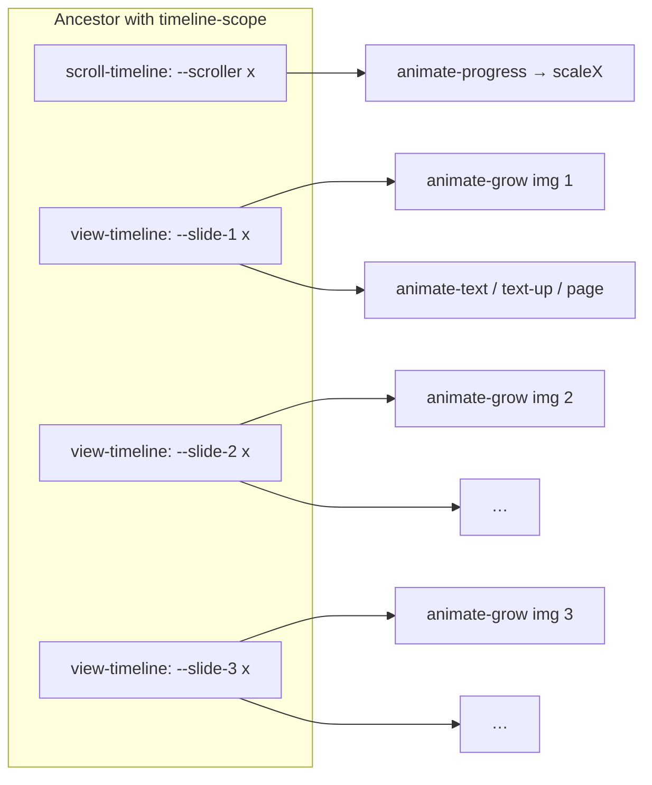

# Prompt: Codrops CSS-Only Carousel — Demo 1 (Scroll-Driven Animations)

Reusable specification for rebuilding **this exact animation system** on other pages or sections. Everything below is derived from the current `index.html`, `css/demo1.css`, `css/shared.css`, `tailwind.demo1.config.js`, and `package.json`.

**Section 0** is the contract for **identical** Demo 1 animation. **Section 0.5** explains how to **restyle** the demo (fonts, colors, tokens) to match an **existing web app** while keeping motion wiring intact. Sections **13–17** add **motion-design and technical animation** depth (choreography, timeline semantics, performance, accessibility) so ports stay intentional—not accidental.

---

## 0. Exact parity with Demo 1 (`index.html`) — same animation

**“Same animation as Demo 1” is not a vibe—it is a fixed wiring.** If anything below differs, motion will diverge.

### 0.1 Canonical files (must match together)

| File | What it locks for motion |
|------|---------------------------|
| **`index.html`** | DOM structure, **`timeline-scope`** / **`--slides`**, **`scroll-timeline`**, each **`view-timeline`**, every **`animation-timeline`** and **`animation-range-start`**, **`supports-sda`** visibility, classes that set initial **`transform`** / **`origin-left`**, z-index and pointer-events. |
| **`css/demo1.css`** | **`@keyframes`** (`grow`, `page`, `progress`, `text`, `text-up`) and **`animate-*`** utilities (`linear both`). |
| **`css/shared.css`** | Loader (`loaderAnim`), **`.overlap`**, **`.scrollbar-hidden`**, base link styles (do not strip if you want identical chrome behavior). |
| **`tailwind.demo1.config.js`** | **`supports.sda`**, **`fontFamily`**, **`letterSpacing.widest`** — required so **`supports-sda:*`** and typography utilities compile the same. |
| **`package.json` deps** | Same Tailwind / Vite / **`@tailwindcss/container-queries`** / Fontsource versions avoid subtle build differences. |

**Rule:** For **pixel-identical Demo 1 animation**, treat **`index.html` + `demo1.css` + `shared.css` + Tailwind config** as the **single specification**. This markdown explains it; it does **not** replace copying those files when you need a guaranteed match.

### 0.2 Minimum checklist (binary same vs Demo 1)

- [ ] Same **`style`** on the root wrapper: `timeline-scope: --scroller, --slide-1, --slide-2, --slide-3; --slides: 3;`
- [ ] Same **`scroll-timeline: --scroller x`** on the hidden scroller; same marker **`view-timeline: --slide-N x`** for each **`id="slide-N"`**
- [ ] Same **`animation-timeline`** on each layer (image → `--slide-N`; progress bar → `--scroller` only)
- [ ] Same **`animation-range-start: 30cqw`** everywhere it appears in Demo 1 (not on backgrounds or progress)
- [ ] Same keyframes and **`animate-grow` / `animate-page` / `animate-progress` / `animate-text` / `animate-text-up`** definitions in CSS
- [ ] **`@container`** on the ancestor that wraps the `cqw` layout (Demo 1 line 18)

### 0.3 Copy-paste instruction for an AI (strict)

Use this when you must reproduce **the same effects as current Demo 1**:

```text
Goal: Reproduce Demo 1 animation and layout exactly as the reference repo.

Non-negotiable:
1. Use the reference files index.html, css/demo1.css, css/shared.css, and tailwind.demo1.config.js as the source of truth.
2. Preserve every inline style that sets timeline-scope, scroll-timeline, view-timeline, animation-timeline, animation-range-start, and --slides.
3. Preserve every class on animated elements (including translate/skew, origin-left, supports-sda variants).
4. Do not rename timeline names (--scroller, --slide-1, …) or change keyframe percentages unless explicitly asked.
5. Only change copy, image paths, or slide count if requested—if slide count changes, update timeline-scope, markers, --slides, and duplicated layers together.

Deliverable: files that diff minimally against the reference (ideally only content/assets).
```

### 0.4 If you only change slide count or copy

- **Same animation family:** keep **`demo1.css`** unchanged; extend **`timeline-scope`**, add **`view-timeline`** markers, duplicate background + overlap blocks, set **`--slides: N`**, add **`href="#slide-N"`** links.
- **Same motion curve:** do **not** edit **`@keyframes`** unless you intentionally change the feel.

---

## 0.5 Adapt typography, colors, and tokens to your existing web app

Use this when embedding Demo 1 **inside another product**: keep **scroll timelines, keyframes, and DOM wiring** as in **section 0**; change only **presentation** so the carousel **looks native** to the host UI.

### 0.5.1 Principle: motion vs skin

| Layer | Host app integration |
|--------|----------------------|
| **Keep from Demo 1** | `timeline-scope`, `scroll-timeline`, `view-timeline`, `animation-timeline`, `animation-range-start`, `--slides`, `.overlap`, `.scrollbar-hidden`, all **`@keyframes`** and **`animate-*`** classes, snap/scroller structure. |
| **Swap for host app** | Font stacks, text/border/surface colors, radii, shadows, spacing scale if your design system demands it, loader appearance, optional removal of Codrops-only chrome (article link, “Demo 2/3” nav). |

**Do not** “fix” animation jank by editing **`@keyframes`** until you have ruled out missing **`supports-sda`** or broken timeline names.

### 0.5.2 Fonts — map Demo 1 roles to your app

Demo 1 uses Tailwind **`font-sans`** / **`font-serif`** (configured as **Inter Variable** + **Cardo** in `tailwind.demo1.config.js`) plus **`tracking-widest`** on labels.

**Integration steps:**

1. **Merge Tailwind `theme.extend.fontFamily`** in the **host** config: set **`sans`** and **`serif`** to your product fonts (or map `sans` → your body UI font, `serif` → your display/headline font if you keep the same HTML classes).
2. **Load fonts** the way the host app already does (Fontsource, `next/font`, Google Fonts link, self-hosted `@font-face`). Remove unused **`@import`** from `demo1.css` if the host supplies fonts globally.
3. Preserve utility usage on markup unless your design system renames roles: e.g. **`font-serif text-8xl`** for hero lines, **`font-medium`**, **`uppercase`**, **`tracking-widest`** — swap fonts at the theme level so **class names** can stay stable.

**Italic emphasis:** Demo 1 uses **`<em>`** inside headlines (Cardo italic). Point **`em`** at your display italic or a secondary weight via CSS if your stack has no true italic.

### 0.5.3 Colors — where Demo 1 sets them today

| Location | Demo 1 usage | Adapt to host app |
|----------|----------------|-------------------|
| **`<html>`** | `class="[--color-bg:theme(colors.black)] text-white antialiased"` | Set **`--color-bg`** to your **canvas / page background** token; replace **`text-white`** with your **primary on-canvas** text token (e.g. `text-foreground`). |
| **`css/shared.css` `:root`** | `background: var(--color-bg)` | Ensure **`--color-bg`** is defined on `:root` or **`html`** in the host (same variable name, or replace with your token and update **`shared.css`** once). |
| **Loader** (`body::before` / `::after`) | Solid **`var(--color-bg)`**; spinner uses **`currentColor`** | Loader inherits **`color`** from context — set **`color`** on `html`/`body` to your **foreground** so the dot matches your theme. |
| **Header** | `border-white/60` | Map to **divider / border** token (e.g. `border-border/60`). |
| **Progress track + fill** | `bg-white/60` (track), `bg-white` (fill) | Map to **muted track** + **accent or foreground** (e.g. `bg-muted` + `bg-primary`). |
| **Nav numbers** | `!text-white` on index links | Use **`text-primary-foreground`** or **high-contrast** token on your chosen background. |
| **Links (`shared.css`)** | `currentColor` with **`color-mix`** when not hover/current | Works if body text **`color`** matches your design system; adjust base link opacity rules only if contrast fails. |

**Images:** Background photos are full-bleed; text readability depends on **host text color** vs imagery—add a **scrim** (`bg-black/30` overlay) only if your brand palette is light-on-busy-photo.

### 0.5.4 Other UI tokens (radius, shadow, spacing)

- **Demo 1** uses Tailwind spacing (`px-7`, `gap-8`, `py-6`) and arbitrary widths (`w-[17rem]`, `w-[31rem]`). Align **`px-*` / `gap-*`** with your **spacing scale** if the host uses a strict grid.
- **No box shadows** on the core carousel—add **elevation** only if your system requires cards.
- **`rounded-*`:** not central to Demo 1 motion; safe to add for chrome only (**header**, **progress container**) without touching timelines.

### 0.5.5 Dark / light or brand modes

If the host uses **`class="dark"`**, **`data-theme`**, or CSS **`color-scheme`:**

- Define **`--color-bg`** and text **`color`** per mode on **`html`** or **`:root`**.
- Re-test **`border-*`**, **`bg-white/*`**, and **progress** colors in **each** mode (section **0.5.3**).
- Scroll-driven animation behavior is **unaffected** by theme; only **contrast** and **loader** visibility need checks.

### 0.5.6 Copy-paste instruction for an AI (theme + motion)

Use when you want **Demo 1 motion** but **host app look**:

```text
Implement the Demo 1 scroll-driven carousel (same structure and CSS animation wiring as the reference: timelines, keyframes, overlap, scroller).

Visual integration:
1. Use the host project's Tailwind theme / CSS variables for fonts, background, text, borders, and progress bar colors—do not keep Codrops-specific black/white unless the host matches.
2. Map font-sans and font-serif in tailwind config to the host's body and display fonts; load fonts the host way.
3. Replace literal classes like text-white, border-white/60, bg-white with the host design tokens or semantic utilities (foreground, background, border, primary).
4. Do not change animation-timeline bindings, keyframe percentages, or timeline names unless fixing bugs.

Deliverable: identical motion and layout structure; appearance matches the host design system.
```

---

## 1. Objective

Deliver an **experimental, CSS-only carousel** driven by **horizontal scrolling**, using **CSS Scroll-Driven Animations (SDA)**:

- Full-viewport **background images** that animate per slide.
- **Overlaid copy** (small paragraph, slide index, large serif headline + label) synchronized to each slide.
- A **global progress bar** tied to the **scroller** timeline, not individual slides.
- **No JavaScript** for motion (only minimal JS for loading UX and feature fallback messaging).

---

## 2. Stack (as in this repo)

| Piece | Role |
|--------|------|
| **Vite** | Dev server and build (`npm run dev`, `npm run build`). |
| **Tailwind CSS 3.x** | Layout, typography utilities, `@container`, custom `@supports` variant. |
| **`@tailwindcss/container-queries`** | `cqw` / `cqmin` units in animations and layout. |
| **`@fontsource-variable/inter`** | Sans (variable Inter). |
| **`@fontsource/cardo`** | Serif (400 + italic). |

**Note:** Fonts are loaded via **Fontsource** packages imported in CSS, not Google Fonts `<link>` tags.

---

## 3. Browser capability: `supports-sda`

In `tailwind.demo1.config.js`, a custom variant detects scroll-timeline support:

```js
supports: {
  sda: 'timeline-scope: none'
}
```

**Meaning:** Utilities prefixed with `supports-sda:` apply when `@supports (timeline-scope: none)` is true (browsers that implement named timelines / scroll-driven animation plumbing).

**Usage in markup:**

- **`supports-sda:block`** — Show the hidden scroller, background stack, and main animated UI when SDA is available.
- **`supports-sda:hidden`** — Hide that UI when not supported.
- **`supports-sda:flex`** — Flex layout for the main column when supported.
- **`supports-sda:pointer-events-none`** — On the **outer** wrapper: disables pointer events on the scroll surface so the invisible scroller does not steal clicks; interactive regions use **`pointer-events-auto`** (header, nav links, fallback message).

Always pair with a **fallback block** (`supports-sda:hidden`) that links to MDN scroll-driven animations docs for unsupported browsers.

---

## 4. Page load / FOUC (not scroll-driven, but part of “motion” UX)

In `<head>`:

```html
<script>
  document.documentElement.setAttribute('data-js', '')
  window.addEventListener('load', () => document.documentElement.removeAttribute('data-loading'))
</script>
```

On `<html>`: start with **`data-loading`** (and theme tokens, e.g. `data-loading class="[--color-bg:theme(colors.black)] …"`).

In **`css/shared.css`**, when **both** `data-js` and `data-loading` are present on `:root`:

- `body::before` — Full-screen solid background (`var(--color-bg)`).
- `body::after` — Centered 60×60px circle, **`loaderAnim`**: `0.7s linear infinite alternate` — opacity and `scale3d` pulse.

When `load` fires, `data-loading` is removed and the loader disappears.

---

## 5. Architecture: timelines and variables

### 5.1 Parent: `timeline-scope` and slide count

On the **root flex container** of the demo (the one wrapping scroller + header + content):

- **`style="timeline-scope: --scroller, --slide-1, --slide-2, --slide-3; --slides: 3;"`**

**Rules for reuse:**

- List **every** named timeline used by children: `--scroller` plus `--slide-1` … `--slide-N`.
- Set **`--slides: N`** (integer) — used only by the progress bar keyframes (`calc(1/var(--slides))`).

### 5.2 Scroll timeline (horizontal)

Hidden horizontal strip:

- **`overflow-x: auto`**, **`scroll-smooth`**, **`snap-x`**, **`snap-mandatory`**, **`scrollbar-hidden`** (utility in `shared.css`).
- Inline style: **`scroll-timeline: --scroller x;`** (horizontal axis).

**Grid of markers:**

- `grid-flow-col`, **`auto-cols-[70cqw]`**, **`pr-[30cqw]`**, **`h-full`**, **`w-fit`** — sizing tied to **container** width (`@container` on ancestor).

Each slide is an empty **`role="none"`** div with **`id="slide-N"`**, **`snap-start`**, and:

- **`style="view-timeline: --slide-N x;"`**

No images live inside the scroller; it only **defines scroll progress and per-slide view timelines**.

### 5.3 Linking animations to timelines

| Element | CSS utility class | `animation-timeline` | `animation-range-start` (if any) |
|--------|-------------------|----------------------|----------------------------------|
| Background image *N* | `animate-grow` | `--slide-N` | — |
| Small paragraph *N* | `animate-text` | `--slide-N` | `30cqw` |
| Nav label *N* (01, 02…) | `animate-page` | `--slide-N` | `30cqw` |
| Progress bar fill | `animate-progress` | `--scroller` | — |
| Caption label *N* | `animate-text-up` | `--slide-N` | `30cqw` |
| Large headline *N* | `animate-text` | `--slide-N` | `30cqw` |

**`animation-range-start: 30cqw`** delays the start of the animation along the view timeline until the scroll position reaches **30cqw** on that axis — aligns motion with container-based slide geometry.

---

## 6. Shared utilities (`css/shared.css`)

| Class | Purpose |
|--------|---------|
| **`.overlap`** | `display: grid`; `grid-template-areas: "overlap"`; direct children `grid-area: overlap` — stacks all slide layers in one cell for crossfade-style swapping. |
| **`.scrollbar-hidden`** | Hides scrollbars (IE/legacy, Firefox, WebKit). |

**Base:** `min-width:0` / `min-height:0` on `*`; `background: var(--color-bg)` on `:root`; link colors muted unless hover/focus/`aria-current="page"`.

---

## 7. Animation utilities (`css/demo1.css`)

All scroll-driven clips use:

- **`animation: <name> linear both;`** — linear progression tied to scroll/view progress; **`both`** fills before/after states.

Imported layers: `shared.css`, Fontsource CSS, `@config "../tailwind.demo1.config.js"`.

### 7.1 `animate-grow` → `@keyframes grow`

**Attached to:** Full-bleed background `` per slide. **`hidden`** until `supports-sda:block`**.

| Progress | Effect |
|----------|--------|
| **0%** | `clip-path: inset(0 25% round 35cqmin)`; `transform: translateX(70%) scale(0.15)` — small rounded inset card, shifted right. |
| **58.75%** | `clip-path: inset(0 round 0)`; `transform: none` — full rectangular viewport. |
| **100%** | `transform: scale(1.5) translateX(-16%)` — continues zoom/pan as slide exits. |

*(Commented-out block in source shows an alternate earlier concept with different clip/transform stops — optional reference only.)*

### 7.2 `animate-page` → `@keyframes page`

**Attached to:** Numeric nav links (01, 02, 03). Highlights “active” segment along the slide timeline.

| Progress | Effect |
|----------|--------|
| **0%, 100%** | `opacity: 0.5` |
| **58%** | `opacity: 1` |

**Markup note:** `!text-white pointer-events-auto` so labels stay visible and clickable.

### 7.3 `animate-progress` → `@keyframes progress`

**Attached to:** Inner bar; **`animation-timeline: --scroller`** only.

```css
from {
  transform: scaleX(calc(1/var(--slides)));
}
```

**Behavior:** `scaleX` runs from **`1/N`** toward **`1`** as the horizontal scroller moves start → end (`transform-origin` left via **`origin-left`**). Requires **`--slides`** on the scoped parent.

### 7.4 `animate-text` → `@keyframes text`

**Attached to:** Small body paragraphs and large **`text-8xl`** headlines.

| Progress | Effect |
|----------|--------|
| **0%, 25%** | `opacity: 0` |
| **50%** | `opacity: 1`; `transform: none` |
| **75%, 100%** | `opacity: 0` |

**Initial transform (Tailwind, not in keyframes):**

- Small copy: **`translate-y-[50%] skew-y-[1.5deg]`**
- Large headline: **`translate-y-[205%] skew-y-6`**

So at timeline start, elements are offset/skewed; at **50%** they settle to **`transform: none`** (overriding utilities for that keyframe).

### 7.5 `animate-text-up` → `@keyframes text-up`

**Attached to:** Uppercase caption line inside **`overflow-clip`** wrapper (vertical mask).

| Progress | Effect |
|----------|--------|
| **0%, 25%** | `opacity: 0.5`; `transform: translateY(105%)` |
| **50%** | `opacity: 1`; `transform: none` |
| **75%, 100%** | `opacity: 0.5`; `transform: translateY(-105%)` |

**Motion read:** Line rises into view, holds, then exits upward.

---

## 8. Layering and layout (HTML/CSS interplay)

- **Background images:** `absolute`, `-z-20`, `inset-0`, `h-full w-full`, **`object-cover`**, **`animate-grow`** + per-slide **`animation-timeline`**.
- **Scroller:** `absolute`, `-z-10`, same inset, **`overflow-x-auto`**, snap + smooth scroll, **`pointer-events-auto`** (receives scroll/gesture; outer wrapper may use **`supports-sda:pointer-events-none`**).
- **Header:** `relative z-50`, **`pointer-events-auto`**, border-bottom **`border-white/60`**.
- **Main column:** `flex-1 px-7`, `relative`, `hidden supports-sda:flex`, vertical **`gap-[inherit]`**.
- **Widths:** Overlap groups use fixed-ish widths (`w-[17rem]` copy, `w-60` indicator, `w-[31rem]` captions) — adjust per breakpoint as needed.

---

## 9. Typography and aesthetics (from markup + Tailwind theme)

- **`font-bold`** title; nav **`text-sm`**, **`gap-5`**.
- Caption: **`uppercase`**, **`tracking-widest`**, **`font-medium`**, **`mb-4`**.
- Headline: **`font-serif text-8xl`**, emphasis with **`<em>`** (Cardo italic).
- Theme: dark **`text-white`**, **`antialiased`**, **`--color-bg`** black via Tailwind theme bridge on `<html>`.

---

## 10. Reuse checklist (other pages / sections)

1. **Dependencies:** Vite + Tailwind + container-queries plugin + Fontsource fonts + `demo1.css` pattern (`@layer utilities` keyframes).
2. **Tailwind config:** Extend `fontFamily` (Inter Variable, Cardo), `letterSpacing.widest`, and **`supports.sda`** as above; **`content`** glob must include new HTML files.
3. **HTML:** `@container` ancestor if using **`cqw`** / **`cqmin`**; set **`timeline-scope`** and **`--slides`** on a common ancestor of all timeline references.
4. **Scroller:** Horizontal **`scroll-timeline`**, column of **`view-timeline`** markers with **`id`s** matching **`href="#slide-N"`**.
5. **Per-slide layers:** Duplicate background + copy blocks; stack with **`.overlap`**; assign each block **`animation-timeline: --slide-N`** and matching **`animation-range-start`** if used.
6. **Progress bar:** One element with **`animation-timeline: --scroller`**; keep **`--slides`** in sync with marker count.
7. **Accessibility / UX:** Preserve **`pointer-events-auto`** on interactive rows; offer non-SDA fallback message.
8. **Loading:** Optional — reuse **`data-loading`** + `shared.css` loader for clean font/image paint.
9. **Host web app styling:** Map **`font-sans` / `font-serif`**, **`--color-bg`**, text, borders, and progress colors to the host design system — see **section 0.5** (keep motion wiring; swap tokens).

---

## 11. Implementation guide for AI / developers

1. Scaffold **Vite** + **Tailwind** + **container-queries**; add **Fontsource** Inter Variable and Cardo **or** merge **`tailwind.demo1.config.js`** **`theme.extend`** (fonts + **`supports.sda`**) into the **host** Tailwind config and load fonts the host way (**section 0.5**).
2. Import **`shared.css`** pattern (Tailwind layers + loader + **`.overlap`** + **`.scrollbar-hidden`**).
3. Add **`demo1.css`** (or merge) **`@layer utilities`** with all **`@keyframes`** and **`animate-*`** classes exactly as specified.
4. Build **DOM**: loader script on **`html`**; root with **`timeline-scope`** and **`--slides`**; hidden scroller + **`--scroller`**; N markers with **`view-timeline`**; stacked backgrounds and **`overlap`** content areas.
5. Apply **`animation-timeline`** and **`animation-range-start`** per the mapping table; verify **`supports-sda`** display toggles and **`pointer-events`** stacking.
6. **Test** in a browser with scroll-driven animations; tune **`auto-cols`**, **`pr-[…cqw]`**, and **`animation-range-start`** so peaks align with “active” slide feel.

---

## 12. Quick reference — animation ↔ timeline matrix

| Keyframes | Class | Default timeline binding in Demo 1 |
|-----------|--------|-------------------------------------|
| `grow` | `animate-grow` | `--slide-1` … `--slide-3` |
| `page` | `animate-page` | `--slide-1` … `--slide-3` |
| `progress` | `animate-progress` | `--scroller` |
| `text` | `animate-text` | `--slide-1` … `--slide-3` |
| `text-up` | `animate-text-up` | `--slide-1` … `--slide-3` |

**Loader (scroll-independent):** `loaderAnim` on `body::after` when `data-js` + `data-loading` present (`shared.css`).

---

## 13. Motion design language and choreography (why it reads “premium”)

This demo is not random opacity tweens: each slide is a **short narrative beat** driven by **scroll position**, with **layered focal points** that peak at *slightly different* phases of the same view timeline.

### 13.1 Per-slide story arc (view timeline `--slide-N`)

Think of each slide’s **`view-timeline`** as **one continuous arc**: off-stage → **center / emphasis** → off-stage. Scroll progress maps to **entry**, **hold**, and **exit** for every animated layer tied to that timeline.

| Layer | Primary motion read | “Peak” phase (approx.) | Notes |
|--------|---------------------|-------------------------|--------|
| **Background (`grow`)** | Thumbnail card → full bleed → drift zoom | Full rectangle by **~58.75%**; continues pan/zoom to **100%** | **Clip-path** + **transform** sell scale; exit keeps moving so the next slide can take over visually. |
| **Small paragraph (`text`)** | Fade + de-skew / settle | Opacity peak **50%** | Starts with **translate + skew** (Tailwind); keyframes clear transform at **50%**. |
| **Big headline (`text`)** | Dramatic rise + skew release | Same **text** curve — peak **50%** | Larger initial **`translate-y-[205%]`** + **`skew-y-6`** = editorial “poster” energy. |
| **Caption label (`text-up`)** | Vertical wipe inside mask | Hold **50%**; enters from below, exits above | Parent **`overflow-clip`** is the **stage**; motion is **translateY** only in keyframes. |
| **Index (`page`)** | Number brightens | Peak opacity **~58%** | Slightly **later** peak than body copy — draws the eye after text stabilizes. |
| **Progress (`progress`)** | Global scroll advance | Tied to **`--scroller`**, not slides | Monotonic **scaleX**; reads as “how far through the whole story,” not “which slide.” |

**Expert takeaway:** Copy and hero image **peak together (~50% / full bleed ~59%)**; the **01/02/03** accent peaks **a touch later**, which avoids a single cluttered instant and feels **directed**.

### 13.2 Two rhythms: slide-local vs whole-carousel

- **Slide-local (`--slide-*`):** All emotional beats—images, copy, captions, numbers—**reset per slide** as that slide’s view timeline runs.
- **Global (`--scroller`):** Only the **progress bar**—**one continuous** motion from first to last scroll position.

When reusing this pattern, **do not** bind hero copy to `--scroller` unless you want cross-slide blending; this demo **intentionally separates** story rhythm from navigation progress.

### 13.3 Masking, skew, and depth (effects stack)

- **`clip-path` + `border-radius` (via `inset(… round …)`)** on **`grow`**: fake “card” → **full bleed** without separate DOM layers.
- **Skew on body copy / headline:** subtle **oblique tension** at rest; **`transform: none`** at peak reads as **straightening**—cheap editorial flair.
- **`overflow-clip` + `text-up`:** classic **motion masked to a band** (title safe); same pattern works for marquees or labels elsewhere.

---

## 14. Scroll-linked animation semantics (technical)

### 14.1 Why everything uses `linear` + `both`

- **`linear`:** Progress along **scroll or view range** is already the user’s “easing”—the finger/mouse/wheel **is** the curve. Non-linear `animation-timing-function` would **remap** scroll position to keyframe progress and often feels **wrong** (laggy or unpredictable) unless you model it deliberately.
- **`both`:** **`animation-fill-mode: both`** extends **start** and **end** keyframe states **outside** the active range so layers don’t **pop** before entry or after exit—critical when multiple slides **overlap** in the same `.overlap` grid.

### 14.2 Scroll timeline vs view timeline (same axis `x`)

| Name | Declared on | Axis | Drives |
|------|-------------|------|--------|
| **`--scroller`** | Hidden overflow element | **`scroll-timeline: --scroller x`** | **Total horizontal scroll distance** (progress bar). |
| **`--slide-N`** | Empty snap markers | **`view-timeline: --slide-N x`** | **That marker’s visibility/intersection journey** in the scrollport (per-slide arcs). |

**`timeline-scope` on the ancestor** lifts those named timelines so **siblings in other branches** (images, copy, chrome) can reference them—this is the **wiring that makes the DOM look “impossible” without JS.**

### 14.3 `animation-range-start: 30cqw` (tuning the beat)

**Container-query width (`cqw`)** ties range shift to **layout width**, not viewport pixels—stable when the `@container` changes size.

- **Effect:** Slides the active portion of each **view** timeline so fades and peaks happen **later** along the slide’s progress—aligns perceived “active slide” with **card width** (`70cqw`) and **trailing padding** (`30cqw`).
- **When porting:** If you change **`auto-cols-[…]`** or **`pr-[…]`**, **retune** `animation-range-start` / optional **`animation-range-end`** until entry/exit feel centered on snap.

### 14.4 Optional extensions (not in repo; use when needed)

- **`animation-range-end`** — Shorten the tail so exits finish earlier.
- **`animation-range: entry …`** — Alternative phrasing for view timelines (MDN: scroll-driven animations).
- **Different axis** — Vertical sections would use **`y`** on scroll/view timelines and vertical snap.

---

## 15. Compositing, stacking, and performance

### 15.1 Layer cake (as implemented)

Order matters for **hit-testing** and **paint**:

1. **Background images** — `absolute`, **`z-index` −20**, full bleed; **three** stacked ``s, each bound to its own timeline (only one “reads” strongly at a time due to keyframes).
2. **Scroller** — **`z-index` −10**, **`pointer-events-auto`** so it still captures scroll.
3. **Header / links / content** — **`z-50`** or **`relative`** stacking above; **`pointer-events-auto`** where clicks matter.

**`isolate`** on the root wrapper creates a **stacking context** so z-index and overlays behave predictably.

### 15.2 Cost awareness (expert)

- **Three full-viewport images** + **`clip-path`** + **`transform`** animations = **GPU-friendly** in principle, but **memory** and **decode** still matter; prefer **reasonable resolution** and modern formats on real sites.
- **Avoid** slapping **`will-change: transform`** on everything—use sparingly if profiling shows jank.
- **`scroll-smooth`** + scroll-driven animations: acceptable for this demo; if combination causes oddness in a target browser, test **with smooth scroll off**.

---

## 16. Inclusive motion and robust ports

### 16.1 `prefers-reduced-motion` (recommended for reuse)

This codebase does **not** ship a reduced-motion variant. For production reuse, consider:

- **`@media (prefers-reduced-motion: reduce)`** — Disable or replace scroll-driven keyframes with **static** first-slide / stacked layout, or **instant** `scroll-behavior: auto` for anchor jumps.
- Keep **semantic HTML** and **visible fallback** when SDA is unsupported (already present).

### 16.2 Motion sensitivity and flashing

- **`page`** and **`text-up`** use **opacity swings** (not only 0/1). For strict WCAG **flash** thresholds, audit **large bright areas** if you adapt colors.
- **Loader** uses **alternating** opacity/scale—short-lived; still optional to soften under **`prefers-reduced-motion`**.

### 16.3 Interaction pairing

- **Anchor links** (`href="#slide-N"`) + **`scroll-smooth`** give **click choreography** that matches **drag scroll**—preserve **IDs** on markers when cloning.
- **`aria-current="page"`** on demo nav is for **state**, not animation—don’t confuse with slide index nav.

---

## 17. Diagram — timeline wiring (mental model)



---

*End of specification — aligned with the Animation_Extraction Demo 1 codebase; **section 0** defines **exact parity** with `index.html`; **section 0.5** covers **restyling for the host web app**; sections 1–12 describe **what** is implemented; sections 13–17 explain **why** it behaves like a cohesive motion system.*
