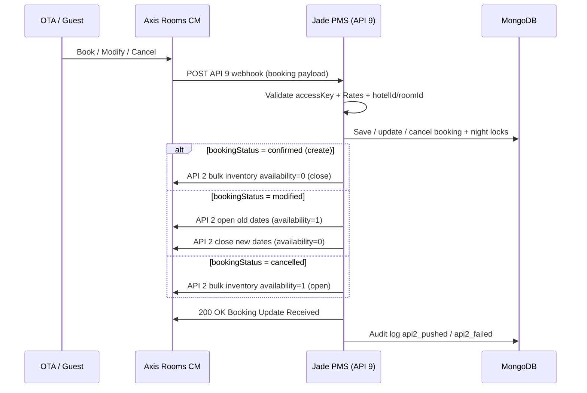

# Axis Rooms UAT Session — 9 July 2026 (updated)

**PMS:** Jade Host PMS  
**Sandbox:** `https://sandbox2.axisrooms.com`  
**UAT site:** `https://jade-revamp.vercel.app`  
**API 9 webhook:** `https://jade-revamp.vercel.app/api/webhooks/axisrooms`

---

## Rohit requirement (9 Jul 2026)

> *"Please push the inventory back to us using API 2 after you receive the request from the push booking URL (API 9)"*

**Implemented:** After every successful API 9 event, Jade now calls **API 2** (`POST /api/inventory`) bulk inventory push.

---

## Flow chart — API 9 → API 2 inventory ack



---

## Inventory update behaviour

| Event | Direction | Jade calendar | Push to Axis |
|-------|-----------|---------------|--------------|
| **Direct / website booking confirmed** | Jade → CM | Night locks acquired | API 1 `free: 0` |
| **Staff cancel (dashboard)** | Jade → CM | Night locks released | API 1 `free: 1` |
| **Staff date change (dashboard)** | Jade → CM | Locks swapped | API 1 open old + close new |
| **OTA booking confirmed (API 9)** | CM → Jade | Night locks acquired | **API 2 `availability: 0`** |
| **OTA booking modified (API 9)** | CM → Jade | Locks swapped | **API 2 open old + close new** |
| **OTA booking cancelled (API 9)** | CM → Jade | Locks released | **API 2 `availability: 1`** |
| **Calendar block** | Jade → CM | Local block | API 1 `free: 0/1` |

Night model: check-out is **exclusive** (stay 15–17 Aug blocks nights of 15 and 16 only).

---

## API 2 payload shape (bulk inventory)

```json
{
  "accessKey": "...",
  "channelId": "227",
  "hotels": [{
    "hotelId": "12123",
    "rooms": [{
      "roomId": "2",
      "startDate": "2026-08-15",
      "endDate": "2026-08-16",
      "availability": 0
    }]
  }]
}
```

| Event | `availability` |
|-------|----------------|
| Create / confirm | `0` (booked) |
| Cancel | `1` (open) |
| Modify | `1` on old range, then `0` on new range |

---

## Sandbox property IDs (1301–1316, seeded 10 Jul 2026)

Whole-villa model: `roomId: 1`, `ratePlanId: 1`, `ratePlanName: Best Available Rate`.  
Assigned alphabetically by villa name. Full CSV: `docs/jade-axisrooms-properties.csv`.

| hotelId | Villa slug | Property |
|---------|------------|----------|
| 1301 | diamond | Diamond Pavilion by Jade |
| 1302 | blue-dome | Dome Villas — Blue Dome |
| 1303 | red-dome | Dome Villas — Red Dome |
| 1304 | yellow-dome | Dome Villas — Yellow Dome |
| 1305 | emerald | Emerald by Jade |
| 1306 | haven | Haven by Jade |
| 1307 | jade-735 | Jade 735 by Jade |
| 1308 | lemon-tree | Lemon Tree by Jade |
| 1309 | lounge-fly | Lounge Fly by Jade |
| 1310 | magnolia | Magnolia by Jade |
| 1311 | palatio | Palatio by Jade *(website_only)* |
| 1312 | retreat-on-the-ridge | Retreat on the Ridge |
| 1313 | royalty | Royalty by Jade *(website_only)* |
| 1314 | tranquil | Tranquil Woods by Jade |
| 1315 | vannani | Vannani by Jade *(website_only)* |
| 1316 | wonderland | Wonderland by Jade |

**Rohit test curl:** `hotelId: 1303` → **red-dome** (not emerald).

---

## Critical validation gate (API 9)

| Step | Check | On fail |
|------|-------|---------|
| 1 | `accessKey` matches `AXIS_ROOMS_API_KEY` | 401 |
| 2 | Valid JSON + API 9 structure | 422 |
| 3–7 | bookingNo, hotelId, dates, roomId, noOfRooms=1 | 422 |
| 8 | hotelId + roomId match registered villa | 422 |
| 9 | ratePlanId matches villa mapping | 422 |
| 10 | Villa `channel_managed` | 422 |
| 11 | Duplicate event | 200 idempotent |
| 12 | Save booking + API 2 inventory ack | 200 |
| — | API 5 not used on inbound (Axis sandbox inactive; Rohit: use 1/2/6/7/9 only) | — |

---

## Sandbox test property (legacy UAT row)

| Field | Value |
|-------|-------|
| `channelId` / `pmsId` | `227` |
| `hotelId` | `1303` (red-dome) |
| `roomId` | `1` |
| `ratePlanId` | `1` |
| `noOfRooms` | `1` |

---

## Test results — 10 July 2026

### VPS seed + production webhook

| # | Test | Result |
|---|------|--------|
| 1 | `npm run axis:seed-all` on VPS MongoDB (`200.97.161.24`) | 16 villas mapped 1301–1316 |
| 2 | `npm run axis:export-csv` | `docs/jade-axisrooms-properties.csv` |
| 3 | API 9 valid `hotelId 1303` on Vercel | Was 422 via API 5 verify; **API 5 removed** — redeploy then expect 200 |
| 4 | API 9 `hotelId 9999` on Vercel | 422 — `Unknown hotelId/roomId` ✓ |
| 5 | API 9 invalid `noOfRooms: 5` on Vercel | 422 ✓ |
| 6 | `npm run axis:test` (hotelId 1303) | 401 on API 1/2/6/7 — Axis must activate sandbox key |
| 7 | Unit tests (`validateInbound`, `inboundInventoryPush`) | 13/13 pass |

**Next:** Set Vercel env per `docs/vercel-axis-sandbox-env.md`, redeploy, then re-run inbound test for `api2_pushed` once Axis activates outbound key.

---

## Test results — 9 July 2026

### Passed (local PMS logic)

| # | Test | Result |
|---|------|--------|
| 1 | API 9 valid booking → PMS save | Pass |
| 2 | API 9 invalid Rates → 422 reject | Pass |
| 3 | API 2 push wired after API 9 create/cancel/modify | Pass (code + unit tests) |
| 4 | Inbound log phases | `received` → `validated` → `api2_pushed`/`api2_failed` → `processed` |
| 5 | API 9 `ARKSAADD91P2W` → API 2 called | API 2 invoked (`availability: 0`); Axis returned 401 invalid accessKey |

### Blocked (needs Axis)

| # | Test | Result |
|---|------|--------|
| 1 | Outbound API 1, 2, 5, 6, 7 | HTTP 401 — `Authorization Failed.Invalid accessKey` |
| 2 | API 2 ack actually received by CM | Cannot verify until key refreshed |

---

## Logging

| Location | Contents |
|----------|----------|
| `logs/axisrooms-inbound.jsonl` | Full API 9 + API 2 lifecycle |
| Dashboard → Axis Rooms → Sync log | `axisrooms.inbound`, `axisrooms.inventory.bulk` |
| Phases | `api2_pushed`, `api2_failed` added |

---

## Commands

```bash
# Full UAT matrix → Overall-Axis-API-Integration-Testing.html (send to Rohit)
WEBHOOK_BASE_URL=https://jade-revamp.vercel.app npm run axis:uat-report

# Seed all villas (use VPS MONGODB_URI for production — see docs/vercel-axis-sandbox-env.md)
npm run axis:seed-all
npm run axis:export-csv
npm run axis:inbound-test -- --hotel=1303 --room=1 --rate=1
npm run axis:inbound-test -- --bad-hotel=9999
npm run axis:test
```

**Overall report (Rohit-ready):** [`Overall-Axis-API-Integration-Testing.html`](../Overall-Axis-API-Integration-Testing.html) — Root Cause Summary (Rohit 1313/2 vs API 5 removed from inbound), Phase A correct IDs → Phase B invalid IDs (distinct 422/401) → Phase C lifecycle → Phase D outbound 1/2/6/7. Regenerate: `WEBHOOK_BASE_URL=https://jade-revamp.vercel.app npm run axis:uat-report`.

---

## Action for Axis (Rohit)

1. **Refresh sandbox `accessKey`** — current key returns 401 on API 2  
2. Confirm API 2 bulk inventory ack is received on your side after API 9 push  
3. Register webhook: `https://jade-revamp.vercel.app/api/webhooks/axisrooms`
