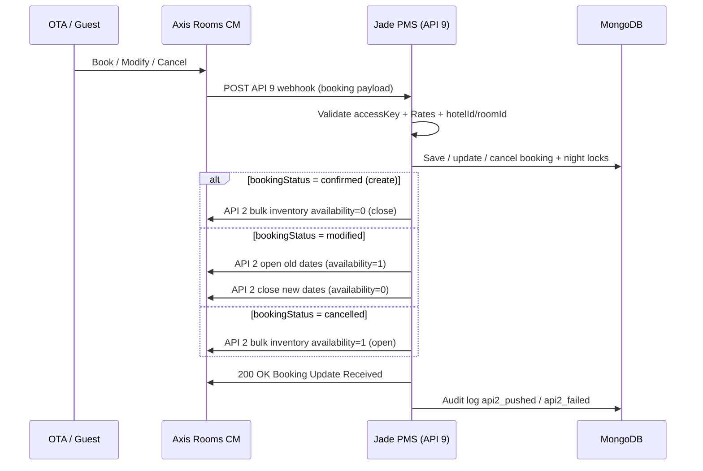

# Axis Rooms UAT Session — 9 July 2026 (updated)

**PMS:** Jade Host PMS  
**Sandbox:** `https://sandbox2.axisrooms.com`  
**UAT site:** `https://jade-revamp.vercel.app`  
**API 9 webhook:** `https://jade-revamp.vercel.app/api/webhooks/axisrooms`

---

## Rohit requirement (9 Jul 2026)

> *"Please push the inventory back to us using API 2 after you receive the request from the push booking URL (API 9)"*

**Implemented:** After every successful API 9 event, Jade now calls **API 2** (`POST /api/inventory`) bulk inventory push.

---

## Flow chart — API 9 → API 2 inventory ack



---

## Inventory update behaviour

| Event | Direction | Jade calendar | Push to Axis |
|-------|-----------|---------------|--------------|
| **Direct / website booking confirmed** | Jade → CM | Night locks acquired | API 1 `free: 0` |
| **Staff cancel (dashboard)** | Jade → CM | Night locks released | API 1 `free: 1` |
| **Staff date change (dashboard)** | Jade → CM | Locks swapped | API 1 open old + close new |
| **OTA booking confirmed (API 9)** | CM → Jade | Night locks acquired | **API 2 `availability: 0`** |
| **OTA booking modified (API 9)** | CM → Jade | Locks swapped | **API 2 open old + close new** |
| **OTA booking cancelled (API 9)** | CM → Jade | Locks released | **API 2 `availability: 1`** |
| **Calendar block** | Jade → CM | Local block | API 1 `free: 0/1` |

Night model: check-out is **exclusive** (stay 15–17 Aug blocks nights of 15 and 16 only).

---

## API 2 payload shape (bulk inventory)

```json
{
  "accessKey": "...",
  "channelId": "227",
  "hotels": [{
    "hotelId": "12123",
    "rooms": [{
      "roomId": "2",
      "startDate": "2026-08-15",
      "endDate": "2026-08-16",
      "availability": 0
    }]
  }]
}
```

| Event | `availability` |
|-------|----------------|
| Create / confirm | `0` (booked) |
| Cancel | `1` (open) |
| Modify | `1` on old range, then `0` on new range |

---

## Sandbox test property

| Field | Value |
|-------|-------|
| `channelId` / `pmsId` | `227` |
| `hotelId` | `12123` |
| `roomId` | `1` or `2` |
| `ratePlanId` | `1` or `2` |
| `noOfRooms` | `1` |
| Mapped villa (UAT) | `diamond` — room `2`, rate `2` |

---

## Test results — 9 July 2026

### Passed (local PMS logic)

| # | Test | Result |
|---|------|--------|
| 1 | API 9 valid booking → PMS save | Pass |
| 2 | API 9 invalid Rates → 422 reject | Pass |
| 3 | API 2 push wired after API 9 create/cancel/modify | Pass (code + unit tests) |
| 4 | Inbound log phases | `received` → `validated` → `api2_pushed`/`api2_failed` → `processed` |
| 5 | API 9 `ARKSAADD91P2W` → API 2 called | API 2 invoked (`availability: 0`); Axis returned 401 invalid accessKey |

### Blocked (needs Axis)

| # | Test | Result |
|---|------|--------|
| 1 | Outbound API 1, 2, 5, 6, 7 | HTTP 401 — `Authorization Failed.Invalid accessKey` |
| 2 | API 2 ack actually received by CM | Cannot verify until key refreshed |

---

## Logging

| Location | Contents |
|----------|----------|
| `logs/axisrooms-inbound.jsonl` | Full API 9 + API 2 lifecycle |
| Dashboard → Axis Rooms → Sync log | `axisrooms.inbound`, `axisrooms.inventory.bulk` |
| Phases | `api2_pushed`, `api2_failed` added |

---

## Commands

```bash
npm run axis:seed -- --slug=diamond --room=2 --rate=2
npm run axis:inbound-test
npm run axis:test
```

---

## Action for Axis (Rohit)

1. **Refresh sandbox `accessKey`** — current key returns 401 on API 2  
2. Confirm API 2 bulk inventory ack is received on your side after API 9 push  
3. Register webhook: `https://jade-revamp.vercel.app/api/webhooks/axisrooms`
